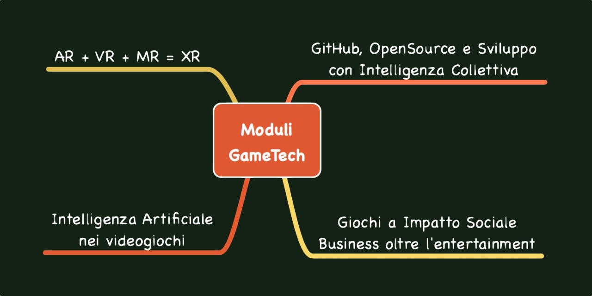

# 2042 Game Dev Books
*i miei libri e appunti dei corsi per Human Game Developers 2042*

## Intelligenza Collettiva e Sviluppo Distribuito
*da Git all'immortalità*  
[book_CollectiveIntelligence/01_README.md](book_CollectiveIntelligence/01_README.md)

## Games++
*Business oltre l’Entertainment*  
[book_Games++/001_README.md](book_Games++/01_README.md)

## Game A.I.
*Intelligenza Artificiale nei Videogiochi*  
[book_GameAI/01_README](book_GameAI/01_README.md)

## XR = AR + VR + MR
*Le nuove tecnologie immersive*  
[book_XR/01_README](book_XR/01_README.md)

## Licenza
Copyright (c) 2020 Stefano Cecere
CC BY-NC-SA: Attribution-Non Commercial-Share Alike 

Public Repo: <https://github.com/StefanoCecere/book_2042GameDev>
