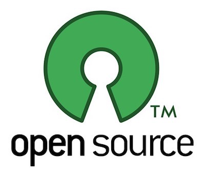

# Open Source e Inner Source

## Open Source

Il termine "Open Source" si riferisce a prodotti progettati per essere pubblici e accessibili affinché tutti possano usarli, modificarli e condividerli.

I progetti OpenSource richiedono una collaborazione aperta, una buona comunicazione pubblica e un'adeguata qualità generale.

Collaborare pubblicamente su un progetto implica:
- più occhi e più mani
- accessibilità
- maggiore qualità

inoltre si possono usare progetti preesistenti per non dover reinventare tutto, sopratutto i bricks (mattoni) di base, spesso i più complessi.

è inoltre gratificante migliorare un progetto comune, dove altri costruiscono partendo da dove siamo arrivati noi

in un progetto Open si dà molto, è forse un po' più faticoso, ma si riceve ancora di più

### pros
- gratuito. raramente ci sono licenze
- facile da installare e maneggiare
- sviluppo in tempo reale
- indipendenza
- si modifica il necessario
- competitività
- è divertente
- crea Open Standards
- le università e gli indie lavorano qui
- grande scelta

### cons
- non sempre user-friendly
- mancanza di supporto
- necessità studio
- può essere complesso
- facilità di progetti abbandonati
- non sempre c'è qualità
- non c'è guadagno monetario diretto
- segmentazioni delle comunità

### considerazioni
- una filosofia, più che una pratica
- storia: anni 90, Linux il primo grandissimo progetto OpenSource (il cui creatore inventò Git per migliorare lo sviluppo collaborativo), big companies oggi lo adottano (Facebook, Google, Microsoft, Oracle), ROI
- intelligenza collettiva: in tanti possono partecipare e mettere il meglio di se in modalità open e meritocratica
- feedback in tempo reale con gli utenti
- possibilità di lavoro (manutenzione, customizzazione, velocità)
- il progetto sopravvive al nostro tempo e interesse. qualcun altro potrà portarlo avanti
- aprire i propri cassetti di idee e pubblicare. male non fa
- Game Jams sono i migliori eventi dove il prodotto deve essere rilasciato OpenSource. più del prodotto in sé è interessante il come è stato fatto, con chi e le referenze a futuro (portfolio)

### Licenze
fondamentalmente 3 categorie:

#### 1. closed - all rights reserved
- copyright / closed source

#### 2. share-alike - condivido ma non specularci
- Creative Commons 

#### 3. open - do whatever u want
- GPL/MIT per codice
- unlicensed

## InnerSource
l'InnerSource è il processo di sviluppo collaborativo di progetti basandosi sulle tecnologie e procedure OpenSource, ma stando all'interno di un ambiente privato, non pubblico.

l'InnerSource usa le skills degli sviluppatori abituati all'OpenSource e le porta dentro i firewalls dei progetti privati, garantendo una piattaforma interna per collaborare ai progetti.

- OpenSource dietro ad un firewall
- lavorare internamente come se fosse un progetto OpenSource
- portare le best practices dell'OpenSource nel team work
- Inner-sourcing è un mind-shift mentale

### Perché InnerSource
- la tecnologia rimane proprietaria.
- sviluppo più efficente
  - riuso del codice
  - codice più pulito
  - limit development bottleneck
- ottimizza la  collaborazione
  - improve talent retention
  - utilize talent across teams better
  - reduce tribal knowledge
- Faster development: Programmers use unit tests, code coverage, and continuous integration to remove bugs at early stages
- Complete documentation: Code is documented better, both in-code comments and less formally on discussion lists
- Code reuse: Programmers across the organization understand the code and architecture of modules developed by other teams
- Cross-team collaboration: Contributions by members outside of the team are frictionless and rarely have to be rewritten
- Development with GitHub: GitHub maintains private repositories for in-house projects as well as public repositories for open source code