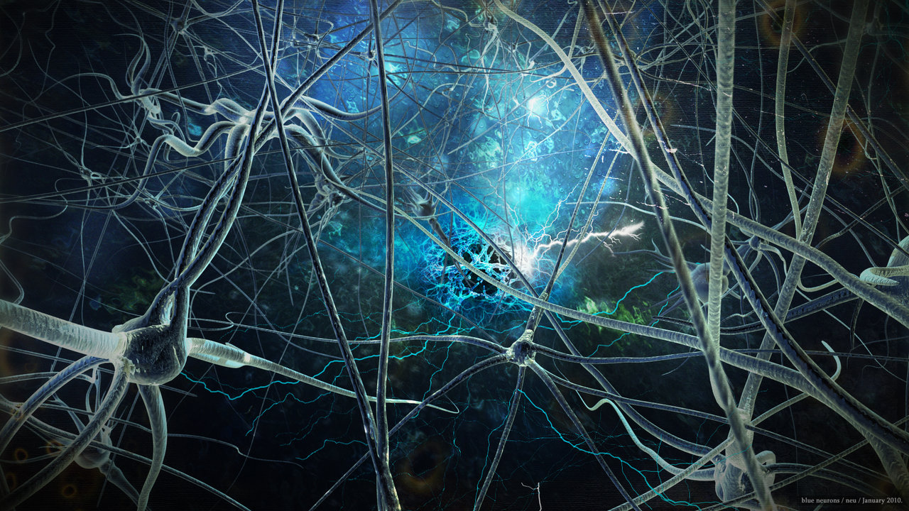
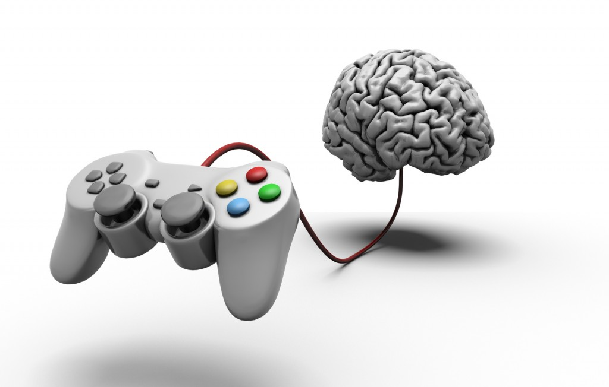
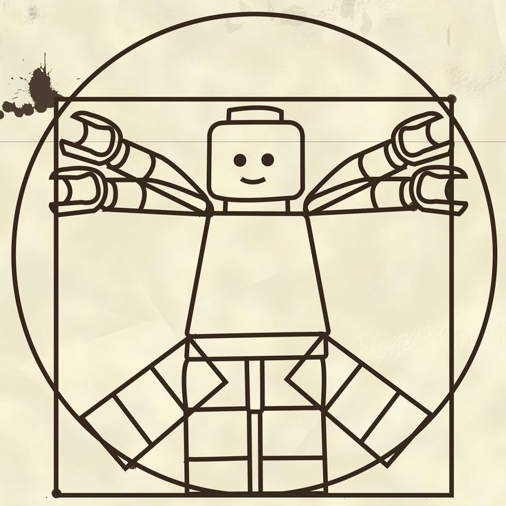

---
presentation:
  width: 500
  height: 500
  # theme: black.css
  enableSpeakerNotes: false
  showNotes: false
  overview: true
---

<!-- slide -->
### Intelligenza Collettiva

<!-- slide data-notes="contesto esistenziale" -->

<!-- slide -->

<!-- slide data-notes="neuroni + albo alunni: nesso?"-->

<!-- slide -->
### la costruzione della memoria
<https://www.youtube.com/watch?v=hb7tjqhfDus>

<!-- slide data-notes="giocatori e i loro cervelli, esperienze si costruiscono con la multisensorialità e ripetizione" -->

<!-- slide data-notes="giocatori e i loro cervelli, esperienze si costruiscono con la multisensorialità e ripetizione" -->

<!-- slide data-notes="videogiochi sono media mutidisciplinari: gli strument perfetti" -->

<!-- slide data-notes="per forza devono essere svilupti in tanti a difficoltà a lavoare insime"-->
<!-- ### progetti di gruppo -->

<!-- slide data-notes="serve un'immagine coerente, ma sopratutto una sua utilità esperienziale" -->

<!-- slide data-notes="SpaceX: lavoraotori.. sono in missione, che va al di la del prestigio personale o dei soldi, o del nerdame: aituare l'umanità" -->
### spaceX

<!-- slide data-notes="" -->

<!-- slide data-notes="" -->
serve un IKIGAI personale

<!-- slide data-notes="" -->
e un mito sociale

<!-- slide -->
- Realtà Oggettiva: pubblica e condivisa
- Mondo mentale: individuale e privato

<!-- slide -->
dove stanno i PENSIERI?

<!-- slide -->
### cosa sono i miti?

<!-- slide -->
### miti
possono essere storie che traghettano i popoli in difficoltà

<!-- slide -->
una storia condivisa che dia l'energia per preoccuparsi del progetto comune, prima che del proprio Io. 

<!-- slide data-notes="il rischio è che tutti facciano il meglio per sè, e il minimo per il progetto."-->

<!-- slide -->

<!-- slide -->
### giappone (ad esempio)

- giappone: spiriti, demoni, animali
- sono un popolo molto "mitico", e resiliente
- shonen e le evoluzioni, vs il geekismo

<!-- slide -->

