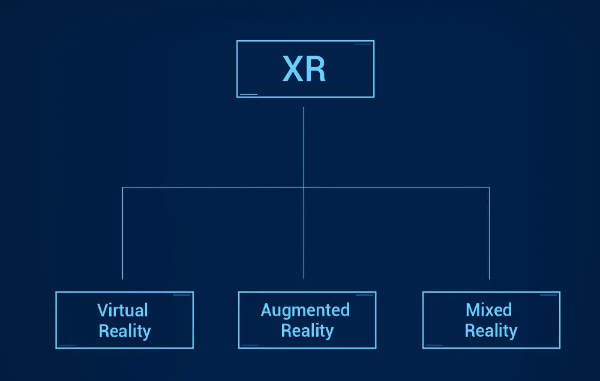
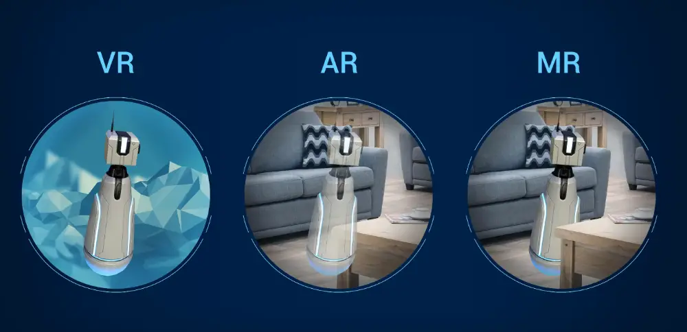

# XR = AR + VR + MR
*Le nuove tecnologie immersive*  
di [Stefano Cecere](https://github.com/StefanoCecere)

conoscere la teoria e le basi della XR, per essere pronti al futuro e cogliere le nuove opportunità.

- basi teoriche di computer vision e tracking
- mercato e opportunità
- case studies di app XR
- tecnologie AR Augmented Reality
- tecnologie VR Virtual Reality
- tecnologie MR Mixed Reality
- Unity AR Foundations: conosciamolo

## Human Centered Design

## Trends
1. hardware sempre più economico
2. Remote work più connesso ([vedi](https://arpost.co/2021/04/27/vr-remote-collaboration-changing-work/))
3. Augmented Shopping sarà la norma per i social media
4. Metaverse

