# VR

> [!note] Definition
Inducing *targeted* behavior in an *organism* by using *artificial sensory stimulation*, while the organism has little or *no awareness* of the interference.

## Realtà Virtuale
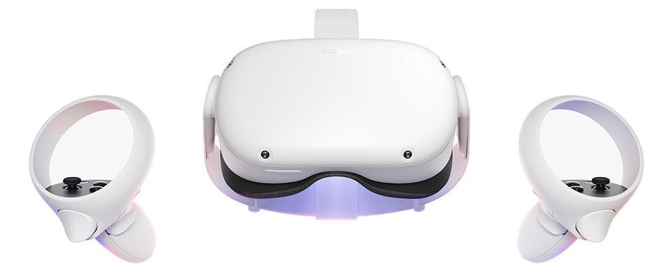

La VR (Virtual Reality) sta raggiungendo livelli di **immersività** sempre più sofisticati, con un potenziale tutto da valorizzare (educativo, formativo, culturale, sportivo, sociale, lavorativo).  
Ed è interessante meditare su come funziona tutto questo: con la  **sabotazione dei nostri sensi**.

|Sense|Stimulus|Receptor|Sense Organ|
|---|---|---|---|
|Vision|Electromagnetic energy|Photoreceptors|Eye|
|Auditory|Air pressure waves|Mechanoreceptors|Ear|
|Touch|Tissue distortion|Mechanoreceptors, Thermoreceptors|Skin, muscles|
|Balance|Gravity, acceleration|Mechanoreceptors| Vestibular organs
|Taste/Smell|Chemical composition|Chemoreceptors|Mouth, Nose|

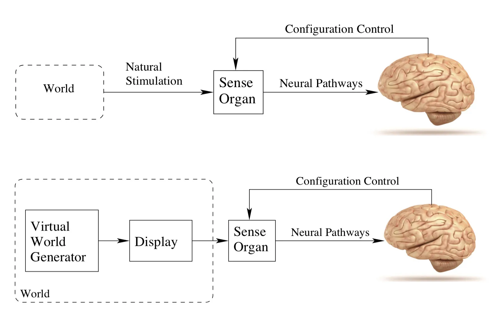

Se l'essere umano percepisce il mondo esterno grazie ai sensi e il mondo interno grazie alla cenestesia (sensazioni interne) e propriocezione (la consapevolezza della nostra posizione nello spazio), nessuno vieta di far arrivare a questi sensi dei segnali artificiali, tanto da ingannare la nostra coscienza fino ad immedesimarsi e credere che sia tutto reale.
Ad oggi la vista e l'udito sono i più ingannati e solo loro basterebbero, ma ci sono progressi anche su tatto, olfatto, gusto e sensazioni cenestesiche.

Il problema? se l'inganno non è perfetto e c'è una minima discordanza tra le percezioni sabotate e le sensazioni interne, si crea malessere, ed è interessante sapere che i grossi problemi che si hanno nel progettare esperienze in VR derivano da una superficiale o trascurata attenzione alla fisiologia umana.

### Problems
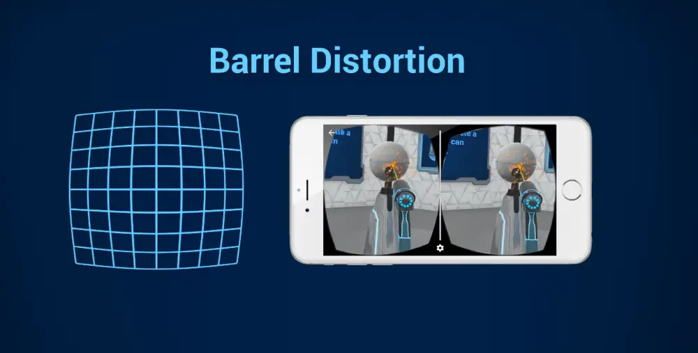
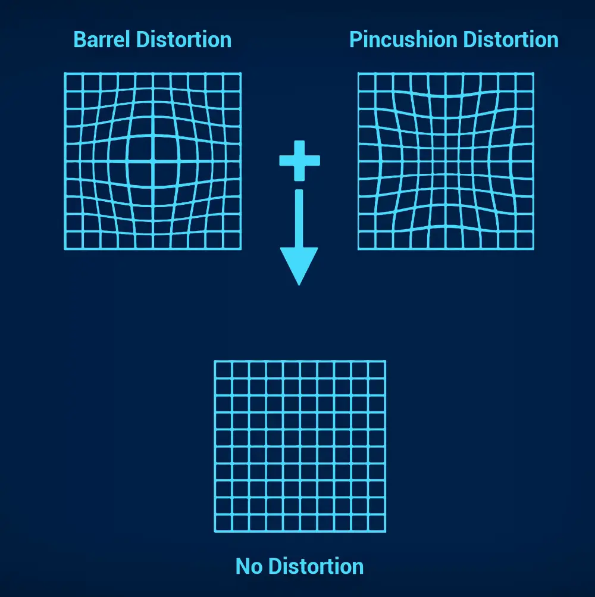

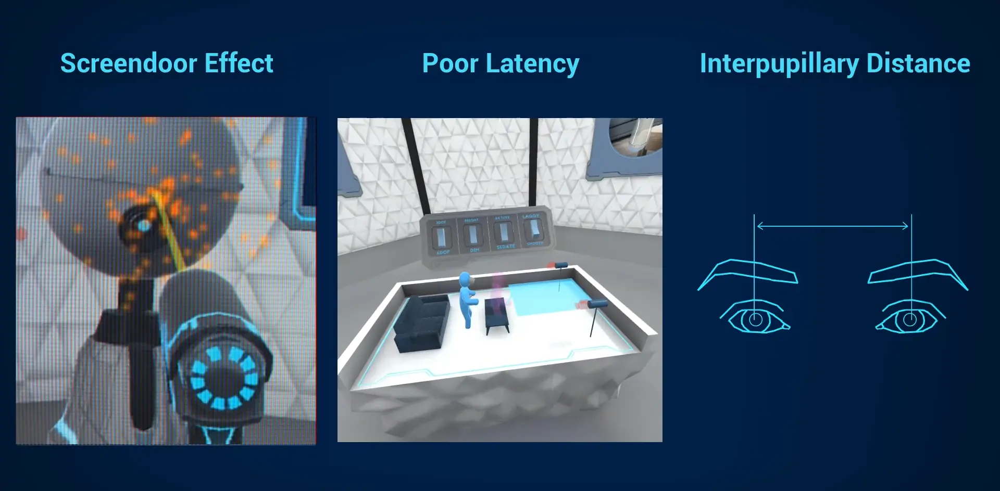

## Modalità

**Seated** vs **Standing** experience

## VR Applications
> [!question] Domanda
> Dove useresti la VR?

### 360 video

### Empatia
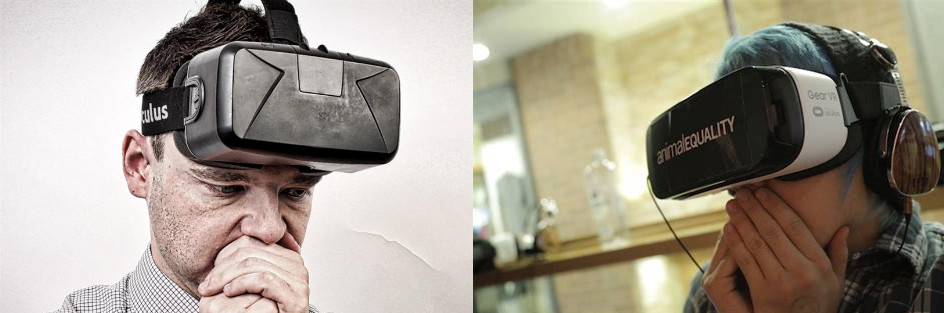

"cammina nelle mie scarpe" sintetizza molto bene il tema dell'empatia, e la VR è uno strumento magnifico per provare a mettersi nelle scarpe degli altri: che sia una persona del sesso opposto, fisicamente diversa, più alta, più bassa, disabile, daltonica, o che viva in un campo profughi dall'altra parte del mondo o in un letto d'ospedale, c'è chi ha addirittura simulato di essere imprigionati, o di essere dei biscotti e mangiati a colazione!  
Vivere le esperienze degli altri in prima persona può cambiare la vita.

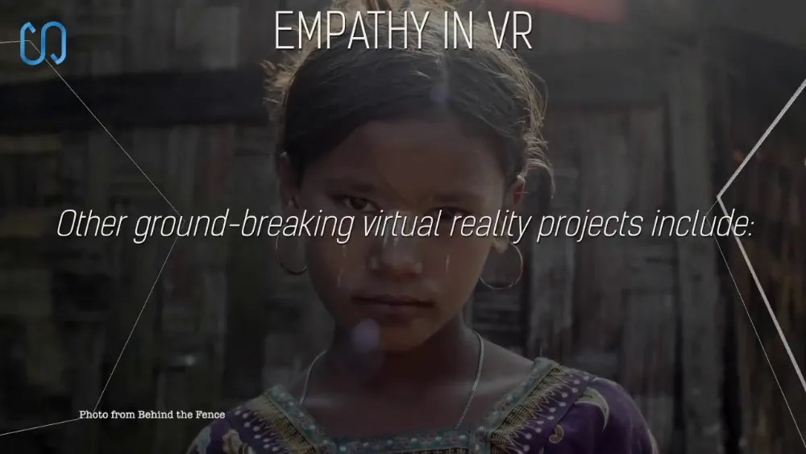

### Being Someone Else
http://beanotherlab.org/home/work/tmtba/

### VR sociale
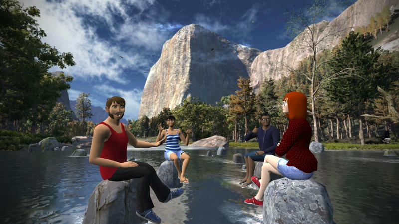

la vera rivoluzione della VR sarà con i social: se io e te ci incontriamo con i nostri avatar in uno spazio virtuale e avremo percezioni perfette, dove saremo noi? Qui o là? Cosa mi definisce? il mio corpo o la mia coscienza? Ma di cosa sarò cosciente? Sono tutte domande molto interessanti, vero?

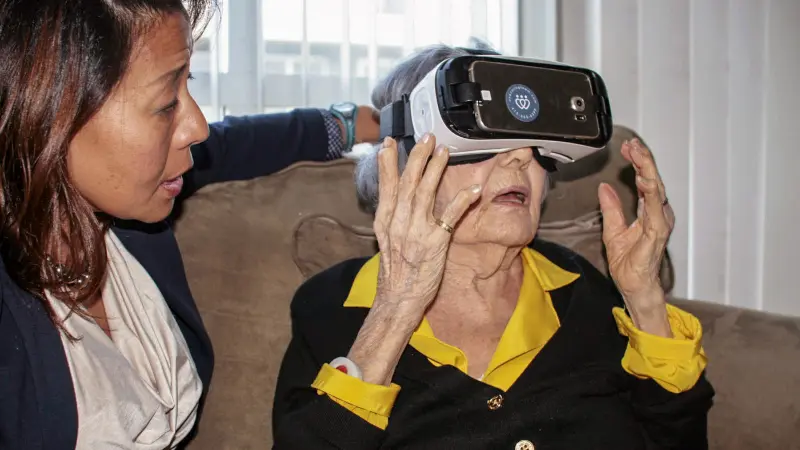

### Medical Training
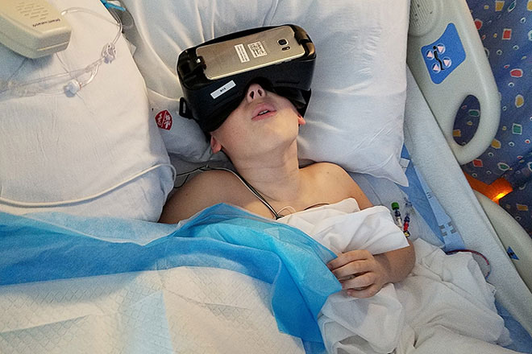

### Sports
Playing Table Tennis in VR
https://www.youtube.com/watch?v=m4Oeu4SLCgY

## Experiments
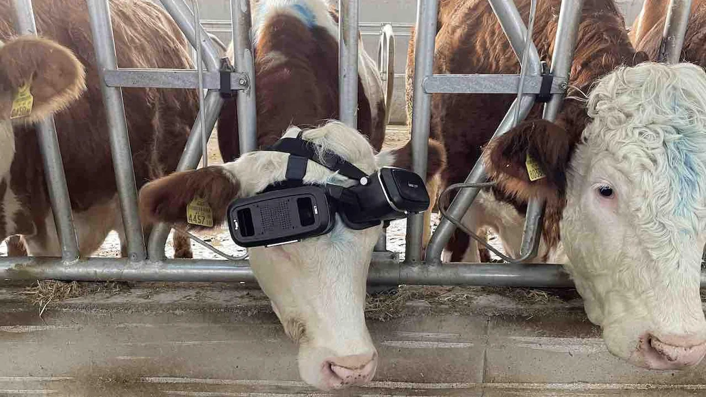

### Physical Rehabilitation and Psychotherapy
social and spideer phobia

## VR hardware
CAVE or HMD?
Standalone or PC-based?
**input**: tracking systems, motion capture systems, data gloves
**output**: visual displays, audio, haptic

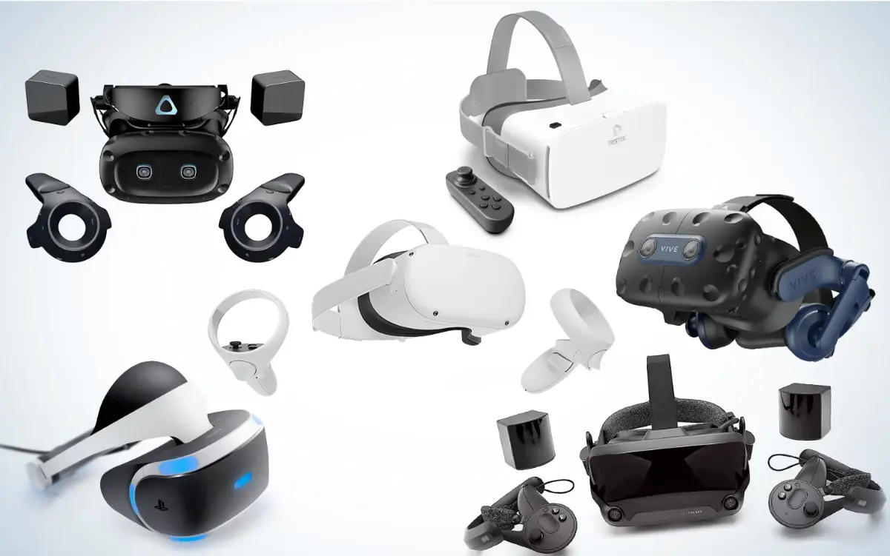
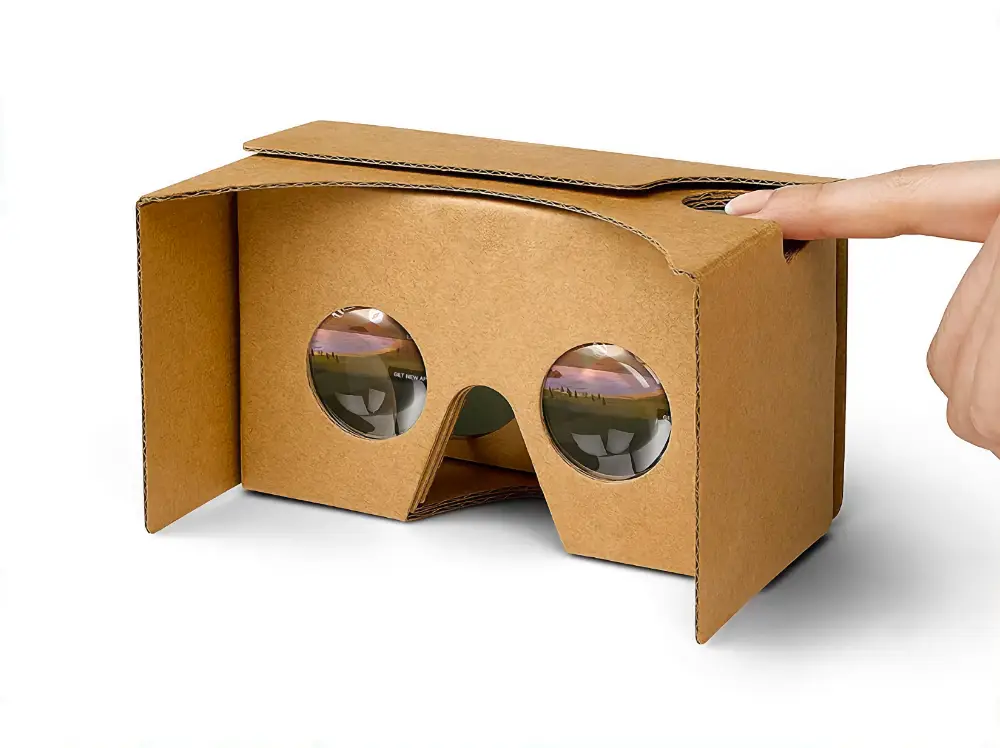

## Raccomandazioni per i dev
highly successful and popular game experience does not translate directly to a comfortable, or even fun, VR experience. Most of the surprises are due to a lack of understanding human physiology and perception.

### Virtual worlds
- **Set units in the virtual world that match the real world** so that scales can be easily matched. For example, one unit equals one meter in the virtual world. This helps with depth and scale perception.
- Make sure that **objects are completely modeled** so that missing parts are not noticeable as the user looks at them from viewpoints that would have been unexpected for graphics on a screen.
- **Very thin objects**, such as leaves on a tree, might look incorrect in VR due to varying viewpoints.
- **Design the environment so that less locomotion is required**; for example, a virtual elevator would be more comfortable than virtual stairs.
- Consider visual and auditory rendering performance issues and simplify the geometric models as needed to maintain the proper frame rates on targeted hardware.

### Visual rendering
- **Never allow words, objects, or images to be fixed to part of the screen**; all content should appear to be embedded in the virtual world. being stationary on the screen is not the same as being perceived as stationary in the virtual world.
- Be careful when adjusting the field of view for rendering or any parameters that affect lens distortion that so the result does not cause further mismatch.
- Re-evaluate common graphics tricks such as texture mapping and normal mapping, to ensure that they are effective in VR as the user has stereoscopic viewing and is able to quickly change viewpoints.
- Anti-aliasing techniques are much more critical for VR because of the varying viewpoint and stereoscopic viewing .
- The rendering system should be optimized so that the desired virtual world can be updated at a frame rate that is at least as high as the hardware requirements (for example, 90 FPS for Oculus Rift and HTC Vive); otherwise, the frame rate may decrease and vary, which causes discomfort
- Avoid movements of objects that cause most of the visual field to change in the same way; otherwise, the user might feel as if she is moving.
- Determine how to cull away geometry that is too close to the face of the user; otherwise, substantial vergence-accommodation mismatch will occur.
- Unlike in games and cinematography, **the viewpoint should not change in a way that is not matched to head tracking**, unless the intention is for the user to feel as if she is moving in the virtual world, which itself can be uncomfortable
- For proper depth and scale perception, the **interpupillary distance** of the user in the real world should match the corresponding viewpoint distance between eyes in the virtual world.
- In comparison to graphics on a screen, **reduce the brightness and contrast of the models** to increase VR comfort.

### Tracking and the matched zone
- Never allow head tracking to be frozen or delayed; otherwise, the user might immediately perceive self-motion
- Make sure that the eye viewpoints are correctly located, considering stereo offsets, head models and locomotion .
- Beware of obstacles in the real world that do not exist in the virtual world; a warning system may be necessary as the user approaches an obstacle.
- Likewise, beware of obstacles in the virtual world that do not exist in the real world. For example, it may have unwanted consequences if a user decides to poke his head through a wall.
- As the edge of the tracking region is reached, it is more comfortable to gradually reduce contrast and brightness than to simply hold the position fixed.

### Interaction
- Consider interaction mechanisms that are better than reality by giving people superhuman powers, rather than applying the universal simulation principle
- For manipulation in the virtual world, try to require the user to move as little as possible in the physical world; avoid giving the user a case of gorilla arms.
- With regard to social interaction, higher degrees of realism are not necessarily better, due to the **uncanny valley**

### User interfaces
- If a floating menu, web browser, or other kind of virtual display appears, then it should be rendered at least two meters away from the user’s viewpoint to minimize vergence-accommodation mismatch.
- Such a virtual display should be centered and have a relatively narrow field of view, approximately one-third of the total viewing area, to minimize eye and head movement.
- Embedding menus, options, game status, and other information may be most comfortable if it appears to be written into the virtual world in ways that are familiar; this follows the universal simulation principle.

### Audio
- Be aware of the difference between a user listening over fixed, external speakers versus attached headphones; sound source localization will not function correctly over headphones without tracking.
- Both position and orientation from tracking and avatar locomotion should be taken into account for auralization.
- The Doppler effect provides a strong motion cue.

### Self appearance
- The feeling of being present in the virtual world and the ability to judge scale in it are enhanced if the user is able to see her corresponding body in VR.
- **A simple virtual body is much better than having none at all**.
- Unexpected differences between the virtual body and real body may be alarming. They could have a different gender, body type, or species. This could lead to a powerful experience, or could be an accidental distraction.
- If only head tracking is performed, then the virtual body should satisfy some basic kinematic constraints, rather than decapitating the user in the virtual world.
- Users’ self-appearance will affect their social behavior, as well as the way people around them react to them

## Comfort and VR Sickness
### Common symptoms of VR sickness
- Nausea. This is the most negative and intimidating symptom of VR sickness
- Dizziness (vertigine, disequilibrio): Users may feel a sensation of movement, such as spinning, tumbling, or swaying, even after the stimulus is removed. This may also include vertigo, which is similar and often associated with malfunctioning vestibular organs
- Drowsiness: Users may become less alert, yawn, and eventually start to fall asleep
- Increased salivation
- Cold sweating
- Pallor
- Warmth/flushing
- Headache
- Fatigue
- Eyestrain
- Accommodation issues: Users may have blurred vision or have difficulty focusing

ma cosa causa questi sintomi? quali sono le cause?

## Frontiers
### Touch and Proprioception
### Smell and Taste
### Robotic Interfaces
### Brain-Machine Interfaces

