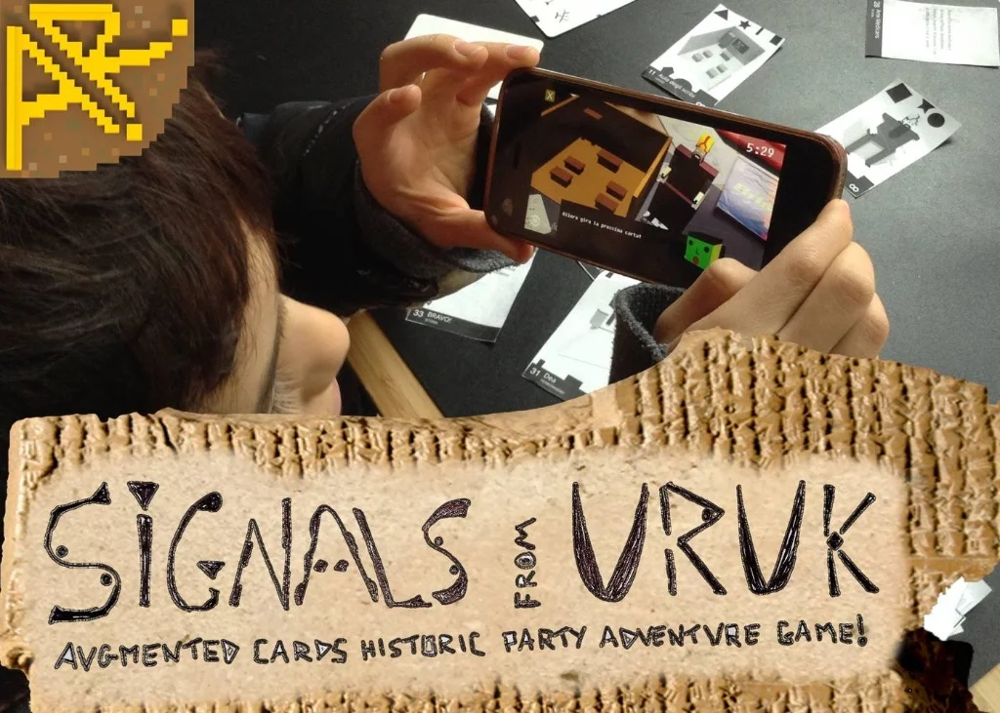
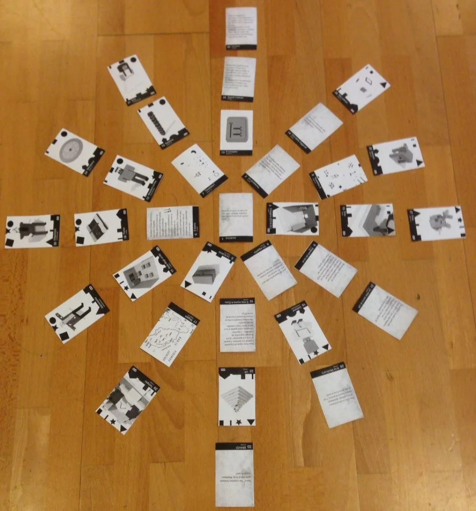
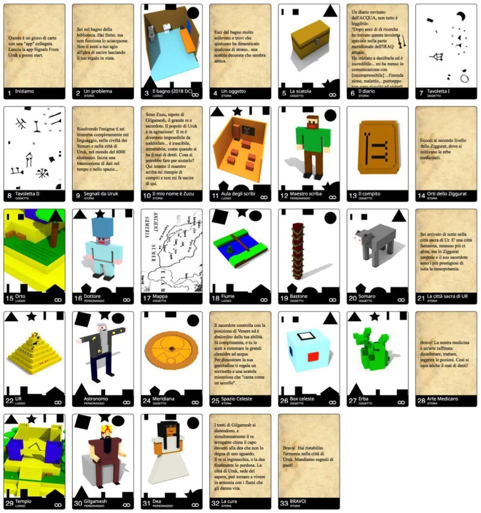
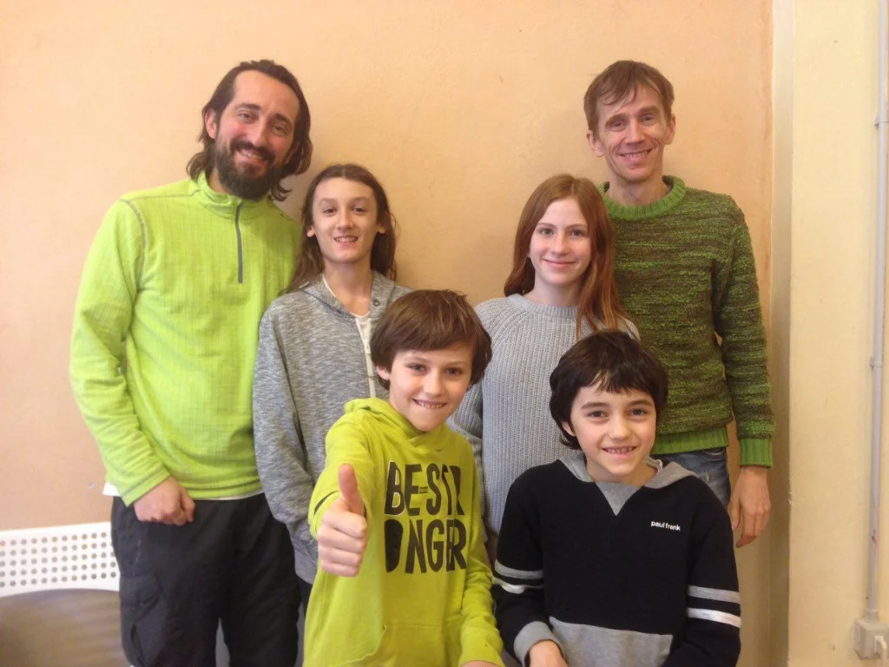
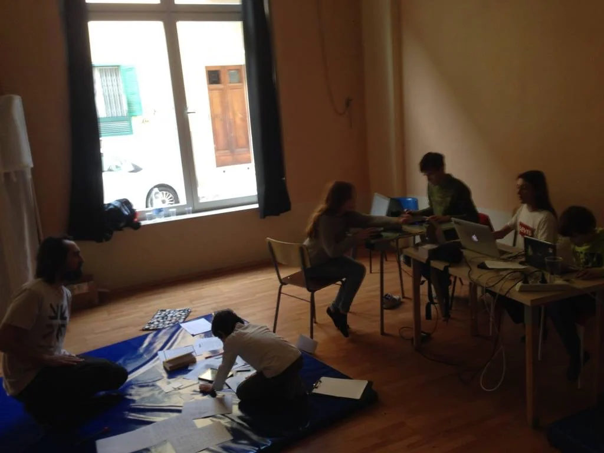

questo il gioco che abbiamo ideato e prodotto nel finesettimana durante la Global Game Jam 2018, il cui tema era TRANSMISSION

un gioco di carte “aumentate” (grazie all’ausilio di cellulari/tablet android o ios) per vivere un’avventura ambientata niente meno che ad Uruk, la prima città avanzata della storia umana, inventando la scrittura, primo enorme strumento di “trasmissione”

Gilgamesh ha un problema.. riuscirete a scoprire perchè gli è capitato e sopratutto aiutarlo?

una storiella breve (siamo riusciti a sintetizzare tutto in sole 33 carte gioco, tra storia e 13 enigmi di vario tipo) ma ricchissima di contenuti e divertimento.

i 5 personaggi che incontrate sono stati doppiati (in sumero ovviamente!) e una guida in Intelligenza art… ops STUPIDITA’ NATURALE, vi non aiuterà nella missione.

è stata una bella sfida.. volevamo fare qualcosa di interessante dal punto di vista narrativo ed educativo, divertente e con nuove tecniche, ma senza “sforare” il limite della fattibilità imposto dal tempo e dalle condizioni non confortevoli della trasferta.

il team intergenerazionale (due adulti, due adolescenti e due bambini) è stato davvero sinergico, siamo riusciti a concentrarci e lavorare bene, e anche oziare in ristoranti, al fiume e dormire tanto!

questa la scheda ufficiale del gioco sul sito dell GGJ:
<https://globalgamejam.org/2018/games/signals-uruk>

il sito GitHub del progetto OpenSOurce è: <https://github.com/StefanoCecere/SignalsFromUruk/>

per giocarlo bisogna stampare le carte e scaricare le app.. per settimana prossima renderemo la cosa più agevole per tutti.. intanto godetevi le schermate e mettetevi in stato di ricezione di segnali lontani ma profondi!

dal Team Uruk questo è tutto.. a presto e scrivetemi se siete incuriositi

con Pietro Polsinelli e un grazie estremamente pieno di complimenti a Michele M. Lanzo e Giacomo Guccinelli e Mixart per l’organizzazione della GGJ a Pisa.

PS: grazie anche a Stratagemma per esistere verremo presto a far provare il gioco

