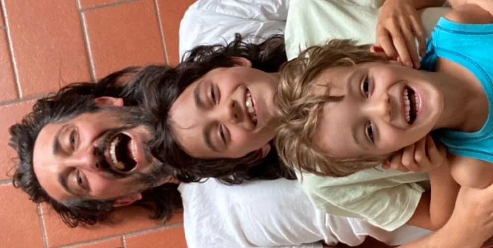

## Chi

Questo progetto nasce molto tempo fa, quando fin da ragazzo [Stefano Cecere](https://cecere.xyz) pensava quanto i media interattivi (sviluppava videogiochi e cd-rom multimediali agli inizi del agli '90) avessero il potere di veicolare esperienze interessanti, per imparare a pensare e fare meglio.  

Avendo sempre tenuto alto lo spirito ludico e la ricerca di attività "anagogiche", che elevassero la conoscenza e lo spirito, ha avuto la massima espressione con la nascita e quindi l'educazione dei suoi figli (Fabio e Bruno, ndr).

Dal 2013 ha iniziato a organizzare eventi di didattica ludica e creativa prima con il proprio figlio, poi con amici, poi eventi pubblici, quindi ha iniziato a insegnare ai game designers e scoprendo quanto i moltissimi amici genitori e insegnanti fossero interessati a questo mondo del "gioco educativo", della tecnologia creativa e della pedagogia ludica, ha iniziato a scrivere una guida sempre più estesa e alla portata di tutti.

E questo è un suo primo risultato.  
Speriamo vi possa tornare utile e nel caso [lasciate un messaggio](contact.md)!

PS: Oltre a questo sito, Stefano sviluppa videogiochi educativi ed impatto sociale con [Videogames Without Borders](https://vgwb.org), è vicepresidente di una bella [Casa del Popolo](https://cdp.settignano.org) sulle colline di Firenze, ed è da sempre un attivista umanista per il tema della nonviolenza e la cittadinanza attiva. Studia **Scienze della Formazione con INDIRE** e partecipa al [GAME Science Research Center](https://gamescience.imtlucca.it/). Ed è stato musicista professionista per 15 anni e dal 2023 lavora con [FEM - Future Education Modena](https://fem.digital) per portare il Game Based Learning e la didattica ludica nelle scuole di tutta Italia.

Eventualmente questo il suo sito [cecere.xyz](https://cecere.xyz).

## Perché 2042?
Cosa sta succendendo? Come sta cambiando il mondo? Cosa faremo nei prossimi (2042 - anno di oggi) anni?  

## Play Well, Die Happy { id="play-well-die-happy" }
▶️👍🎲😊  
Cosa significa?

## Contatto e Partecipazione
Per suggerire modifiche o fare critiche, per chiedere una consulenza o una collaborazione, per seguire gli aggiornamenti del sito e gli eventi che segnaliamo, [contattateci!](contact.md).

## Come leggerlo
Puoi cercare per [tag](../played/tags.md) o usare il potentissimo motore di ricerca nella barra in alto. Puoi scaricarlo sul tuo computer o esportarlo in PDF. Ricordati però la [Licenza d'uso](license.md), ovvero **non puoi rivendere niente** e devi sempre citare questo sito e Stefano Cecere come autori originali, almeno fino al 2042.

## Grazie
Questo progetto non sarebbe nato e non avrebbe sostanza senza la collaborazione, l'amicizia, la solidarietà, il lavoro o la semplice esistenza di:

- Il Giuoco delle Perle di Vetro
- Pietro Polsinelli
- [Mauro Vanetti](https://maurovanetti.info)
- Antonella Prunecchi
- Fabio e Bruno Cecere
- Alessandro Mancini
- [i 7 Frames](../lab/jam/7-frames.md)
- la banda del [PlayFriday](../lab/lab/play-friday.md)
- Annabella Coiro con [Edumana](https://www.edumana.it/) e [Centro di Nonviolenza Attiva](http://www.centrononviolenzattiva.org)
- [Rita Greta Rombolotti](https://www.studiohelda.it)
- [Christian "CH" Costanza](https://www.facebook.com/profile.php?id=100085391032077)
- [Christian "Zoltar" Bellomo](https://www.instagram.com/z0ltar/)
- Michele Gotuzzo
- Michele Lanzo e [MixArt](https://www.mix-art.org)
- [Francesco Rugerfred Sedda](https://www.rugerfred.com)
- Ivan Venturi, Svilupparty e IPID
- Dario Pelella
- Stefano Pippa e i Fossolo
- Michele Pirovano
- Mark Boas
- Francesco Cavallari e [Videogames Without Borders](https://vgwb.org)
- Daniele Giardini
- Giacomo Guccinelli, Sara Sasi e la [TheSIGN – Comics & Arts Academy](https://thesign.academy)
- Giacomo Salvadori
- [Matteo Papadopoulos](https://www.spleenteo.org)
- Lorenzo Palumbo
- Francesco Piersoft Paoloncelli
- [Andrea Millozzi](https://www.andreamillozzi.it)
- Marco Stegani
- [Mario Rodriguez Cobos](http://silo.net)
- [Gabriele Mari e gli Educatori Ludici](https://www.facebook.com/educatoriludici)
- Martino Chiacchiera
- Beniamino Sidoti
- Andrea Angiolino
- Francesco Mattioli
- Christian Giove
- Emiliano Sciarra
- Zio Ludovico
- Adolfo Zilli
- Thalita Malago, Giorgio Catania e [IIDEA](https://iideassociation.com)
- Doriano Benaglia e Lindasoft
- Alessandra Zanazzi e l'[INAF](http://www.inaf.it/it)
- [Games For Change](https://www.gamesforchange.org)
- il [GAME Science Research Center](https://gamescience.imtlucca.it)
- la [Casa del Popolo di Settignano](https://cdp.settignano.org)
- [Stratagemma (Firenze)](https://www.stratagemmaonline.com)
- [Ludissea 42](https://www.ludissea.it)
- [Firenze Gioca](https://firenzegioca.it), [PlayFestival](https://www.play-modena.it), [Internet Festival](https://www.internetfestival.it) e [Lucca Comics & Games](https://www.luccacomicsandgames.com)
- [BoardGameGeek](https://boardgamegeek.com/) e [Board Game Arena](https://boardgamearena.com/)
- i nerd di GitHub / [Obsidian](https://obsidian.md) e l'OpenSource
- M.C. Escher, Douglas Hofstaedter, Douglas Adams
- tu!
