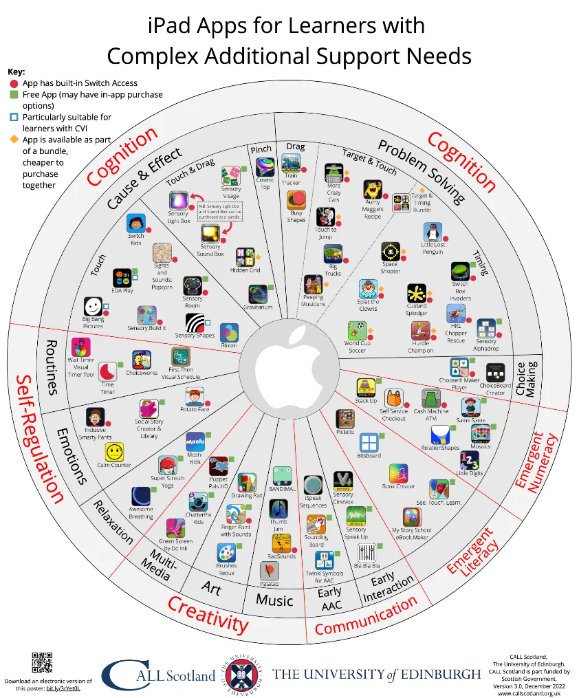

# Ruota delle App iPad per bisogni educativi speciali

In questa "ruota" sono raggruppate una selezione di app particolarmente adatte a gestire bisogni educativi speciali.
<!-- more -->
[Scarica il poster in formato PDF](https://www.callscotland.org.uk/downloads/posters-and-leaflets/ipad-apps-for-learners-with-complex-additional-support-needs/?CXsFTO0qvBHlyD3kVmSc)

## Cognition

### Cause & Effect

#### Touch

- [Big Bang Pictures](https://apps.apple.com/it/app/big-bang-pictures/id586617928 )
- [Sensory Room](https://apps.apple.com/it/app/sensory-room/id814529452 )
- [Early Learning: Sensory Shapes](https://apps.apple.com/it/app/early-learning-sensory-shapes/id1243794980 )
- [Bloom](https://apps.apple.com/it/app/bloom/id292792586 )
- [Sights & Sounds: Popcorn](https://apps.apple.com/it/app/sights-and-sounds-popcorn/id775047939 )
- [Switch Kids](https://apps.apple.com/it/app/switch-kids/id467551739 )
- [EDA Play](https://apps.apple.com/it/app/eda-play-toby/id1103173134 )
- [Sensory Build It](https://apps.apple.com/it/app/sensory-build-it/id1550501048 )

#### Touch & Drag

- [Sensory Light Box](https://apps.apple.com/it/app/sensory-light-box/id533976433 )
- [Sensory Sound Box](https://apps.apple.com/it/app/cause-and-effect-sensory-sound-box/id548622567 )
- [Gravitarium](https://apps.apple.com/it/app/gravitarium/id741646894 )
- [Sensory Visage](https://apps.apple.com/it/app/sensory-visage/id1564086432 )
- [Hidden Grid](https://apps.apple.com/it/app/hidden-grid/id490089517 )

#### Pinch

- [Cosmic Top](https://apps.apple.com/it/app/cosmic-top/id401450971 )

### Problem Solving

#### Drag

- [Busy Shapes](https://apps.apple.com/it/app/busy-shapes/id722784048 )
- [Train Tracker](https://apps.apple.com/it/app/train-tracker/id530126114 )

#### Target & Touch

- [More Crazy Cats](https://apps.apple.com/it/app/more-crazy-cats/id922529105)
- [Aunty Maggie's Recipe](https://apps.apple.com/it/app/aunty-maggies-recipe/id490121669)
- [Touch to Jump](https://apps.apple.com/it/app/touch-to-jump/id814323906)
- [Big Trucks](https://apps.apple.com/it/app/big-trucks/id579627492 )
- [Peeping Musicians](https://apps.apple.com/it/app/peeping-musicians/id490120210 )
- [Target & Timing Bundle](https://apps.apple.com/it/app-bundle/target-and-timing/id1567375733 )

#### Timing

- [Space Shooter](https://apps.apple.com/it/app/space-shooter/id557890309 )
- [Little Lost Penguin](https://apps.apple.com/it/app/little-lost-penguin/id579634725 )
- [Switch box Invaders](https://apps.apple.com/it/app/switch-box-invaders/id590004243 )
- [Custard Splodger](https://apps.apple.com/it/app/custard-splodger/id922527516 )
- [Splat the Clowns](https://apps.apple.com/it/app/splat-the-clowns/id579625979 )
- [Hurdle Champion](https://apps.apple.com/it/app/hurdle-champion/id557894486 )
- [World Cup Soccer](https://apps.apple.com/it/app/world-cup-soccer/id1236162636)
- [HKL Chopper Rescue](https://apps.apple.com/it/app/hkl-chopper-rescue/id1236668402 )
- [Jungle Adventure](https://apps.apple.com/it/app/jungle-adventure/id579631110 )
- [Sensory Alphadrop](https://apps.apple.com/us/app/sensory-alphadrop/id1563984402 )

### Choice Making

- [ChoiceBoard-Creator](https://apps.apple.com/it/app/choiceboard-creator/id453988580 )
- [ChooseIt! Maker Player](https://apps.apple.com/it/app/chooseit-maker-player/id1609401409 )

## Emergent Numeracy

- [Stack Up](https://apps.apple.com/it/app/stack-up-stack-items-bottom-up-to-build-a-tower/id1135865797 )
- [Self Service Checkout](https://apps.apple.com/it/app/self-service-checkout/id1234619083 )
- [Cash Machine ATM](https://apps.apple.com/it/app/cash-machine-atm/id1234617785 )
- [RelationShapes](https://apps.apple.com/it/app/relationshapes/id1143015542 )
- [Same Same](https://apps.apple.com/it/app/same-same-match-identical-items/id1135853830 )
- [Mosaics](https://apps.apple.com/it/app/mosaics-arrange-colorful-pieces-to-form-a-mosaic/id1186205878 )
- [Little Digits](https://apps.apple.com/it/app/little-digits/id511606843 )

## Emergent Literacy

- [Pictello](https://apps.apple.com/it/app/pictello/id397858008 )
- [Bitsboard](https://apps.apple.com/it/app/bitsboard-flashcards-games/id516842210 )
- [Book Creator](https://apps.apple.com/it/app/book-creator-for-ipad/id442378070 )
- [See. Touch. Learn](https://apps.apple.com/it/app/see-touch-learn/id406826506 )
- [My Story School eBook Maker](https://apps.apple.com/it/app/my-story-school-ebook-maker/id449232368 )

## Communcation

### Early Interaction

- [Bla Bla Bla](https://apps.apple.com/it/app/bla-bla-bla/id430815432 )
- [Sensory Speak Up](https://apps.apple.com/it/app/sensory-speak-up-speech-therapy/id655636902 )
- [Sensory Cinevox](https://apps.apple.com/it/app/id673958511 )

### Early AAC

- [iSpeak Sequences](https://apps.apple.com/it/app/ispeak-sequences/id593930331?l=uk )
- [Twinkl Symbols for AAC](https://apps.apple.com/us/app/twinkl-symbols-for-aac/id1543188023 )
- [SoundingBoard](https://apps.apple.com/it/app/soundingboard/id390532167 )

## Creativity

### Music

- [Patatap](https://apps.apple.com/it/app/patatap/id880626868 )
- [RadSounds](https://apps.apple.com/it/app/radsounds-cause-effect/id420977569 )
- [Thumb Jam](https://apps.apple.com/it/app/thumbjam/id338977566 )
- [BANDIMAL](https://apps.apple.com/it/app/bandimal/id1065440354)

### Art

- [Finger Paint With Sounds](https://apps.apple.com/it/app/finger-paint-with-sounds/id586598528 )
- [Brushes Redux](https://apps.apple.com/it/app/brushes-redux/id932089074)
- [Drawing Pad](https://apps.apple.com/it/app/drawing-pad/id358207332 )

### Multi-Media

- [Puppet Pals HD](https://apps.apple.com/it/app/puppet-pals-hd/id342076546 )
- [Green Screen by Do Ink](https://apps.apple.com/it/app/green-screen-by-do-ink/id730091131 )
- [ChatterPix Kids](https://apps.apple.com/it/app/chatterpix-kids/id734046126 )

## Self Regulation

### Relaxation

- [Super Stretch Yoga](https://apps.apple.com/it/app/super-stretch-yoga/id456113661 )
- [Awesome Breathing](https://apps.apple.com/us/app/awesome-breathing-pacer-timer/id1453087953 )
- [Moshi Kids](https://apps.apple.com/it/app/moshi-kids-sleep-meditation/id1306719339 )

### Emotions

- [Calm Counter](https://apps.apple.com/it/app/calm-counter-social-story-anger-management-tool/id470369893 )
- [Inclusive Smarty Pants](https://apps.apple.com/it/app/inclusive-smarty-pants/id490126715 )
- [Social Story Creator & Library](https://apps.apple.com/it/app/social-story-creator-library/id588180598 )
- [Potato Face: The App](https://apps.apple.com/it/app/potato-face-the-app/id1086487183 )

### Routines

- [Wait Timer Visual Timer Tool](https://apps.apple.com/it/app/wait-timer-visual-timer-tool/id552189725 )
- [Time Timer](https://apps.apple.com/it/app/time-timer/id332520417 )
- [Choiceworks](https://apps.apple.com/it/app/choiceworks/id486210964 )
- [First Then Visual Schedule](https://apps.apple.com/it/app/first-then-visual-schedule/id355527801 )

## Riferimenti
[iPad Apps for Learners with Complex Additional Support Needs](https://www.callscotland.org.uk/downloads/posters-and-leaflets/ipad-apps-for-learners-with-complex-additional-support-needs/)
