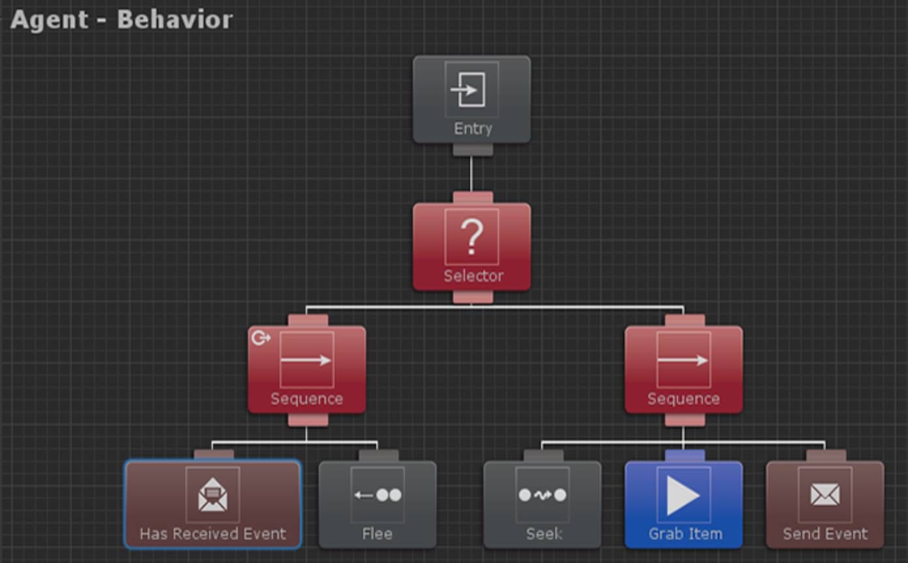

- papà cosa stai facendo?
- preparando la lezione sui Behavior Trees...
- ...
- i diagrammi comportamentali, usati per definire il comportamento dei personaggi dentro i videogiochi ad esempio
- tipo come si muove il boss?
- si, ma anche gli altri.. dai fantasmini di PacMan ai personaggi che incontri... insomma permettono di programmare in modo facile e visuale cosa fa e come interagisce un personaggio con l'ambiente e con il giocatore quando lo incontra
- ah ecco come fanno, in pratica come funziona la loro mente
- esattamente. e sai cosa è il bello?
- no
- è una sorta di psicologia applicata.. o meglio: di analisi psicologica. ti capita mai di cercare di capire perchè pensi o ti comporti in un certo modo?
- uhm... quando studiamo le emozioni a scuola
- benissimo! io penso che stare attenti al proprio pensiero, al perchè delle proprie azioni e reazioni, sia la cosa più interessante della psicologia, che è appunto lo studio della nostra mente. più che studiare psicologia noi dovremmo anche solo fare pratica quotidiana di stare attenti a noi stessi.
e se poi ci fossero degli strumenti per prendere appunti.. una volta io tenevo il diario quotidiano... ora sto cercando di fare dei diagrammi
- con quei disegni?
- beh sai che c'è molta più psicologia nell'imparare a creare i Behavior Trees dei videogiochi che non in tanti libri... 
qui devi pensare a come si devono comportare.. come ti comporteresti tu? ad esempio senti un forte rumore non molto lontano.. cosa fai?
sei a scuola e ti sei dimenticato di fare un compito.. come reagisci?
un amico non ti saluta... cosa provi e cosa pensi e cosa fai?
- quindi tu stai programmando un boss con il tuo cervello?
- ahahah no questo è impossibile.. sebbene in Behavior Trees rientrino nell'"Intelligenza Artificiale" dei videogiochi.. è una versione estramemente semplificata e ridotta, e sopratutto "finta" perchè predeterminata
- ma dicevi che ora si possono avere personaggi che imparano da soli
- si diciamo che si sta iniziando ad avere risultati molto interessanti.. con altre tecniche che rientrano nel "Machine Learning".. ovvero "macchine che imparano"
- mi ricordi Zima Blue
- e si.. pian piano ci arriveremo. ora continuo lo studio che lunedì ho lezione e devo spiegare per bene tutto questo
- ok

NB: Zima Blue è un cortometraggio animato di un robot che... beh dovete vederlo! su Netflix
