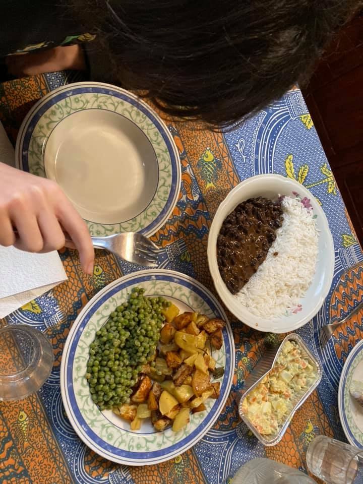

- ma come vengono uccisi i maiali?
- è vero che le scoregge delle mucche inquinano così tanto?
- ma non potremmo mangiare un animale già morto per cause naturali?
- i polli soffrono a stare chiusi in piccole gabbie?
- è vero che gli animali vengono considerate “cose”?
- ma 15.000 anni fa allevavamo già gli animali?
- gli antichi greci mangiavano più carne o avevano già i formaggi?
...
- ahhh carissimo sono contento di tutte queste domande. ti è piaciuto il pranzo di a base di riso, fagioli piccanti, patate arrosto e piselli?
- tantissimo
- ecco quello era un pasto vegano! nessun animale è stato ucciso o allevato industrialmente. e se tutti mangiassimo di più così, anche l’ambiente ringrazierebbe
