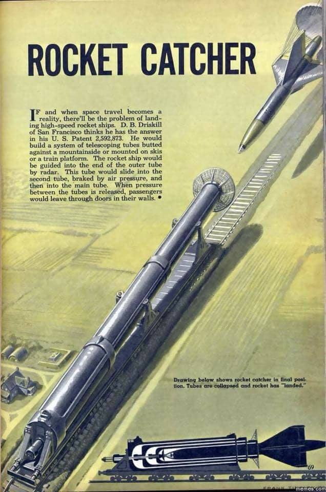

- papà ma chi è un genio?
- direi una persona che riesce a creare nuove soluzioni o opere in modo inaspettato o unico
- tutti quelli che inventano cose nuove sono dei geni allora?
- bah c'è genio e genio
- il genio della lampada, il genio del male, l'ingegnere è un genio?
- beh la parola stessa ingegnere deriva da "ingegno" che è poi collegata ai CONGEGNI (o aggeggi come li chiamiamo noi) e alla dinamica mentale
- serve essere intelligenti allora
- aggiungerei anche la creatività.. genio = intelligenza+creatività
- quelli che hanno inventato i razzi che atterrano (spaceX) sono dei geni secondo me
- concordo.. ma prima di loro sai quanta gente ha provato a inventare modi per fare atterrare i razzi?
pensa che uno aveva anche brevettato un modo che oggi ci fa ridere .. guarda questa immagine.. e qui c'è il brevetto! https://patents.google.com/patent/US2592873
- davvero? un acchiapparazzi! e chi sono i geni del male?
- quelli che sono estremamente intelligenti ma il loro interesse è fare i propri interessi sfruttando la meno intelligenza, l'ignoranza o la povertà degli altri.
- tipo Berlusconi?
- mi commuovi
- ma secondo me è peggio quella del museo egizio che discrimina gli altri in base alle loro caratteristiche
- tra i due non saprei chi scegliere.. a già ma tanto sono amici!
- magari le loro idee sono come quelle di questo dell'acchiappa razzi
- già! delle grandi prese per il culo!
- AHAHAHAH (rotolando insieme sul pavimento)
