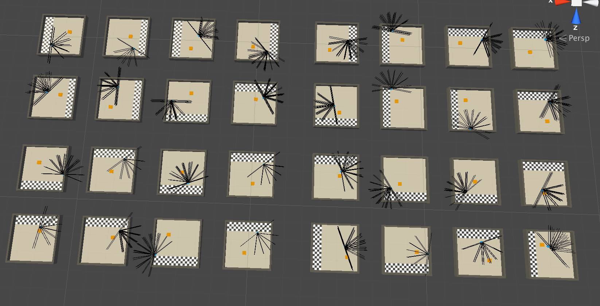

- papà ma che fai in studio anzichè stare in giardino a lavorare con noi?
- sto allenando questi omini a lavorare per me
- eh?
- come pensi che funzionino i robot non telecomandati?
- vedono con le telecamere, riconoscono gli ostacoli e fanno quello che gli diciamo di fare
- e secondo te è facile programmarli in modo da essere autonomi nella loro missione, e sopratutto adattarsi a qualsiasi ambiente in cui si trovino?
- uhmmm no
- esatto.. ma ci sono modi molto semplici (si fa per dire) per avvicinare l'intelligenza di un robot al comportamento ottimale... addestrandoli, o meglio: mettendoli in condizione di imparare dai propri errori e migliorare sempre di più
- e perchè hai 32 livelli?
- per velocizzare alleno 32 omini contemporaneamente.. il bello dei robots è che quando uno ha imparato, può condividere la propria esperienza con tutti gli altri, quasi all'istante. mentre noi umani si deve ognuno fare tutto il percorso di studio, esperienza, errori, impara, rifai.
- ma sono sempre più veloci!
- certo, ad ogni giro accumulano esperienza... e questa è una cosa semplicissima (che spiegherò domani alla mia lezione sull'Intelligenza Artificiale nei videogiochi)
- ma cosa stanno imparando di preciso?
- a spostare quel cubo messo casualmente in mezzo alla stanza, verso la zona di scarico. devono farlo nel minor tempo possibile e col minor sforzo.
- ma però gli omini dei videogiochi, ad esempio quelli di Zelda, sono avvantaggiati, perchè loro sanno già tutto: dove si trovano i tesori, come è fatta la mappa, dove ti trovi tu..
- e NO! o meglio: si in molti videogiochi i "nemici" sono finti.. ma qui invece si ragiona così: dai all'omino solo degli "occhi" e loro devono interagire e imparare solo in base a quello che vedono. senza barbatrucchi
Tutto questo si chiama Machine Learning... ne sentirai parlare ..fin troppo, nella tua vita. magari in settimana alleniamo insieme un omino che impari da solo ad uscire dai tuoi labirinti
- ok
