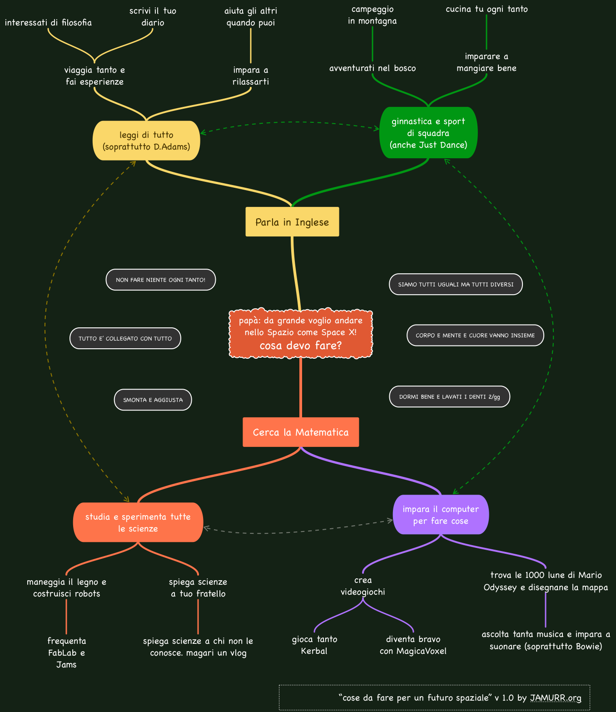

- Papà: ma se da grande volessi andare a lavorare con SpaceX e poi nello Spazio.. cosa dovrei fare?
- beh.. innanzitutto io inizierei a studiare bene MATEMATICA ed INGLESE.. questi sono i fondamenti.. perchè la matematica è alla base di ogni scienza e tecnologia.. e senza inglese non puoi comunicare con il mondo e lavorarci insieme.
Poi SCIENZE..
- tecnologia? costruire razzi?
- tecnologia si, ma dopo.. prima la scienza che è più ampia.. e imparare a usare il COMPUTER, come strumento per fare cose, non per guardarci gli youtubers! un razzetto puoi iniziare a costruirlo con i kits, ma senza esagerare
- e poi filosofia!
- FILOSOFIA?
- si.. diciamo che se arrivi ad un problema e non riesci a risolverlo.. la filosofia può aiutarti a trovare una soluzione.. ad esempio disperarsi o picchiare contro il computer non sono soluzioni interessanti.. meglio andare a fare una passeggiata con gli amici...
- bello!
- ma guarda.. ti faccio uno schemino, con i livelli di priorità che io ti direi di seguire

... ...

- ma anche andare a fare avventure nel bosco è importante?
- certo! andare nello Spazio è un'avventura! non sai cosa ti aspetta o succederà.. devi essere pronto a tutto!
- e mangiare bene?
- il cervello e il corpo funzionano meglio se li nutri bene.. dagli schifezze o quantità inadeguate, e si inceppano
- SAN CEPPATO!

PS: se voi papà e mamme e insegnanti spazio/tecnologici avete commenti o critiche al nostro programmino, benvengano! Fabio ha preso il tutto molto seriamente aiutooo 
