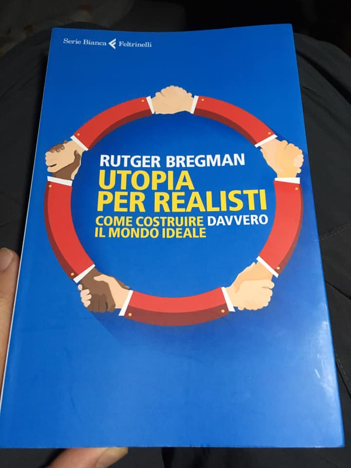

- cosa leggi?
- un nuovo libro sull’utopia. sai cos’è?
- qualcosa coi topi? eheh
- nooo Topos in greco significa “luogo”... e Utopia è un luogo, un mondo, che non cè, immaginario. ideale.
- come nei videogiochi!
- quasi ... ma qui si parla di come vorremmo che evolvesse il nostro mondo reale, la nostra società. se potessimo avere la bacchetta magica come vorresti che vivessimo? ma il bello è pensare a dei modi realisti per arrivarci!
- tipo?
- tipo che se il mondo si riempie di robots che fanno tutti i lavori... avrà ancora senso per noi umani il lavorare? perché non immaginare un mondo dove noi si lavora pochissimo e riceviamo lo stesso un bello stipendio (un reddito di base universale)?
- beh potremmo avere ognuno il suo robot che lavora per noi e ci porta i soldi del suo lavoro.
- come in Guerre Stellari! no non credo che ognuno avrà il suo robot lavoratore. guarda ora il Signor Amazon ha già milioni di robots tutti lui.
- è ricco?
- Jeff è il più ricco di tutti e lo sarà sempre di più. ma noi dobbiamo progredire verso una bella utopia, non arrenderci ad una distopia
- distopia?
- un luogo, un mondo brutto, che non andrà bene per tutti. sai a cosa servono le utopie?
- no
- a farci progredire. a farci avanzare in una determinata direzione. come fosse il sogno a cui aspiro. poi quando ci arrivi magari scompare e ne sorgerà un altro. ma è importante averne sopratutto per coinvolgere altri nell’impresa di avanzamento.
- ok
- poi ti racconto cosa ha scritto questo ragazzo. è un giovane storico olandese. neanche trent’anni. molto sveglio.
- giovane!
- lo sai che i cervelli dei ventenni sono i migliori? dobbiamo far di tutto per dare loro tutto spazio e risorse. e tu intanto preparati che fra 10 anni tocca a te!
- vado a dormire allora.

PS: Rutger Bergman si è fatto conoscere a gennaio con questo discorso al forum economico di Davos, dicendo a tutti i miliardari presenti: “signori la soluzione è semplice: i ricchi devono pagare più tasse. e la povertà non è una mancanza di “carattere”. è mancanza di denaro.” e mi è piaciuto. vedere 
<https://m.youtube.com/watch?v=P8ijiLqfXP0>
