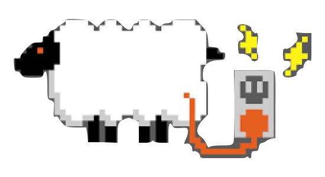
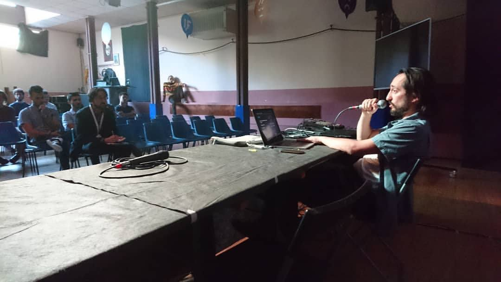

L’Intelligenza Artificiale sta progredendo velocemente e i videogiochi sono un ottimo contesto dove metterla in gioco. Una panoramica sull’uso di vari tipi di Intelligenza Artificiale nei videogiochi: dai comportamenti dei NPC alla generazione procedurale, dal bilanciamento dinamico alla narrativa interattiva. Infine un’anticipazione sugli scenari futuri.

<iframe src="//www.slideshare.net/slideshow/embed_code/key/D0ub6ds5huy4dJ" width="595" height="485" frameborder="0" marginwidth="0" marginheight="0" scrolling="no" style="border:1px solid #CCC; border-width:1px; margin-bottom:5px; max-width: 100%;" allowfullscreen> </iframe>

 
 <strong> <a href="//www.slideshare.net/StefanoCecere/do-npc-dream-of-electric-sheep-games-ai" title="Do NPC Dream of Electric Sheep? (games &amp; AI)" target="_blank">Do NPC Dream of Electric Sheep? (games &amp; AI)</a> </strong> from <strong><a href="https://www.slideshare.net/StefanoCecere" target="_blank">Stefano Cecere</a></strong> 

