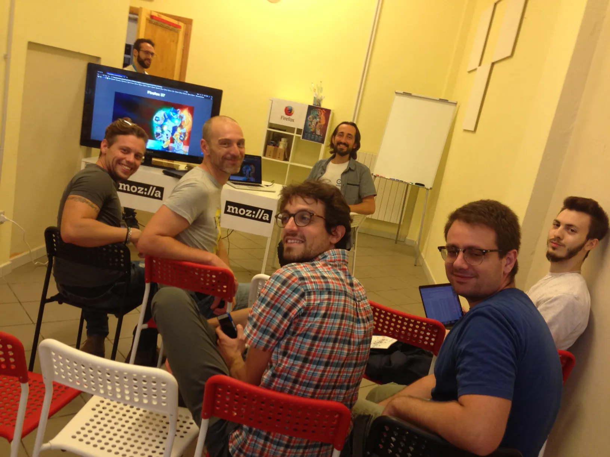
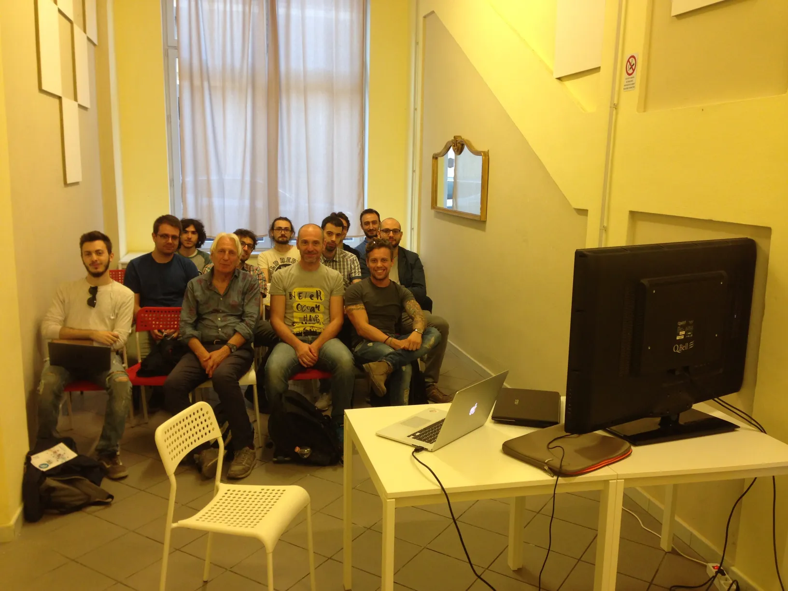

Nuove tecnologie web open source per sviluppatori e giocatori: uno spazio aperto dove conoscere e testare in anteprima l'imminente release 57 di Firefox, molti giochi e i framework di sviluppo"

La fondazione Mozilla è da sempre all’avanguardia sulle nuove tecnologie web e sul come usarle. Con gli ultimi sviluppi (WebAssembly, WebGL 2, asm.js, WebVR, Firefox 57 e i numerosi sottoprogetti nati per renderlo possibile) si sta davvero aprendo una nuova frontiera per tutti gli utenti Internet, anche per i giocatori e gli sviluppatori di videogiochi. 

Presenteremo in anteprima la release 57 di Firefox, testandola con una serie di case studies di videogiochi web d’avanguardia, raccontandone i tool usati per svilupparli e tutte le risorse gratuite Mozilla per iniziare a studiarli.

