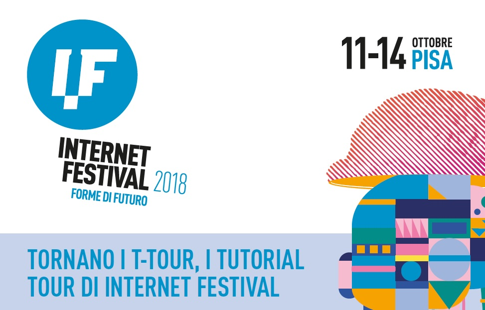

BUON LABORO
domani saremo (con Sir Pietro Spinach Tagliatelle) a Pisa all’Internet Festival e stiamo finendo di preparare il workshop su digitale, robotica e Nintendo Labo

una cosa che manca tantissimo ai ragazzi è l’ALFABETIZZAZIONE INFORMATICA… non tanto come usare gli aggeggi che sono più bravi di noi, quanto CONOSCERE LE BASI della logica binaria (capiranno perchè 1 + 1 = 10) e della digitalizzazione (campionamento di un segnale analogico e ritorno)

poi i principi base del computer (input->elaborazione->output) e i concetti base base di come si inventa un gioco interattivo (game design e game development)

il tutto condito con cartone, con intelligenza più o meno naturale e con l’assistenza di due giovanissimi generati

e poi videogiochi e matematica e un’oretta speciale solo per gli insegnanti delle medie
