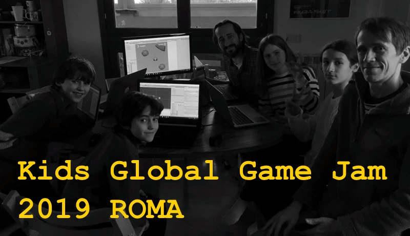

Kids Global Game Jam 2019: pronti!

questo finesettimana io e Pietro Polsinelli saremo i tutors del nostro gruppetto di game designers alla [Global Game Jam](https://www.facebook.com/GlobalGameJam/), l’evento internazionale dove ci si trova, e dato un tema si sviluppa un videogioco in 48 ore.

per l’occasione abbiamo insegnato ai ragazzi un nuovo modo di creare arte: le “TILE MAPS”, e usando un semplice framework di Unity e GitHub, dovrebbero essere quasi autonomi nella loro creazione

ovviamente non mancherà una colonna sonora originale registrata in loco e una vagonata di voxels

l’occasione sarà speciale perchè questa volta saremo a ROMA, in centrissimo (Piazza di Pietra) con alloggio in Piazza di Spagna …. tutto lusso eh.

speriamo di vedere molti amici game dev romani… e se avete bambini e ragazzi interessati, stiamo in contatto.
