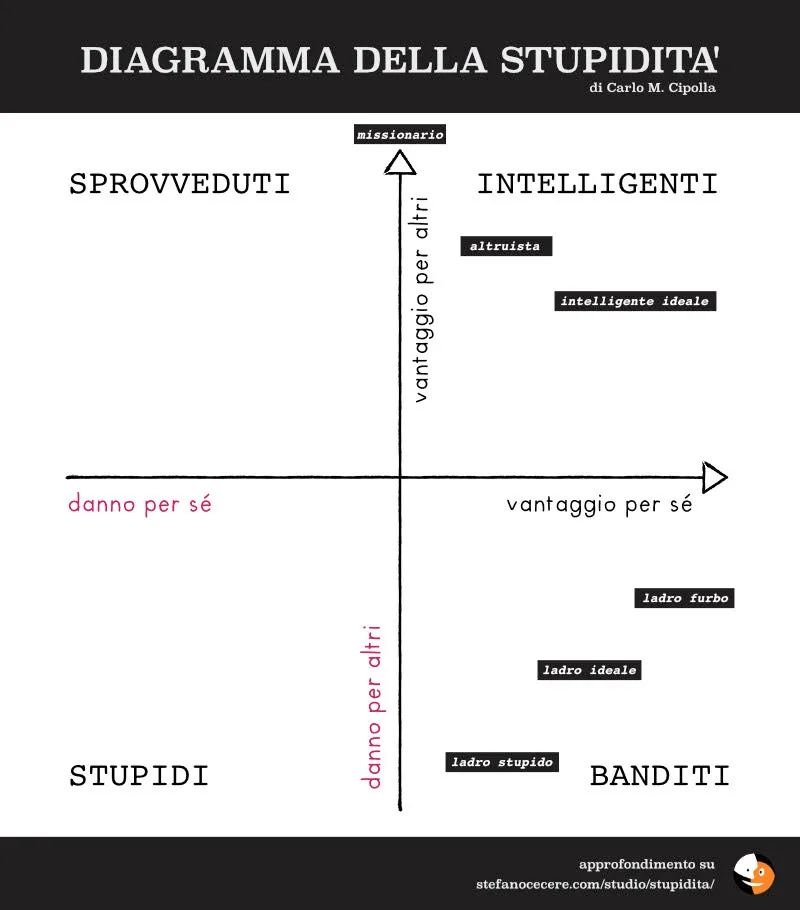

Sommario
🟧 Editoriale: 400!
🟧 La funzione di utilità
🟧 AI utile: per riassumere video
🟧 There is an AI for that
🟧 Una chiacchierata su AI, Educazione e Mondo Attivista
🟧 Errare per sembrare umani
🟧 Inquiry Based Learning e Risorse Idriche
🟧 Le AI semplificano la vita. Anche ai malvagi.
🟧 La dinamica al ribasso
🟧 Tech: Calibre e la biblioteca in tasca
🟧 Eclissi si o no
🟧 Guerre, la mappa geopolitica e la domanda
🟧 2042, ▶️👍🎲😊 e 948
🟧 Gentilezza e indignazione

---

> Se tu potessi chiedere qualsiasi cosa ad un genio 100.000 volte più intelligente di te, cosa chiederesti?

Non parliamo di geni che tutto esaudiscono, ma di enti che tutto conoscono con grande capacità di collegare tutto con tutto e precisione di previsione.
Iniziamo a porci la domanda perché mancano pochi anni. Ed è per questo che siamo qui.

---
## 🟧 Editoriale: 400!
Sono molto emozionato dall’aver superato i 400 iscritti a questa newsletter, è una grande responsabilità, anche perché vi conosco quasi tutti. Per i nuovi arrivati scriverò in coda cosa significa il 2042, il sottotitolo ▶️👍🎲😊 e il 948.

**Oggi gireremo intorno all'utilità.**

Se sei qui forse speri di trovare qualcosa di utile, giusto?

> Forse dietro a qualsiasi azione c'è un calcolo o una speranza o illusione di ottenere benefici?

Se consideriamo la tecnologia, così come il denaro e la comunicazione, come uno strumento, un mezzo (medium) per ottenere altro, per avvicinarci ad un obiettivo, dobbiamo aver chiaro l’obiettivo, o almeno la direzione in cui progredire.

## 🟧 La funzione di utilità
Chi sviluppa videogiochi ha spesso dovuto studiare come dare ai personaggi controllati dal computer una sorta intelligenza per far prendere loro le migliori decisioni di comportamento, per non sembrare meccanici, banali, incoerenti, controproducenti, noiosi. **Per sembrare “umani” o intelligenti (le due cose sono _sempre_ correlate? ;)**

Ci sono diversi metodi e spesso i programmatori e ricercatori partono da semplici analisi del proprio comportamento: **come ragiono io? cosa farei?**

> **La domanda "che fare ora?"** (di [Leniniana memoria](https://it.wikipedia.org/wiki/Che_fare%3F_(Lenin))) ci accompagnerà a lungo nei prossimi anni.

Il primo metodo che si implementa è la **funzione di utilità**:

> date le condizioni dell'ambiente esterno e della mia situazione, quale tra le azioni che mi è permesso fare mi danno il vantaggio, l'utilità, maggiore?

**Definire cosa mi dà vantaggio è già un passo avanti nell'evoluzione dell'umanità**, perché magari ottengo più vantaggio personale se contemporaneamente procuro del vantaggio anche ad altri (che altrimenti potrebbero ritorcersi), oppure una scelta ha effetti nocivi a futuro che sto trascurando (riscaldamento globale? tensioni con il vicinato? solitudine? troppi troppo ricchi e troppi troppo poveri?)

Mi viene da ricordare il celebre diagramma della stupidità di Cipolla, che denota **intelligenti chi trova soluzioni che procurano vantaggi sia a se stessi che agli altri**. (se non avete letto nel numero scorso invito a vedere il [video sulla "teoria della stupidità" di Bonhoeffer](https://2042.substack.com/i/142669579/la-teoria-della-stupidita)

## 🟧 AI utile: per riassumere video
Una delle capacità delle AI attuali è quella di sintetizzare testi. Basta chiedere a [ChatGPT](https://chat.openai.com), [Claude](https://claude.ai), [Gemini](https://gemini.google.com), [Grok](https://grok.x.ai), per citare i servizi più famosi, di riassumere un testo che si passa loro e in pochi secondi arriva il riassunto.

> Ma cosa succede se c'è una conferenza su YouTube che dura due ore e non ho il tempo di seguirla? Oppure diversi documentari ma prima di guardarli vorrei leggerne la sintesi?

Semplice: **basta dire all'AI di trascrivere tutti i dialoghi e poi farne un riassunto**.

Oggi ci sono già dozzine di siti che permettono questa funzione (e tutti si basano sui modelli LLM, Large Language Model, di cui sopra), basta dare loro l’indirizzo di un video.

**Potete provare subito con [https://sumtube.ai](https://sumtube.ai) che lavora con YouTube.**

Ad esempio ho dato in pasto l'[url del video della mia chiacchierata del prossimo paragrafo](https://youtu.be/aQ73tgLdeKI) e questo mi ha restituito:

- Stefano Cecere, esperto di tecnologia, intelligenza artificiale, educazione e attivismo, discute il suo lavoro nel campo tecnologico per 40 anni, concentrandosi sulla tecnologia educativa (EdTech) negli ultimi 15 anni.
- Sviluppa videogiochi educativi e programmi di formazione per insegnanti per l'uso delle tecnologie digitali e dei giochi nell'educazione.
- Stefano sottolinea l'importanza dell'uso della tecnologia per migliorare l'educazione, in particolare per affrontare la carenza di insegnanti e soddisfare le esigenze degli studenti diversificati.
- Evidenzia il ruolo della tecnologia nell'apprendimento personalizzato e come può aiutare gli insegnanti a fornire lezioni e esercizi su misura per ogni studente.
- Menziona l'uso crescente dell'intelligenza artificiale sia da parte degli insegnanti che degli studenti per migliorare le esperienze di apprendimento.
- Enfatizza il potenziale dell'uso di videogiochi e IA nell'educazione per coinvolgere gli studenti e facilitare l'apprendimento in modo più interattivo e personalizzato.
- La discussione si sposta sull'intersezione tra intelligenza artificiale ed educazione, affrontando le critiche e le preoccupazioni comuni sull'impatto dell'IA nel settore educativo.
- Il relatore discute l'impatto dell'intelligenza artificiale sull'educazione, in particolare nell'uso di chatbot come GPT per completare compiti.
- Sottolineano i pericoli delle tecnologie deep fake e del furto d'identità, esortando gli educatori a essere consapevoli di questi problemi e ad insegnare agli studenti come utilizzare responsabilmente gli strumenti IA.
- Il relatore conclude enfatizzando l'importanza dell'uso etico della tecnologia e la necessità di vigilanza nel combattere la disinformazione e il furto d'identità nell'era digitale.

Poi fornisce una trascrizione completa. L'ho usata **anche con video di due ore e mezza**, che avevo già visto, e la qualità del riassunto è buona. YouTube a volte propone già la trascrizione dei video, molto spesso no. Questi strumenti funzionano in tutti i casi.

> NB: avevo programmato un bot per eseguire la chiamata al servizio ad un certo orario, così da ricevere per email la sintesi una volta finita la diretta youtube... ma non è questo il luogo dove spiegare questi automatismi avanzati, penso che al 99% basti inserire a mano l'indirizzo del video.

**Alternative:**
- Altrettanto valido è [https://notegpt.io/youtube-video-summarizer](https://notegpt.io/youtube-video-summarizer)
- Mentre questo strumento trascrive qualsiasi video [https://huggingface.co/spaces/kazuk/youtube-whisper-20](https://huggingface.co/spaces/kazuk/youtube-whisper-20)

##  🟧  There is an AI for that

Gli strumenti AI si moltiplicano e migliorano ogni giorno. Starci dietro è impossibile (e non interessante, almeno per me), ma ci sono siti come questo che aiutano nella ricerca tra le 12.000 ! soluzioni oggi accessibili: [https://theresanaiforthat.com](https://theresanaiforthat.com)

##  🟧 Una chiacchierata su AI, Educazione e Mondo Attivista
> SPOILER: sto scrivendo un manuale su come usare le nuove tecnologie e le AI per l'attivismo sociale. Seguitemi e iscrivetevi a questa newsletter per leggerne l'anteprima!

Con l'amico Gabriele Germani abbiamo già fatto diverse chiacchierate intorno all’Intelligenza Artificiale sul 👉🏼 [suo Podcast di geopolitica](https://podcasters.spotify.com/pod/show/gabriele-germani/episodes/La-grande-imboscata-36-Intervista-a-Stefano-Cecere---Intelligenza-artificiale-e-futuro-cosa-aspettarsi-e24lqtr) o su 👉🏼 [Ottolina TV](https://youtu.be/JQOzztbM7lc).

Settimana scorsa siamo partiti dal mondo dell'educazione per arrivare a quella che è una grande **preoccupazione per il continuo della nostra civiltà: la perdita di fiducia negli altri e in quello che percepiamo**.

Approfondirò anche questo tema nel manuale, intanto se avete 24 minuti:

## 🟧 Errare per sembrare umani
Scrivo su Facebook tutti i giorni (👉🏼 [vi invito a chiedermi l'amicizia](https://www.facebook.com/StefanoCecere)) e un amico mi fece notare un piccolo errore di ortografia in un mio post che corsi a correggere perché sono un po' perfezionista.

Ma poi ho pensato: **quell'errore era l'indicatore che scrivo tutto a mano.**

Sebbene potrei usare le AI per fare tutto, scrivo, suono, programmo, cucino e faccio tutto il resto in modo artigianale. Mi piace farlo.

> E forse questa "umanità" sarà sempre più una caratteristica rara quanto di valore.

Ora sono indeciso se correggere il mio prossimo errore di battitura! :)

PS: ricordo nel 1993 circa, il sequencer musicale Notator Logic introdusse il plugin "**humanize**" che **introduceva un po' di imperfezioni ed errori** nelle tracce musicali altrimenti super perfette quantizzate... forse lì ho iniziato a interrogarmi seriamente sul rapporto uomo-macchina e quanto la pratica di "sporcare" gli output altrimenti perfetti.. non solo di ritmo, ma anche di simmetria, colori, etc... per renderlo più piacevole agli umani....

## 🟧 Inquiry Based Learning e Risorse Idriche

Mai sentito parlare di IBL? In pratica anziché fare grandi discorsi su un tema che magari non interessa, o invitare a leggere / studiare un libro o vedere un documentario, **si propongono scenari con delle sfide da risolvere facendo ricerca, capendo cosa succede e provando diverse soluzioni**... in pratica si diventa un "detective / scienziato" e per progredire nella storia deve studiare / comprendere minimamente il tema dei problemi, e provando le varie soluzioni necessariamente si impara qualcosa.

> Un simpatico esempio è [👉🏼 questo videogioco](https://www.chaostheorygames.com/work/working-with-water), gratuito e online, dove risolvere alcuni problemi di approvvigionamento di acqua potabile per le città.

Un argomento che pochi di noi conoscono, ci scommetterei, con una complessità insospettata. Già alla prima sfida: "la popolazione sta crescendo, serve una nuova fonte di acqua... commissioni un depuratore e sarà pronto fra SEI anni", già ci mette in un'ottica diversa. Poi arrivano le siccità, la manutenzione e tanti altre sfide una dopo l'altra. risolvendole (bastano pochi minuti) comprendiamo il potenziale di un gioco del genere.

Come questo videogioco, ce ne sono molti altri... è uno dei miei ambiti di lavoro e continua ricerca e sperimentazione ad esempio nel sito [https://2042ed.org/played/](https://2042ed.org/played/)

> **POLITICA**: non vi verrebbe voglia di mettere alla prova tutti i futuri amministratori pubblici e politici a giochi del genere? io sì e ne parleremo presto.

## 🟧 Le AI semplificano la vita. Anche ai malvagi.

La fisica contemporanea, quella quantistica, è di una complessità disarmante.

I prossimi computer quantistici sembrano oggetti più magici che fisici (ricordiamo Arthur C. Clarke e “qualsiasi **tecnologia** sufficientemente avanzata **è** indistinguibile dalla **magia”?**)

Ma se c’è una cosa in cui sono brave le AI è l’essere instancabili, veloci, curiose di provare ogni tentativo, fino a raggiungere soluzioni che soddisfano tutti i requisiti di precisione richiesti.

> E se prima ci volevano 100.000 equazioni per risolvere un problema, loro sono riuscite a semplificarlo a sole 4. ([qui è raccontato nei dettagli](https://phys.org/news/2022-09-artificial-intelligence-equation-quantum-physics.html))

Sono impressionanti la velocità con cui si stanno scoprendo nuovi vaccini, nuove famiglie di antibiotici, nuove formule per la fusione nucleare o anche solo soluzioni matematiche.

**I vantaggi sono impressionanti.**

**Ma** se chiediamo loro come superare sistemi di sicurezza, inserire un virus in un’infrastruttura, clonare un sito o un personaggio per ottenere vantaggi personali con la malizia, manipolare l’opinione pubblica.. qui avremo problemi.

Ci sono diversi modi per affrontare questo problema, che, vi assicuro, è peggio che non dare a tutti la possibilità di costruire bombe atomiche in casa: dalla tassazione dei servizi AI al rallentamento dell’open source, dall’educazione diffusa alla pressione politica. Se ne sta parlando apertamente, anzi **dobbiamo parlarne tutti i giorni, perché è una questione urgentissima, più urgente del riscaldamento globale!**

Intanto dobbiamo partire da una consapevolezza dei grandi benefici che le AI portano, e dei grandi rischi che dobbiamo prevenire.

## 🟧 La dinamica al ribasso

Nel film di Barbie c'era anche Barbie Proust, che inizialmente aveva diverse battute, ma durante le proiezioni di pre-valutazione il pubblico non rideva, perché "non conosceva Proust". Ovviamente non essendo un film che doveva educare ma divertire e al massimo far pensare, Barbie Proust è stata tagliata e relegata ad un unico cameo.

Ricordate come [Berlusconi spiegava](https://www.youtube.com/watch?v=zNtI1jdSm1U) cosa pensava del pubblico e di conseguenza la sua tecnica di comunicazione televisiva e politica?

> "uno studio corrente dice che la media del pubblico italiano rappresenta l'evoluzione mentale di un ragazzo che fa la seconda media e che non sta nemmeno seduto tra i primi banchi"

Questa considerazione ha fatto scuola con un conseguenza importante per la nostra società: **non solo il tipo di linguaggio ma proprio il livello dei contenuti si è abbassato sempre più, in una corsa al ribasso in tutti gli ambiti.**

E mentre ci sono personaggi che cercano quotidianamente di portare al grande pubblico contenuti complessi con un linguaggio semplice, in altri casi sembra proprio che ci sia un calcolo, una speculazione, e un desiderio di conservazione, di questo basso livello di evoluzione mentale.

Fa pensare, vero? Stiamo vicini.

## 🟧 Tech: Calibre e la biblioteca in tasca

Negli ultimi 10 anni ho iniziato a convertire e catalogare tutti i 1000 e passa libri su cui ho studiato, da cartaceo in digitale ([👉🏼 qui un piccolo catalogo](https://cecere.xyz/about/libreria/)) per averli sempre a portata ma sopratutto fare ricerche e collegamenti.

Il cuore della catalogazione e gestione è il programma [👉🏼 Calibre](https://calibre-ebook.com/), open source, potentissimo. ogni mese migliora ed è ormai lo stato dell’arte. lo sviluppa un ragazzo indiano che meriterebbe il nobel per la cultura.

COME LEGGERLI: ok ho un Kindle per andare in giro, ma se sono a casa o in studio, il modo migliore è attivare il server integrato a Calibre (cliccando un pulsante “condividi/avvia server”) e lui restituisce un indirizzo web al quale collegarsi da telefonino o tablet e si ha accesso a tutti i libri con un ottimo lettore.

Il bello è che qualsiasi frase evidenziamo ce la ritroviamo poi permanentemente salvata sul computer pronta per essere usata nelle nostre prossime ricerche, post e newsletter come questa!

Al mio server Calibre si potrebbero poi collegare altri amici, ad esempio mio figlio ha alcuni libri che deve leggere. Con una tecnica più avanzata potrei accedere alla biblioteca anche da fuori casa.

## 🟧 Eclissi si o no

Durante l’eclissi dell’8 aprile 2024 girava questa foto straordinaria, che ridimensiona un po’ il nostro stare nell’Universo.

Qualcuno si domandava come fosse possibile vedere il lato oscuro e se non fosse un falso o un fotomontaggio o un elaborazione AI. Allora ho fatto ricerche e la foto è reale ma era stata scattata anni fa con un telescopio e una tecnica di alta risoluzione spettrografica.

A volte **porsi domande sulla veridicità di quello che vediamo è l’unico modo valido**, ecco qui 👉🏼 [l’approfondimento](https://www.snopes.com/fact-check/james-webb-telescope-eclipse/).

## 🟧 Guerre, la mappa geopolitica e la domanda

Questa è la mappa dei 140 paesi (su 193) che nel 2024 riconoscono la Palestina come stato indipendente. Quei 53 che non lo fanno sono conosciuti come “la comunità internazionale”.

NB: Irlanda, Malta, Slovenia e Spagna il 22 marzo hanno dichiarato che sono pronte a riconoscerla, perché è l’”unico modo per raggiungere un equilibrio di pace”.

Quello che è successo stanotte (attacco dell’Iran a Israele, per fortuna senza troppe conseguenze) era purtroppo prevedibile e previsto, e ci potremmo domandare **COSA POSSIAMO FARE PER FERMARE LA GUERRA?**

Io dirò una cosa che non piacerà a tutti: **le persone intelligenti sanno prevedere quello che succederà soprattutto perché conoscono chi hanno davanti e le loro intenzioni.**

Paradossalmente (perché proprio contro il sentire comune, para-doxa) Israele non avrebbe dovuto rispondere con la violenza militare al primo attacco provocatorio di Hamas, figuriamoci con l'estrema violenza che rasenta il genocidio dei Palestinesi, dove per ogni bambino ucciso creerai 2 nuovi terroristi.

> Avrebbe dovuto fare un atto di "gentilezza intelligente" e disinnescare Hamas riempiendo la Palestina di ospedali, scuole, connessioni.

Stessa cosa si poteva fare tra Ucraina e Russia… Come se non avessimo abbastanza problemi economici e ambientali, essere sull’orlo della terza guerra mondiale non è conveniente, almeno non a noi del 99%.

Perché non chiederlo ad una AI cosa fare?

## 🟧 2042, ▶️👍🎲😊 e 948

Il 2042 è una data in cui le Intelligenze Artificiali saranno di gran lunga più avanzate dell’intelligenza umana e oltre quella data non si sa cosa succederà (momento di Singolarità storica).

▶️👍🎲😊 significa Play Well, Die Happy: ovvero giochiamo al meglio la nostra vita, facciamo del nostro meglio, e cerchiamo di morire felici e soddisfatti (ringraziamo la nostra mortalità che ci dà un obiettivo e una fine del gioco, e impariamo cosa ci rende davvero felici… a volte è collegato con la solidarietà).

948 sono le settimane che mancano al 2042. In teoria vorrei inviare una newsletter alla settimana, ma quello che garantisco è che staremo insieme a studiare e discutere a lungo e ne vedremo di belle (poi se sarò ancora qui io me ne andrò in pensione ;)

## 🟧 Gentilezza e indignazione

Se questa newsletter ti è piaciuta, fammelo sapere e iscriviti e fai iscrivere, anche i ragazzi e se non li hai letti, guarda i numeri precedenti su https://2042.substack.com
**Alla prossima, con un numero speciale AI per l’Educazione**