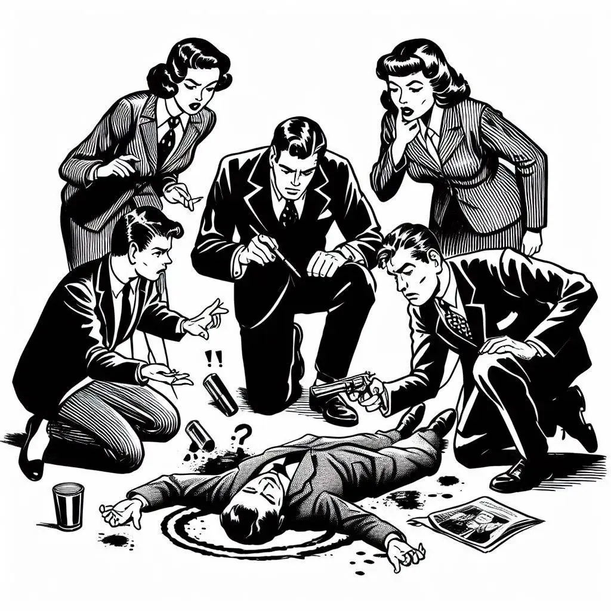

Un celebre investigatore sta cercando il colpevole di un omicidio tra cinque sospettati: Anna, Bruno, Cecilia, Dario ed Enrico.
<!-- more -->
Egli sa che il colpevole mente sempre e gli altri dicono sempre la verità.

- Anna afferma: "Il colpevole è un maschio!"
- Cecilia dice: "È stata Anna oppure è stato Enrico"
- Enrico dice: "Se Bruno è colpevole allora Anna è innocente"

Chi ha commesso l’omicidio?
(A) Anna, (B) Bruno, (C) Cecilia, (D) Dario, (E) Enrico.

_(tratto dai Giochi di Archimede, immagine generata con DALL-E con questo prompt "a black and white drawing of 5 people around a murder, comic like")_

??? warning "Soluzione (cliccare per leggere)"
    Se Cecilia mente, e quindi fosse colpevole, mentirebbe anche Anna e ci sarebbero due colpevoli. Quindi Cecilia dice la verità. Delle due clausole di Cecilia, Enrico dice una verità inconfutabile, quindi non può essere colpevole. Il colpevole quindi è Anna, che infatti mente
