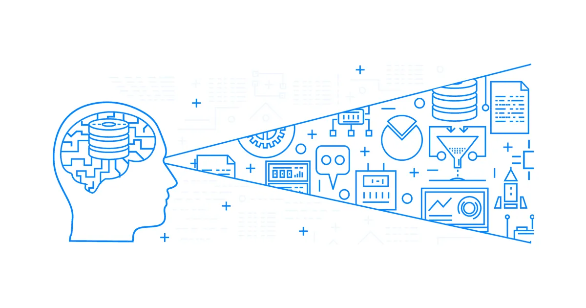

## il passato
Ho sviluppato il primo videogioco 30 anni fa, nel 1989. su un **computer e con un linguaggio che non esistono più**. Magari c'era uno sprite o una procedura che oggi mi farebbero comodo rivederli.

20 anni fa ero ci si alternava al computer di sviluppo per integrare le proprie parti di progetti sviluppate in autonomia.. **mettere tutto insieme era davvero un complicato**!

15 anni fa avevo prodotto una musica, con un **programma che non funziona più sugli attuali computer**, e la nuova versione non apre più il vecchio formato. Per fortuna ho il file audio master.. ma non posso più modificarlo.

10 anni fa avevo sviluppato un progetto Unity 3.0 abbastanza grosso... volevo riaprirlo, ma** il codice C# non è documentato e gli assets non hanno i sorgenti**.

Avevo un bellissimo gioco per Nintendo Wii, Beat the Beat, di 10 anni fa. Non ho più la Wii e non credo potrò giocarlo mai più.  Ma fossi lo sviluppatore: **riuscirei a ricompilarlo**? O è andato perduto? avremmo potuto migliorare lo sviluppo per renderlo compatibile con il futuro?

## il presente

- il tuo progetto sopravviverà fino al 2042? e oltre? 
- oggi non c'è più la tecnologia di 10 anni fa.. figuriamoci di 30 .. e cosa succede fra 10 o 20 anni?

Siamo in due a lavorare ad un gioco ma sta crescendo velocemetne e piace.. nel giro di due mesi diventiamo in 7 e poi in 12
- come lavorare e collaborare meglio?
- come far si che ad ogni nuova entrata non si perde un mese di formazione e inizializzatione e tutti possano lavorare bene fin da subito?

Stiamo sviluppando un gioco e abbiamo dei modelli di riferimento:
- come hanno creato quell'Intelligenza Artificiale?
- come hanno bilanciato quel livello?
- come hanno scritto una tale sceneggiatura ipertestuale complessa?
- come hanno fatto quello shader?
- come ricreare quelle luci?
- come riggare quel modello per ottenere quel risultato?
- bellissima musica o suono... c'è la partitura? come è stato sintetizzato?

Conveniamo che oggi i "dietro le quinte" sono degli ottimi momenti per imparare, tra la teoria e la pratica. vedere e capire i segreti del mestiere è fondamentale.  
ma se nessuno condividesse nulla, o fosse accessibile solo pagando salato, la conoscenza rimarrebbe in mano di pochi e i progressi relegati a pochi.

per fortuna non è più così.  
benvenuti nel 2019 e prepariamoci al 2042.  
