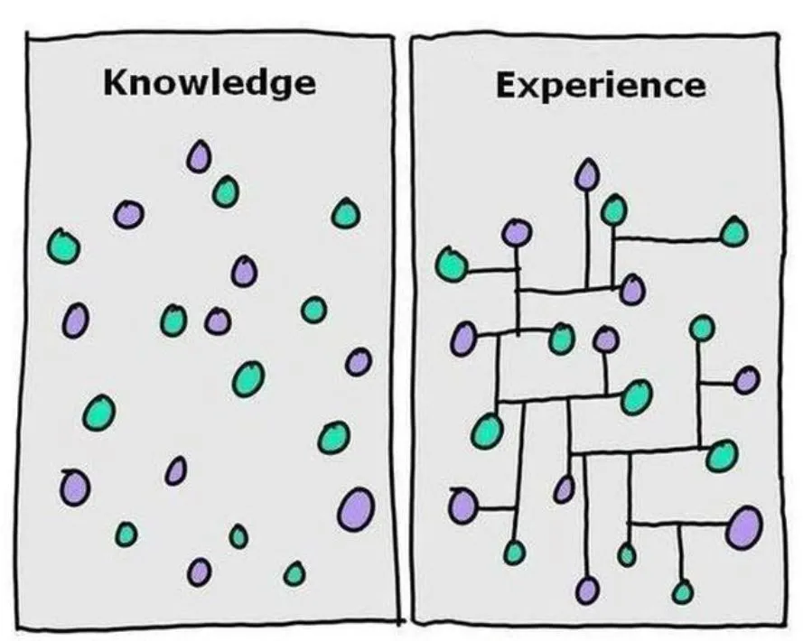
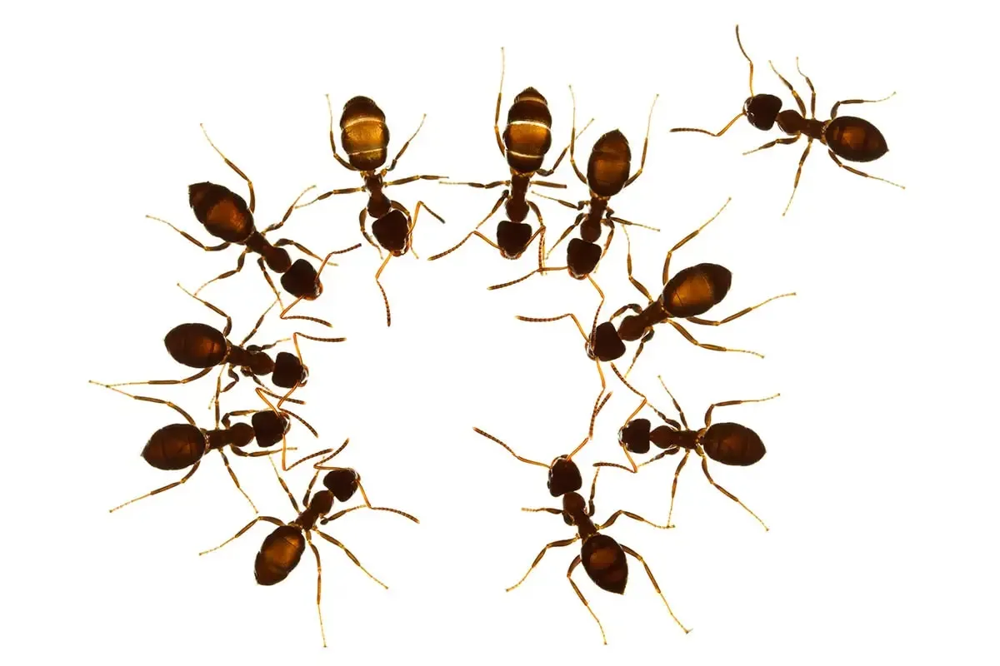
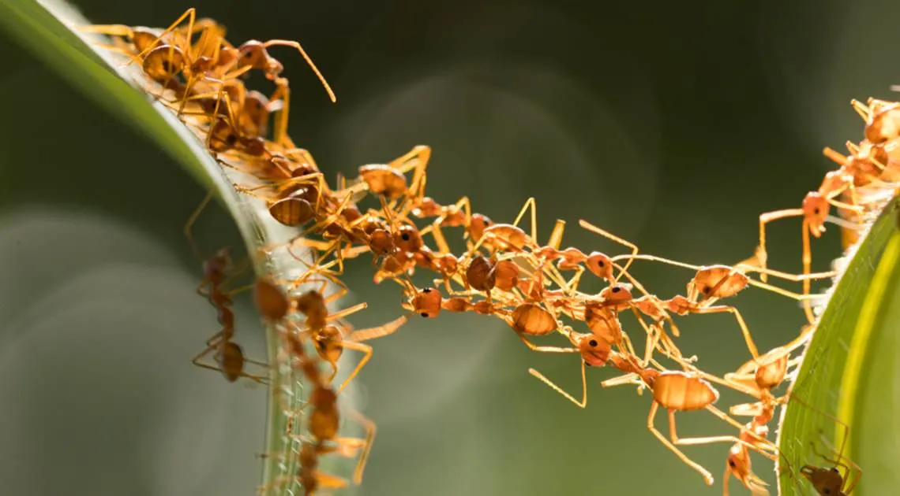

# Contesto Esistenziale

# Capre

# Connessioni
<!-- slide data-notes="neuroni + albo alunni: nesso?"-->

# la costruzione della memoria
<https://www.youtube.com/watch?v=hb7tjqhfDus>

# giocatori
<!-- slide data-notes="giocatori e i loro cervelli, esperienze si costruiscono con la multisensorialità e ripetizione" -->

<!-- slide data-notes="giocatori e i loro cervelli, esperienze si costruiscono con la multisensorialità e ripetizione" -->

<!-- slide data-notes="videogiochi sono media mutidisciplinari: gli strument perfetti" -->

# lavorare insieme non è facile
<!-- slide data-notes="per forza devono essere svilupti in tanti a difficoltà a lavoare insime"-->
<!-- ### progetti di gruppo -->

<!-- slide data-notes="serve un'immagine coerente, ma sopratutto una sua utilità esperienziale" -->

# Intelligenza Collettiva

# spaceX
SpaceX: lavoraotori.. sono in missione, che va al di la del prestigio personale o dei soldi, o del nerdame: aituare l'umanità

# Ikigai
<!-- slide data-notes="" -->

<!-- slide data-notes="" -->
serve un IKIGAI personale

<!-- slide data-notes="" -->
e un mito sociale

# cosa sono i miti?
possono essere storie che traghettano i popoli in difficoltà

una storia condivisa che dia l'energia per preoccuparsi del progetto comune, prima che del proprio Io. 

# azione individuale e collettiva
il rischio è che tutti facciano il meglio per sè, e il minimo per il progetto.

# diagramma stupidità

# comportamento emergente

si mettono regole e procedure  

# reti organizzate +  tecnologie sociali 

# human centric

# formiche

