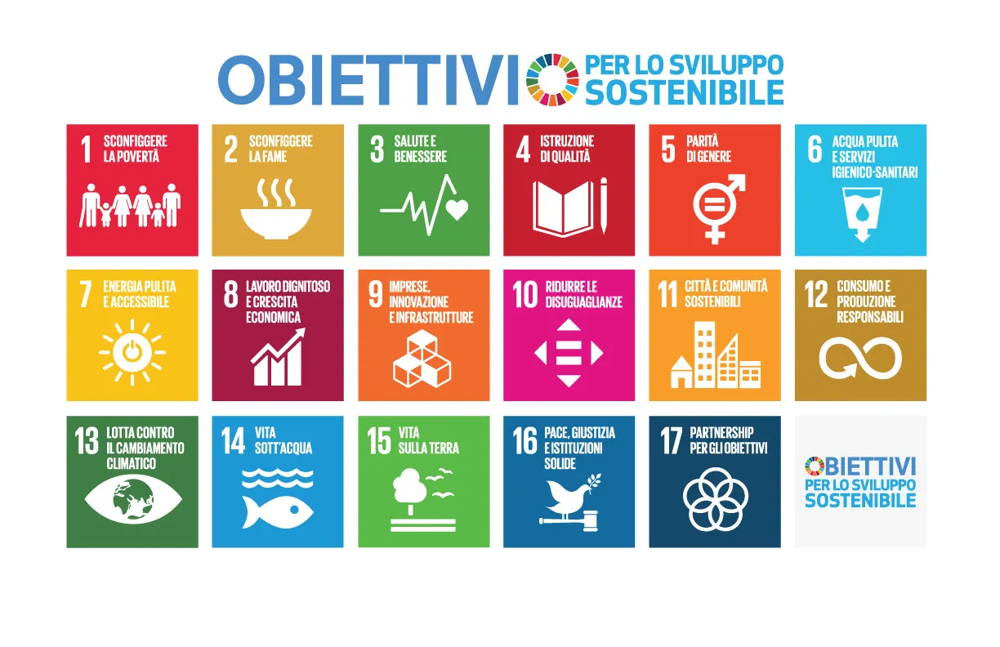
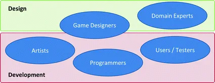
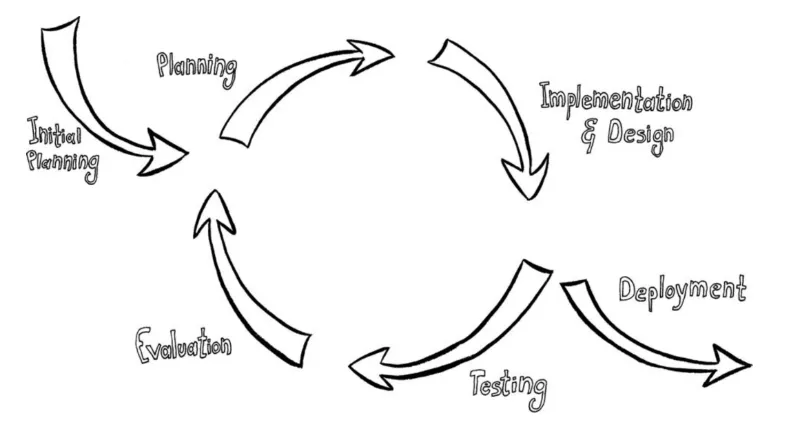
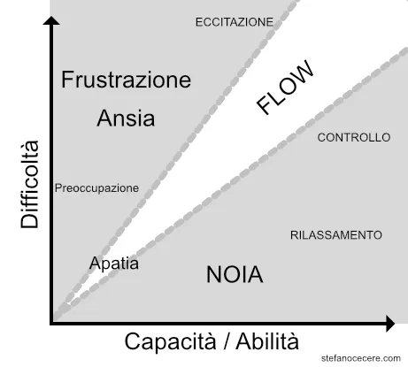
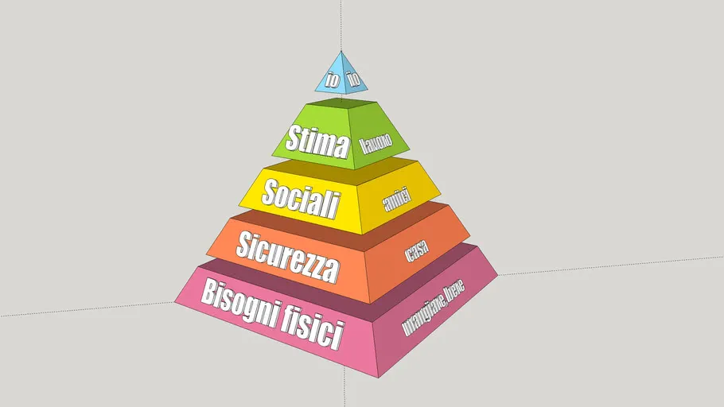
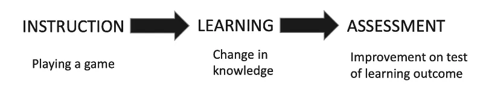

Ci interessa imparare a creare:
> giochi o esperienze ludiche con un effetto positivo intenzionale e misurabile

## Motivazione Instrinseca
Ogni gioco è un'esperienza progettata per altri giocatori.

Ogni esperienza che progettiamo e sviluppiamo ha necessariamente le nostre caratteristiche mentali, la nostra *firma*.

Un'esperienza è il risultato della combinazione di materiali, immaginazione, narrativa, meccaniche, tecnologia, estetica. E' il risultato dell'interazione umana con il mondo intorno.

Affinchè un'esperienza sia significativa per qualcun altro, deve esprimere un valore, presentare qualcosa di importante che ecciti, sorprenda, confronti qualcosa dentro la mente degli altri.

Dewey suggerisce che le esperienze nascono dall'interazione di due principi: continuità ed interazione.

**Continuità**: l'impatto di una esperienza dipende sia dalle esperienze precedenti che dalla qualità delle seguenti.

**Interazione**: il giocatore è parte attiva.

attraverso l'esperienza i giocatori hanno l'opportunità di osservare, sperimentare e riflettere sulle proprie azioni

## Esperienze coinvolgenti

Se cerchiamo di ricordare quali sono state le attività che ci hanno coinvolto di più e che ci hanno aiutato ad imparare, converremmo che ci hanno fatto partecipare, investigare, sperimentare, risolvere problemi, essere curiosi, prendere decisioni ed essere creativi.

La cultura personale è fondamentale per vivere un'esperienza, e tutti noi abbiamo diverse culture.

## Progettazione
Alcuni punti e passi su come iniziare:

### Purpouse
Cosa voglio ottenere?

#### Tematiche e Obiettivi
Le Nazioni Unite hanno definito lo Sviluppo Sostenibile quello che è richiesto oggi ma senza compromettere le generazioni future.

> Domanda: che tipo di esperienza vorresti far vivere al tuo giocatore? C'è qualche valore particolare che ti interessa promuovere?

### Audience
ricordiamoci che spesso non siamo noi il target!
trovare un focus group per discutere il profetto

### Metodologia e genere
- Simulazione
- GBL
- Gamification
- XR

e quindi che genere di gioco?

### Il "driver"
- focalizzarsi più sulle meccaniche che sul tema
- tema e meccaniche sono separate
- il tema attrae all'inizio, ma l'engagement è nelle meccaniche

### ROE (Return on Engagement)

### Domain Expert
che aiuti ad allineare i goal didattici ai livelli di gioco

### Factbook
E' importante bassarsi sui fatti, non sulle opinioni.
Cerchiamo di vedere il mondo per quello che è e non per quello che pensiamo o crediamo che sia.
Fare riferimento ai dati, possibilmente Open Data.
Vedi [libro](https://www.amazon.it/Factfulness-ragioni-capiamo-mondo-pensiamo/dp/8817099635)

### Sviluppo Iterativo
**Iterative Development**: The framework proposes an iterative and incremental approach to game design and development, consisting of three main phases: concept design, game design, and game development.

**Interdisciplinary Teamwork**: The framework suggests an interdisciplinary approach in which all team members, not just the designers, participate in every aspect of the development process and learn from each others field of expertise

## Caratteristiche di un buon gioco
- sfide continue
	- short term goals
	- sfide calibrate sul giocatore
	- conoscere i giocatori e le loro motivazioni
	- calibrare le sfide a specifici obiettivi didattici
- interessante sviluppo della storia
- flessibilità nell'ottenere risultati con effetti multipli
	- incoraggiare la collaborazione
	- permettere di scegliere il proprio path
- rewards utili, immediati e consistenti
	- rewards per incoraggiare
	- badges e achievements
	- sblocchi progressivi di features, livelli e strumenti
- uniscono il divertimento all'imparare
	- la fun deve essere una metrica!
	- non replicare il realismo, siamo in simulazione
	- un gioco non è per tutti, focalizziamo
	- esagerare le reazioni, non è la vita vera, altrimenti è una simulazione

## Flow

## Sfide & Difficulty

- non devono essere banali
- necessitano uno sforzo ragionabile e misurabile per essere risolti
- devono essere adattate alle capacità e interessi del giocatore, perché non tutti imparano allo stesso modo né hanno gli stessi interessi.
- devono dare la sensazione di progressione
- presentarle in diversi livelli e modalità, una componente alla volta.
- anche se generati dinamicamente, devono avere una coerenza di meccanica e di risoluzione
- devono essere presentati chiaramente
- devono permettere al giocatore di sperimentare liberamente
- potrebbero offrire opzioni e soluzioni alternative
- bisogna calibrare bene la crescita di difficoltà
- i buoni puzzles hanno un senso nel contesto del gioco
- la challenge è sia nel gameplay che nell'imparare
- dare tempi di riflessione e pause nel tempo
- ogni successo porta ad un livello successivo
- niente va per linee rette, curve.
- play test è fondamentale

## Personalizzazione e Adattamento
ability to make appropriate responses to changed or changing circumstances

- Procedural and adaptive level and content generation
- Adaptive behavior of agents
- Adaptive and interactive storytelling
- Guidance, hinting
- Motivational interventions
- Adaptive presentation
- Adaptive curriculum sequencing

## Framework

## Design Learning Experiences

### Learner Engagement
La cosa più importante è la _Learner Engagement_: vogliamo che il giocatore sia motivato, che sia felice, di imparare.

### Imparare
Cosa vuole dire *imparare*?

Imparare è un **processo** di acquisizione e ricostruzione di conoscenze che ci portano ad un cambiamento interiore, cambiamento in conoscenza, capacità, valori, comportamento, consapevolezza.

E' un processo **personale**

E' un'attività continuativa e quotidiana

Non c'è un solo modo di imparare

> Cosa è l'**educazione**?   
> L'arte di facilitare l'apprendimento.

Le tre vie per imparare:
1. **formale**
in un ambiente strutturato con obiettivi didattici e procedure per far imparare gli studenti

2. **informale**
ambiente non organizzato, si impara dall'ambiente diffuso, affrontando le varie situazioni

3. **non-formale**
situazioni didattiche non ordinarie, organizzate con obiettivi didattici. Varie metodologie costruite sull'interesse dello studente.

I videogiochi presentano tutte e tre le forme.

### Come si sviluppa
1. si sviluppa quando c’è coinvolgimento nel risolvere problemi *reali* del mondo
2. quando quello che si conosce diventa la base (*foundation*) per nuove conoscenze
3. quando si dimostra l’efficacia delle nuove conoscenze allo studente
4. quando le nuove conoscenze sono applicate dallo studente
5. quando le nuove conoscenze vengono integrate nel mondo dello studente

### motivazioni per imparare

motivazione **instrinseca**

motivazione **estrinseca**

i videogiochi possono essere esperienze motivanti sia instrinseche che estrinseche

### Forme di conoscenza

> La Conoscenza è Potere (Francis Bacon)

Riuscireste a vivere bene senza conoscenza?

1. Conoscenza **Cognitiva**, fatti, pattern, concetti che ci aiutano a sviluppare capacità intellettuali
3. Conoscenza **Affettiva** o Intelligenza Emotiva, come ci comportiamo con gli altri e gestiamo i **sentimenti**
5. Conoscenza Psicomotoria, movimento e coordinazione
  
## GBL

### Principi
- Un **ambiente sicuro** da esplorare e in cui **commettere errori**
- Imparare attraverso il divertimento
- Apprendimento contestualizzato, orientato all'obiettivo anziché astratto
- Apprendimento esperienziale: imparare facendo
- Motivazione intrinseca: il gioco è volontario e autonomo
- Responsabilità e feedback senza interruzioni
- Contenuti appropriati ad Età e cultura 

### Meccanismi
- Un'ambientazione immaginaria o reale
- Livelli di difficoltà progressivi e sfide adeguate
- Feedback immediato e costruttivo
- Un ambito sociale che permette alle persone di condividere esperienze e costruire legami
- Obiettivi, regole, risultati misurabili e ricompense chiari e realizzabili

### Come si impara

### DGBL approach

- introduction to videogame (+ tutor: tech + expectations)
- gameplay / experience (autonomo)
- game results / scores (autonomo)
- debrief: reflection / analysis (+ tutor)
- forming abstract concepts + real world application

### Assessment
Using games for assessment is more than games scores.  
Assessment happens around a game more often than it happens inside the game, and teachers/coaches must still design and provide authentic, useful assessment tasks for students.

### Opzioni di Sviluppo

- Use entertainment/commercial games (Assassin's Creed / Civilization)
- Modify entertainment games (Kerbal Space Academy)
- Use virtual worlds (Minecraft)
- Use educational games (MinecraftEdu)
- Create games (Antura)

### Modello di gioco

### Objectives of learning analytics

### GBL challenges
**Curriculum**: identify how a certain game can connect to the curriculum. 

**Game related**: identify the accuracy and appropriateness of the content of the game. Irrelevant or distracting content from the game that could not be removed.

**Attitudes**: persuading all stakeholders and non-players about the educational value of the game.

**Educators and Teachers support**: make them aware of how to use games more effectively in education.

**Assessment**: Traditional assessments do not often align with GBL, so new models and approaches must be considered.

**Developers** encourage and support game developers in the creation of better educational games

## Cognitive skills Glossary 

### Attention
#### Focused Attention
The ability to focus attention on a single stimulus
#### Divided Attention
The ability to execute more than one action at a time, while paying attention to a few channels of information.
#### Inhibition
The ability to ignore irrelevant stimuli or suppress irrelevant reactions while performing a task.
#### Updating
The ability to respond in a flexible and adaptive manner in order to keep up with the changes in the environment.

### Memory
#### Short-Term Memory
The ability to hold a small amount of information in a readily, available state for a short period of time.
#### Naming
The ability to retrieve a word from our semantic lexicon and is considered to be a basic ability.
#### Working Memory
Refers to the temporary storage and manipulation of the information necessary for complex cognitive tasks.
#### Contextual Memory
The conscious recall of the source and circumstances of a specific memory.
#### Visual Short-Term Memory
The ability to temporarily retain a small amount of visual information.
#### Non-verbal Memory
The ability to store and retrieve information which are non-verbal by nature.
#### Phonological Short-term Memory
The ability to remember phonological information over a brief period of time.

### Sensation and Perception
#### Auditory perception
Auditory Perception is the ability to perceive and understand the difference between sounds.
#### Visual Perception
The ability to interpret information from the effects of visible light reaching the eye.
#### Spatial Perception
The ability to evaluate how things are arranged in space, and investigate their relations in the environment.
#### Visual Scanning
The ability to actively find relevant information in our surroundings quickly and efficiently.
#### Estimation
The ability to estimate an object's future location based on its current speed and distance.
#### Width of Field of View
Corresponds to amount of information we receive from around when looking straight ahead.
#### Recognition
The ability to retrieve information from the past and to recognize certain events, places or other information.

### Reasoning and Comprehension
#### Processing Speed
Involves the ability to fluently perform easy or over-learned tasks.
#### Planning
The ability to "think ahead", to mentally anticipate the correct way to execute a task.
#### Shifting
Ability to adapt behavior and thoughts to new, changing, or unexpected circumstances

### Coordination
#### Hand-eye Coordination
The level of sensitivity with which the hand and eye are synchronized.
#### Response Time
The ability to perceive and process a simple stimulus and respond to it.

## 36 Learning principles in Videogames
| | |
|---|---|
|1. Active, Critical Learning Principle |_All aspects of the the learning environment are set up to encourage active and critical, not passive, learning_|
|2. Design Principle | _Appreciating good design_ |
|3. Semiotic Principle  | _Seeing interrelations within and across multiple sign systems (images, words, actions, symbols, artifacts, etc.) as a complex system is core to the learning experience_ |
|4. Semiotic Domains Principle | _Mastering game languages and participation in the affinity groups connected to them_ |
|5. Metalevel Thinking About Semiotic Domains Principle | _Relating the game world to other worlds_|
|6. "Psychosocial Moratorium" Principle | _Taking risks with reduced consequences_|
|7. Committed Learning Principle | _Putting out effort because they care_|
|8. Identity Principle | _Combining multiple identities_|
|9. Self-Knowledge Principle | _Watching their own behaviour and their current and potential capacities_|
|10. Amplification Of Input Principle | _For a little input, learners get a lot of output_|
|11. Achievement Principle | _intrinsic rewards from the beginning, customised to each learner's level, effort, and growing mastery and signaling the learner's ongoing achievements_|
|12. Practice Principle | _Being encouraged to practice in a context where the practice is not boring_|
|13. Ongoing Learning Principle | _Having to master new skills at each level, with cycles of new learning, automatization, undoing automatization, and new re-organized automatization_|
|14. "Regime Of Competence" Principle | _Tasks being neither too easy nor too hard._|
|15. Probing Principle | _Learning is a cycle of probing the world (doing something); reflecting in and on this action and, on this basis, forming a hypothesis; reprobing the world to test this hypothesis; and then accepting or rethinking the hypothesis_|
|16. Multiple Routes Principle | _There are multiple ways to make progress or move ahead. This allows learners to make choices, rely on their own strengths and styles of learning and problem-solving, while also exploring alternative styles_|
|17. Situated Meaning Principle | _Discovering meaning of signs (words, actions, objects, artifacts, symbols, texts, etc.) situated in embodied experience_|
|18. Text Principle | _Texts are not understood purely verbally but are understood in terms of embodied experience_|
|19. Intertextual Principle | _Relating information_|
|20. Multimodal Principle | _Meshing information from multiple media (images, texts, symbols, interactions, abstract design, sound, etc.), not just words_|
|21. "Material Intelligence" Principle | _Understanding how knowledge is stored in material objects and the environment_|
|22. Intuitive Knowledge Principle | _Intuitive or tacit knowledge built up in repeated practice and experience. Not just verbal and conscious knowledge is rewarded_|
|23. Subset Principle | _Practicing in a simplified setting_|
|24. Incremental Principle | _Being led from easy problems to harder ones_ |
|25. Concentrated Sample Principle | _Mastering upfront things needed later_ |
|26. Bottom-Up Basic Skills Principle | _Repeating basic skills in many games_ |
|27. Explicit Information On-Demand Just-In-Time Principle | _Receiving information just when it is needed_ |
|28. Discovery Principle | _Experiments and Trying rather than following instructions_ |
|29. Transfer Principle | _Applying learning from problems to later ones_ |
|30. Cultural Models About The World Principle | _Thinking about the game and the real world_ |
|31. Cultural Models About Learning Principle | _Thinking about the game and how they learn_ |
|32. Cultural Models About Semiotic Domains | _Thinking about the games and their culture_ |
|33. Distributed Principle | _Meaning/knowledge is distributed across the learner, objects, tools, symbols, technologies, and the environment_ |
|34. Dispersed Principle | _Sharing knowledge with others outside the domain/game_ |
|35. Affinity Group Principle | _Being part of the gaming world and affinity groups bonded by the game and not shared race, gender, nation, ethnicity, or culture_ |
|36. Insider Principle | _Helping others and modifying games, in addition to just playing_ |
