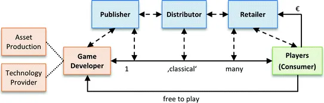
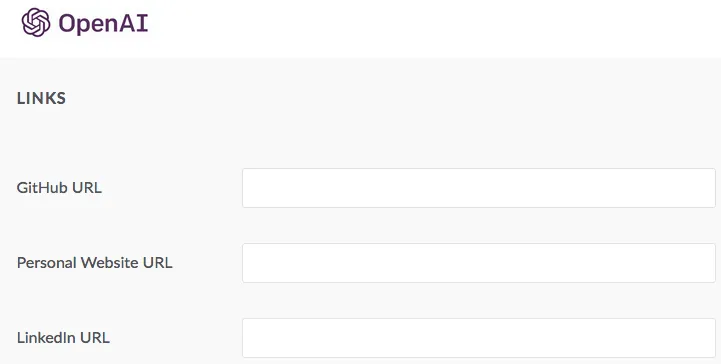

## Considerazioni
- trovarsi una nicchia (tematica o tecnologica)
- come applicarsi ai bandi
- dove trovare l'expert e la valutazione scientifica
- come fare i field test
- gestione del (poco) budget

## Analisi di mercato
- Per chi stiamo sviluppando?
- Quanto è ampio il gruppo target e il potenziale di vendita?
- Che tipo di atteggiamenti e convinzioni ha il gruppo target?
- Chi sono i nostri concorrenti e quali sono i loro principali punti di forza?
- Con quali mezzi possiamo comunicare al meglio il nostro prodotto al gruppo target?

Un problema significativo affrontato da tutti gli attori in questo settore è la mancanza di editori/distributori nel settore e di specialisti.

## Different Business Model

Modello **classico**  

Modello **applied**  

## Finanziamento
Oltre ai classici distributori e self publisher, qui c’è la possibilità di lavorare con

- Fondazioni private e pubbliche
- Organizzazioni Non Goverative (ONG) e No Profit
- Università
- Individui
- Governi
- Imprese private
- Publishers
- autofinanziamento (Kickstarter)

## Temi legali
Etnia, Gender, Data Protection e Privacy

## Team
Imparare a lavorare in gruppo è la cosa più difficile ma anche la più importante.

Servono
- comunicazione diretta e nonviolenta
- obiettivi chiari 
- bisogni espliciti
- volontà di imparare e migliorarsi
- non praticare il giudizio
- consapevolezza dei propri limiti

## Lavorare
- Dipendente
- Libero Professionista
- Startup

## Farsi trovare
necessità di avere una presenza web con i propri temi, interessi e capacità.

tranquilli, ti troviamo noi

