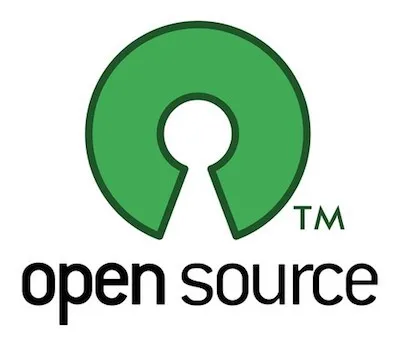

## Si può forse brevettare il sole?
-  "A chi appartiene il brevetto?"
- "Direi alla gente. Non esiste un brevetto. Si può forse brevettare il sole?"
*risposta di Salk al brevetto sul vaccino antipolio, 1952*

e così tutt'ora molto del nostro mondo è costruito su tecnologie e convenzioni aperte patrimonio dell'umanità:
- Internet (TCP/IP e protocolli) + Apache
- Firefox -> Chromium
- LibreOffice / OpenOffice
- le batterie della Tesla
- il PDF
- Blender
- Midi
- ISO e tutti gli standard industriali

## Open Source

Il termine "Open Source" si riferisce a prodotti progettati per essere pubblici e accessibili affinché tutti possano usarli, modificarli e condividerli liberamente.

I progetti OpenSource richiedono una collaborazione aperta, una buona comunicazione pubblica e un'adeguata qualità generale.

Collaborare pubblicamente su un progetto implica:
- più occhi e più mani
- accessibilità
- diffusione

Inoltre si possono usare progetti preesistenti per non dover reinventare tutto, sopratutto i bricks (mattoni) di base, spesso i più complessi, le famose **librerie** o **packages**, oggi tanto integrate in ogni ambiente di sviluppo.

É inoltre gratificante migliorare un progetto comune, dove altri costruiscono partendo da dove siamo arrivati noi.

in un progetto Open si dà molto, è forse un po' più faticoso, ma si riceve ancora di più

## Pros
- gratuito. raramente ci sono licenze
- facile da installare e maneggiare
- sviluppo in tempo reale
- indipendenza
- si modifica il necessario
- competitività
- è divertente
- crea Open Standards
- le università, i centri di ricerca e gli indie lavorano qui
- grande scelta

## Cons
- non sempre user-friendly
- mancanza di supporto garantito
- necessita studio
- può essere complesso
- facilità di progetti abbandonati
- non sempre c'è qualità
- non c'è guadagno monetario diretto
- segmentazioni delle comunità

## Considerazioni sull'Open Source
- una filosofia, più che una pratica
- storia: anni 90, Linux il primo grandissimo progetto OpenSource (il cui creatore inventò Git per migliorare lo sviluppo collaborativo), big companies oggi lo adottano (Facebook, Google, Microsoft, Oracle), ROI (Return Of Investment)
- intelligenza collettiva: in tanti possono partecipare e mettere il meglio di se in modalità open e meritocratica
- feedback in tempo reale con gli utenti
- possibilità di lavoro (manutenzione, customizzazione, velocità)
- il progetto sopravvive al nostro tempo e interesse. qualcun altro potrà portarlo avanti
- aprire i propri cassetti di idee e pubblicare. male non fa
- Game Jams sono i migliori eventi dove il prodotto deve essere rilasciato OpenSource. più del prodotto in sé è interessante il come è stato fatto, con chi e le referenze a futuro (portfolio)

## Resources
- <https://opensource.org/osd>
- Contributing to Open Source for the first time
https://www.youtube.com/watch?v=c6b6B9oN4Vg