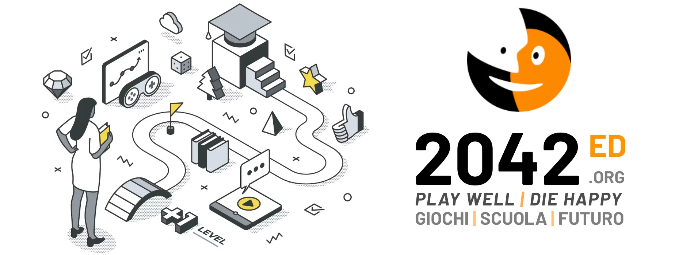

_Benvenuti in questo spazio opensource e un po' familiare nell'intersezione tra il gioco, l'educazione e il futuro. Per genitori, educatori, sviluppatori, giocatori._

## Novità

- [2023-05-22: Introduzione alla AI creativa](scuola/talk/generative-ai-intro.md)
- [2023-04-25: Presentazione sul Creare un Videogioco](scuola/talk/creare-un-videogioco.md)
- [2023-02-05: Leggete la storia del gioco di carte creato dai ragazzi](2042/jam/arkombat.md)

## PLAY: per educatori, genitori e giocatori

- :fontawesome-solid-book: [Inizia qui](ask/index.md)  
*puoi chiedere qualsiasi cosa*  
- :fontawesome-solid-book: [Giochi](played/index.md)  
*guida ai giochi e cose intelligenti*  
- :fontawesome-solid-book: [Ludosofia](scuola/ludosofia/index.md)  
*manuale al giocare bene insieme*  
- :fontawesome-solid-book: [Laboratori e Attività](2042/index.md)  
*laboratori per imparare creando*  
- :fontawesome-solid-book: [Ricerca per Tag](played/tags.md)  
*se non sai cosa vuoi cercare*  

## DEV: per sviluppatori e ricercatori

- :fontawesome-solid-book: [Intelligenza Collettiva e Sviluppo Distribuito](scuola/game-dev/ci/index.md)  
*da Git all'Immortalità* 
- :fontawesome-solid-book: [Extended Reality](scuola/game-dev/xr/index.md)  
*XR = AR + VR + MR: le nuove tecnologie immersive*  
- :fontawesome-solid-book: [Game A.I.](scuola/game-dev/ai/index.md)  
*Intelligenza Artificiale nei Videogiochi*
- :fontawesome-solid-book: [Human Games](scuola/game-dev/g4c/index.md)  
*Games 4 Change e Business oltre l’Entertainment*  

## Changelog (ultimi aggiornamenti)

### <small>13 Dicembre 2022</small>
- finalmente con un po' di sprint mi ci metto e metto insieme questo sito. E' in _alpha_ ma meglio che niente.

## Per rimanere aggiornati

- :fontawesome-brands-telegram: **[Canale Telegram](https://t.me/ed2042)**  
- :fontawesome-brands-whatsapp: **[Canale WhatsApp](https://chat.whatsapp.com/CjWcksEAFHZKG9Edahs2yO)**  
- :fontawesome-solid-envelope-open-text: **[Newsletter mensile](https://tinyletter.com/2042ed)**  
- :fontawesome-brands-facebook: **[Facebook](https://facebook.com/2042ed)**  

---

_Play Well, Die Happy!_
