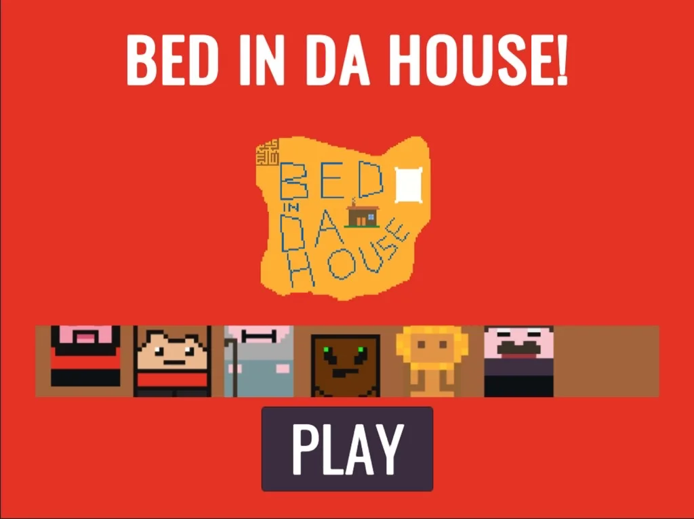
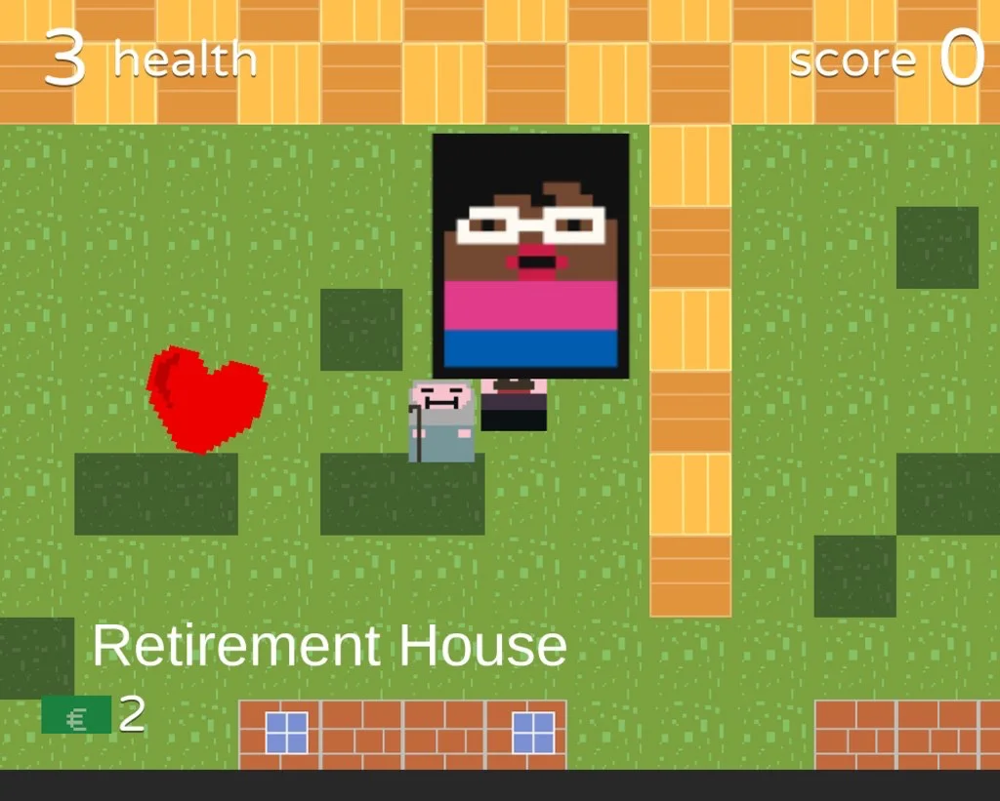
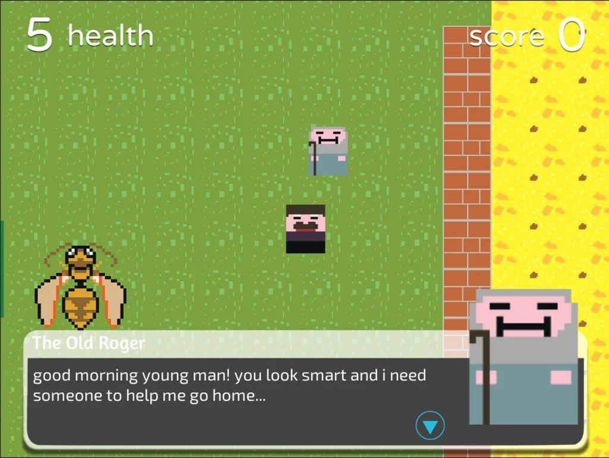
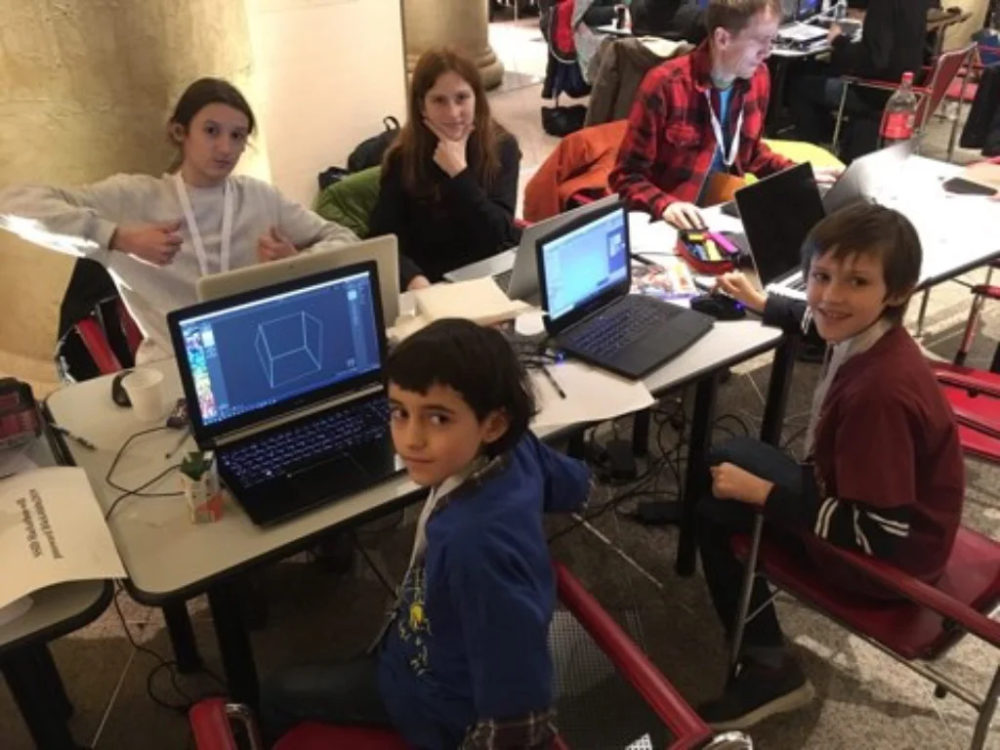
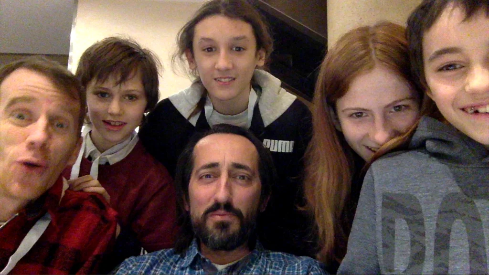

A game **designed and developed by kids and teens** at the [Global Game Jam 2019](https://globalgamejam.org/2019/games/bed-da-house), with the theme _"What home means to you"_.

The team (from 10 to 14yo) worked in Rome (at the [Adriano's Temple Jam](https://globalgamejam.org/2019/jam-sites/roma-codemotion-temple-jam)), with the help of their tutors.

They used open-source technologies ([Unity Playground](https://github.com/Unity-Technologies/UnityPlayground) - thanks [Ciro Continisio](https://twitter.com/CiroContns) - and [Fungus framework](https://github.com/snozbot/fungus)), learning **tile maps** and drawing in [MagicaVoxel](http://ephtracy.github.io/), writing and acting the dialogues, playing the music and having lots of fun designing levels, characters and puzzles.

See official page of the game here: <https://globalgamejam.org/2019/games/bed-da-house>

## Play
To play the game directly in the browser:
<https://jamurr.itch.io/bed-in-da-house>

## Video Trailer
To showcase the game at the jam we recorded this short video:

<https://www.youtube.com/watch?v=s28Vm8gWLDg>

## Some Photos

## Requirements
The game runs almost everywhere, it's a simple Unity 2018.3 project.  
The GitHub project is <https://github.com/2042ed/JAM.BedInDaHouse>

## Team
Team 4+2 are
- Ruben Aicardi (teen)
- Fabio Cecere (kid)
- Enea Polsinelli (kid)
- Maia Polsinelli (teen)
- Francesco Bernardini (kid, special guest)
- [Pietro Polsinelli](https://github.com/ppolsinelli/) (tutor)
- [Stefano Cecere](https://github.com/StefanoCecere/) (tutor)

## License
<http://creativecommons.org/licenses/by-nc-sa/4.0/>