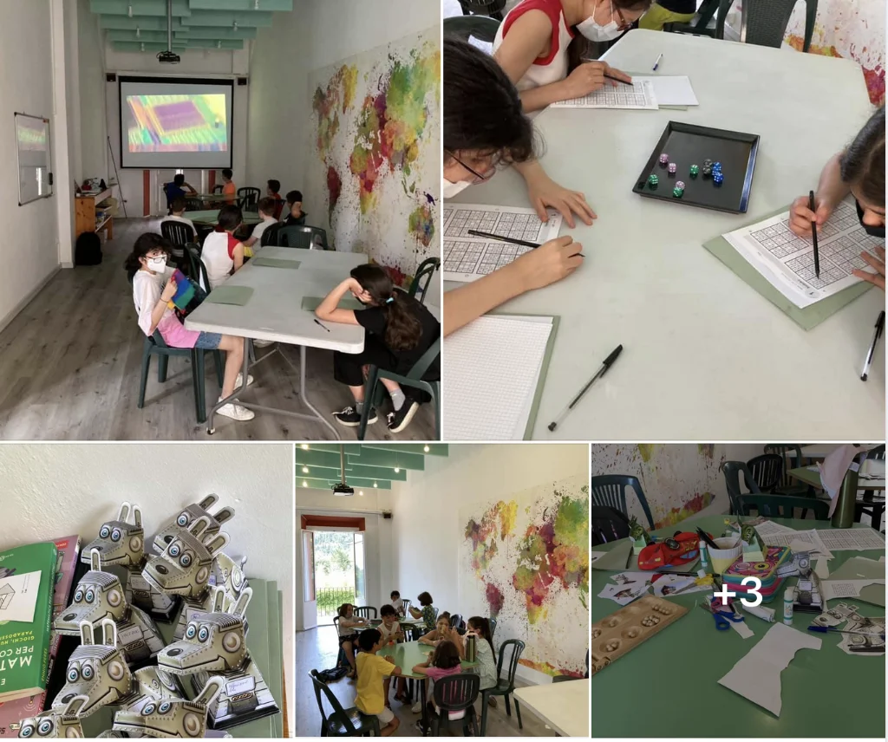
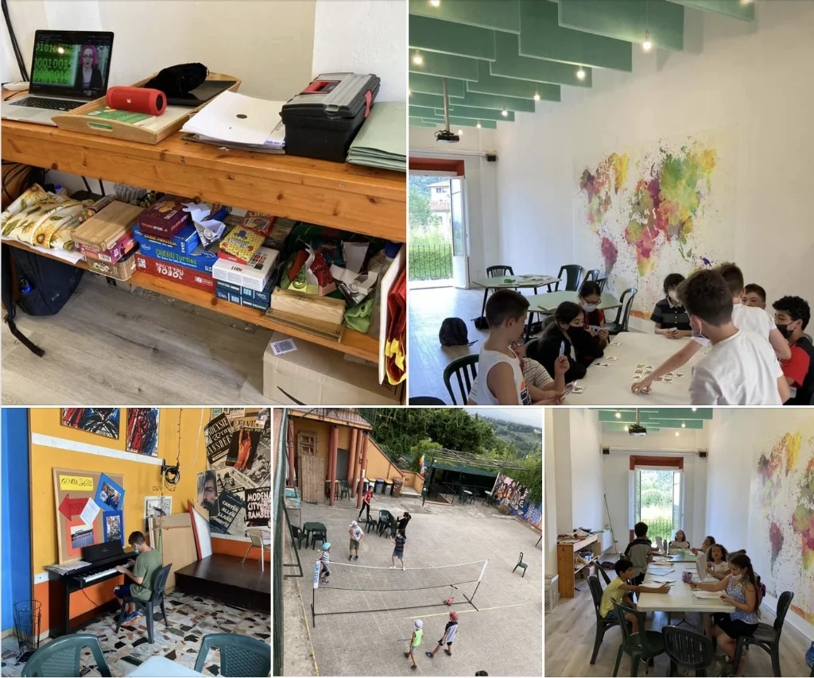
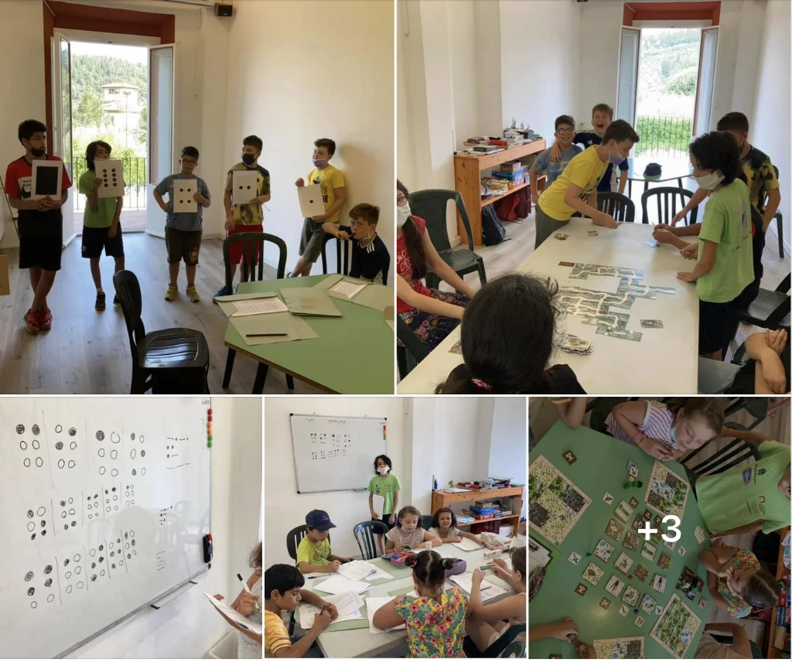
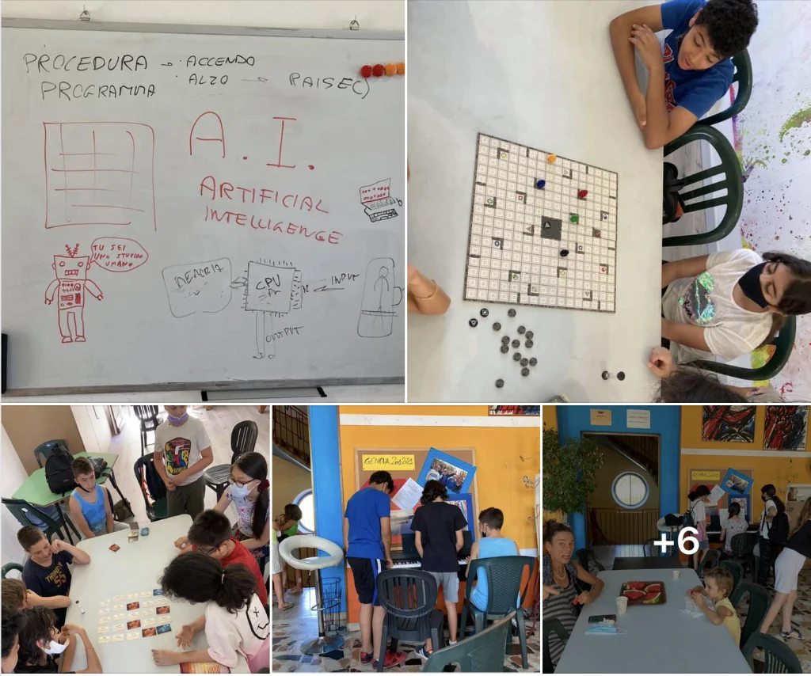
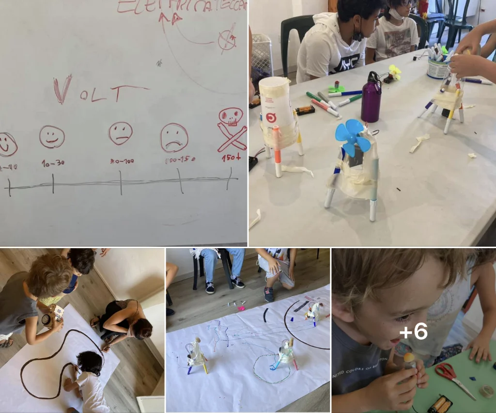
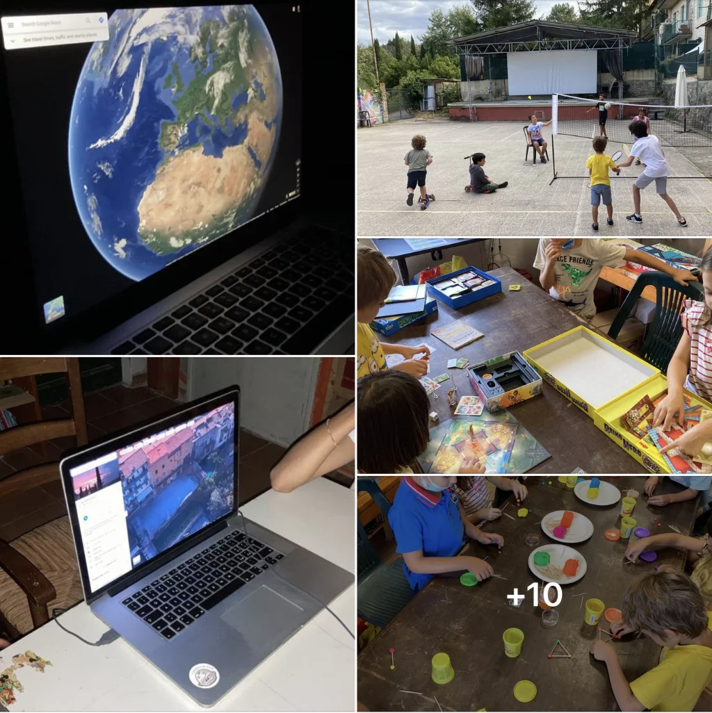
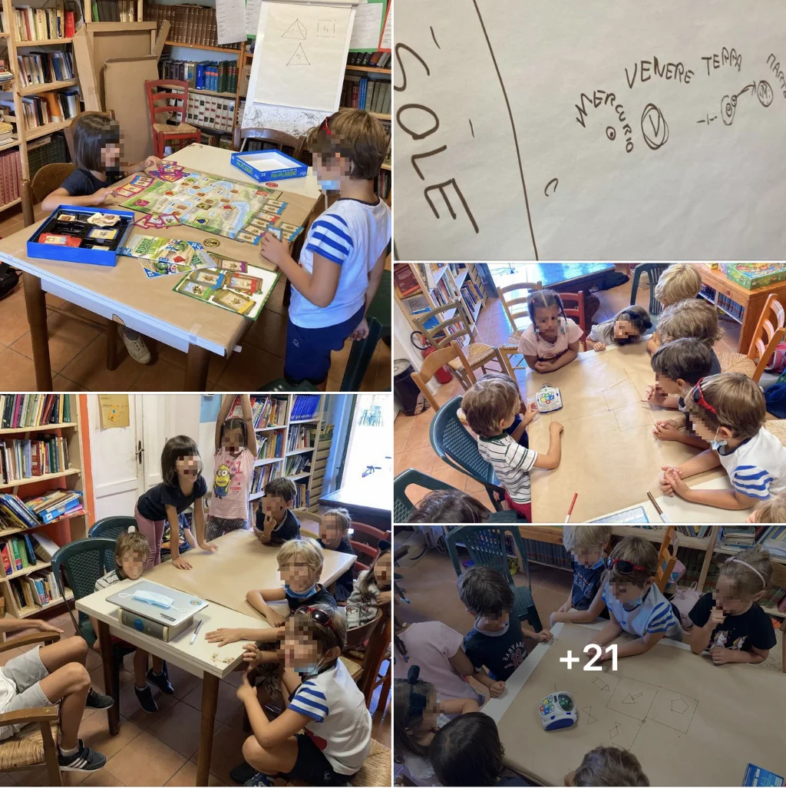
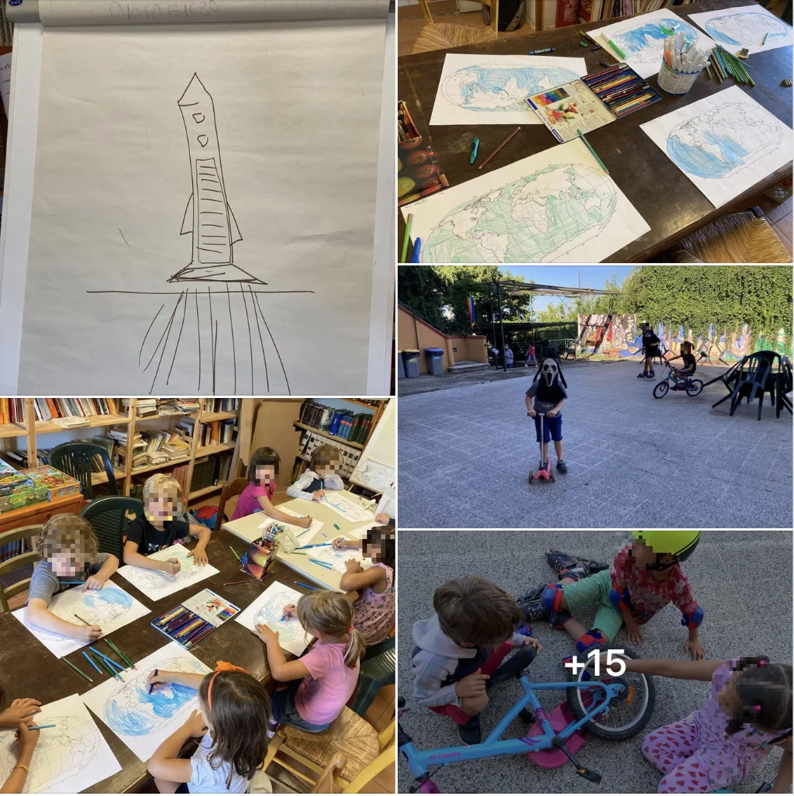
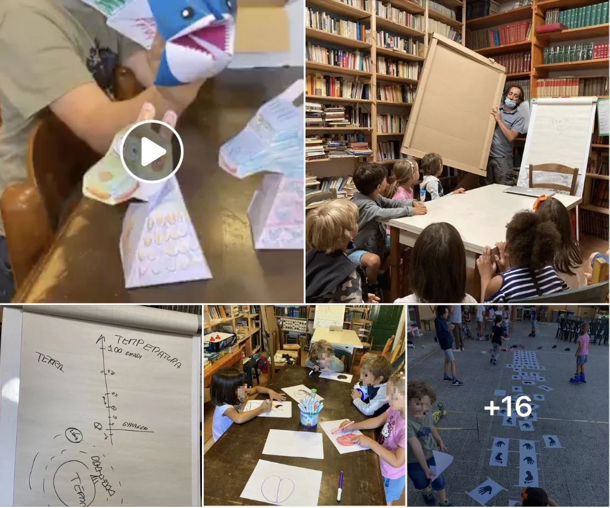
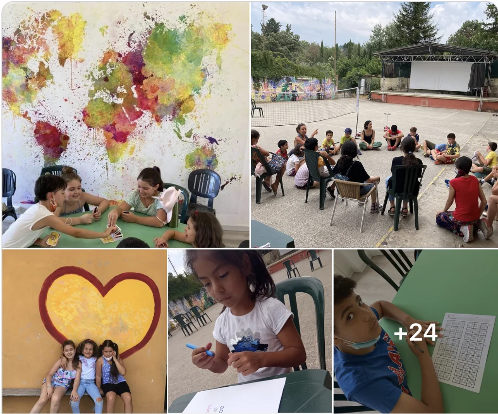

Ogni tanto tengo dei centri estivi.
Qui ne racconto un paio!

## Centro estivo Ludo-Didattico
anno 2021

### giorno 1 - lunedì

prima giornata di CentriEstivi: sopravvissuto.

Dai principi base del computer a fare calcoli aritmetici con i dadi, dalla matematica nei videogiochi alle illusioni ottiche per mancanza di prospettiva. e poi tante partite a [UNO](../../played/boardgame/uno.md), a [mancala](../../played/boardgame/mancala.md), *Sudoku* di tutti i livelli (perché chi è al primo e chi è esperto). unico effetto collaterale il caldo afoso di oggi, sofferto più da noi grandi che dai ragazzi.

NB: mentre io avevo un gruppo per matematica e digitale, in parallelo un altro gruppo faceva danza, arte e numeri. poi ci scambiavamo.

### giorno 2 - martedì

seconda giornata: meno stanchi e più soddisfatti.

Oggi visti il tema dell’Informazione … cosa è “informazione”? possiamo misurarla? e codificarla? codici morse, Braille, e digitale con i numeri binari, i pixel e la grafica in bitmap. cosa significa HTTP:// e come i vari computer si scambiano informazioni?

Avere un planisfero gigante aiuta a capire dove era il “far west” e come i telegrafi e le ferrovie collegavano i continenti, con semplici riferimenti alla storia della tecnologia dell’informazione e della differenza tra canale e contenuto.  e, incredibile, far divertire 9 ragazzini a giocare a carte matematiche per un’ora (con 6 Nimmt, grande gioco)

Il pianoforte ha scovato diversi talenti e la giornata si è insonorizzata di Lago dei Cigni e Toccate e fughe, pure una canzone originale. 

Le due ore di giochi “mentali” sono ovviamente compensate da almeno tre ore motorie e sportive (coordinate da Letizia e supervisione di Serena.. siamo in tre educatori)
a domani, dove giocheremo alle spie e codici segreti.

### giorno 3 - mercoledì

Terza giornata: dalla codifica in numeri binari alla lettura del **codice braille** sulle medicine, dal codice morse a quanto “pesa” un minuto di video digitale fullHD a 30 fps (perché se il byte è l’unità di misura del digitale, cosa rappresenta una fotocamera a 5Mpixels? e che differenza c’è tra una ADSL e una fibra? e perché ci interessa saperlo?

E poi tutti a scavare nelle profondità della terra con #Saboteur (un gioco dove siamo tutti nani più o meno sabotatori alla ricerca di pepite d’oro, si gioca fino in 10) e con #Minecraft il gioco da tavolo, che ha entusiasmato anche i più giovani nello scavare, costruire e sconfiggere Endermen. 

il pianoforte sempre al centro, insieme a volano e palloni.

### giorno 4 - giovedì

Abbiamo parlato di hardware e software, “programmato” alcuni ragazzi per eseguire delle istruzioni per accendere le luci della stanza, c’è corrispondenza tra come la nostra mente esegue delle procedure e come le esegue un computer? e cosa è invece un’Intelligenza Artificiale? è vero che dovremo convivere con un mondo totalmente diverso e imparare come funzionano le macchine e internet è importante?

Abbiamo poi giocato a [Rock'n'Roll Robots](../../played/boardgame/rock-roll-robot.md) per stimolare la progettazione mentale, a [Nome In Codice](../../played/boardgame/nome-in-codice.md)) per la deduzione e la comunicazione, [RushHour](../../played/boardgame/rush-hour.md) e [Mastermind](../../played/boardgame/master-mind.md) per le capacità logiche, e infine [Minecraft](../../played/boardgame/minecraft.md) gioco da tavolo (che entusiasma molto soprattutto i più piccoli) per la strategia e il calcolo.

Hanno portato partiture musicali e un piccolo concerto ha ispirato i più piccoli e anche i grandi hanno composto loro canzoni. 

Per finire cocomero, chiacchiere filosofiche, sport, slogan da stadio e attività pittoriche musicali all’aperto. 

e niente: questo centro estivo è davvero bello.

### giorno 5 - venerdì

Giornata finale con l’elettricità, principi di robotica e il costruire qualcosa che si muove. In pochissimi avevano già costruito da zero un circuito elettrico con pile, interruttori, motorino elettrici, pale e accessori vari per far muovere le creazioni. 

L’occasione per spiegare come funziona l’energia elettrica, da dove arriva e come si trasforma, cosa indica il + e il - sulle pile e perché un 1.5V non ci fa niente ma un 220V ci frigge. 

l’interesse per la materia e per il costruire è stato alto, sia per i grandi che per i piccolissimi, con belle rivelazioni di “ingegneri nati” seppur alla prima esperienza. 

come sempre tanto pianoforte e stare insieme. 

## Centro estivo STEAM 6
anno 2021

### giorno 1 - lunedì

Iniziato oggi nuova settimana di centro estivo alla Casa del Popolo di Settignano con una decina di bambini di 6 anni.

Ci siamo subito presentati aggiungendo al nostro nome un "ruolo" per la settimana.. ovviamente io ero il "Re" (Stefano in greco vuol dire appunto "corona", potevo avere un ruolo diverso?) circondato da generali, ingegneri di robots, principesse dell'acqua e del fuoco, generatrici di gemme, e uno scudiero/cuoco/stalliere tutto fare (figlio 1 cooptato come assistente 🙂

Ho impostato la settimana intorno al tema dell'esplorazione della Terra, dello Spazio ed altre faccende (si, anche il riscaldamento globale!), quindi un bel video introduttivo dell'ESA (Ente Spaziale Europeo) ci ha introdotti al Sistema Solare, passando poi a Google Earth per fare un giro del mondo e trovarci lì, proprio in quella storica costruzione sulle colline di Firenze... molto impressionati dal potere di poter camminare ovunque con questa tecnologia,  dalla Torre Eiffell alla piazza imperiale di Pechino (tutti abbiamo visto Mulan!)

Pausa volano, Mondo e bici in cortile e poi si passa a costruire le prime piramidi, come faremmo tutti se ci insediassimo su un nuovo pianeta, vero? Plastilina colorate e stuzzicadenti per formare prima un triangolo, poi una piramide e poi costruzioni fantasiose. Un po' di preoccupazione iniziale perché pensavano di non riuscirci invece poi tutti entusiasti dalla facilità di creare forme 3D.

Nella giornata sono stati esplorati e giocati diversi giochi: da [Robot Turtles](../../played/steam/robot-turtles.md) che introduce al coding programmando le nostre tartarughe laser a [Zombie Kids](../../played/boardgame/zombie-kids-evolution.md), il miglior gioco collaborativo per bambini, da Kaleidos dove si cercano oggetti per categorie (duri, morbidi, che si muovono, che profumano) al gioco dell'anno [Dragomino](../../played/boardgame/dragomino.md) che sviluppa la visione tattica nel comporre i terreni e far crescere i propri draghi, da [Stone Age Jr](../../played/boardgame/stone-age-junior.md) che introduce alla gestione delle risorse per costruire il proprio villaggio con un minimo di memory a [Concept Kids](../../played/boardgame/concept-kids.md) con cui si comunica attraverso simboli e aggettivi.

La sintesi è arrivata da una bambina **"questo è il miglior centro estivo del mondo perché si gioca tantissimo!"**

ah: siamo riusciti a trasformare in un gioco divertente anche l'apparecchiare e poi il pulire al meglio i tavoli del pranzo!

Sebbene fossi inizialmente un po' terrorizzato dal gestire tutto il giorno una squadra di seienni, direi che è andata molto bene e ci siamo divertiti tutti.

### giorno 2 - martedì

Nella prima mezz'ora di gioco libero qualcuno si era già messo con il gioco delle Robot Turtles.. bene perché è uno dei temi della giornata: il nostro Paxi (la mascotte animata dell'ESA) ci porterà a scoprire il pianeta Marte, e così parliamo e ripassiamo il sistema solare, cosa sono i satelliti e come funzionano i vari robot tipo Curiosity che stanno esplorando il pianeta rosso (lo sapete vero perché sia chiama Marte?).

E quindi svegliamo il nostro robottino [Mind](../../played/steam/mind-designer.md) e tutti faranno l'esperienza di programmarlo, con i tasti o con la voce, risolvendo missioni o facendolo disegnare.
Dopo la merenda di pane olio e pane marmellata, l'attività clou della mattinata è armare il nostro esercito: costruendo CATAPULTE con legnetti ed elastici e tutto quello che troviamo. salvo i proiettili che sono stati dei ceci rigorosamente bio!
Per costruire i muri di difesa abbiamo sperimentato per la prima volta il "trasportatore elastico collaborativo": un elastico comandato da 8 fili a raggiera, che impone un coordinamento incredibile per raccogliere, trasportare e depositare i bicchieroni a formare un muro.  
Divertente e non impossibile.

Durante il pranzo i ragazzi tutti insieme apparecchiano e sparecchiano, e con il premio finale a chi ripulisce il piatto riduciamo gli sprechi.
Il calcio balilla è sempre in attività, così come il campo da badminton/volano, i rollerblades, le bici e gli skates.. tutto ciò che ha ruote o è rotondo in pratica.
Nel pomeriggio si inizia a costruire il reparto aereo: aerei di carta di vario tipo e valutazioni di volo, stando attenti alle catapulte impegnate a centrare bidoni di latta con i ceci.

Tra un Zombie Kids e un Dobble, il gioco rivelazione di oggi è stato Othello, che ha appassionato davvero molte menti.

Con un bel ritmo hawaiano all'ukulele e un pianoforte che suona la colonna sonora di Rocky IV, alle 16:30 tutti a casa sotto le prime gocce di pioggia.

### giorno 3 - mercoledì

Il gruppo si è consolidato, le poche ma buone regole assimilate, le diversità comprese e valorizzate, lo spirito ludico condiviso.

Oggi scopriamo e parliamo di esopianeti ed extra-terrestri: lo sapete che ci sono più stelle nell'Universo che non granelli di sabbia sulle spiagge della Terra?
E quali sono le condizioni per cui si possa sviluppare la vita su un altro pianeta simile alla Terra, detto il "pianeta BLU?" Facciamo un semplice grafico della linea del tempo dell'Universo.. partendo da 14 miliardi di anni fa fino alla formazione della Terra e di come si sia raffreddata... e no, non c'eravamo noi umani a soffiare 🙂

Parliamo dell'acqua che ci circonda e coloriamo il nostro planisfero.. e già che ci siamo individuiamo anche dove abitiamo e da dove vorremmo far partire la nostra astronave con motore a reazione che dopo la merenda costruiremo.

Per costruire un semplice razzo a motore a "soffio reazione cannuccia" (in pratica soffiando con una cannuccia dentro una cannuccia più grande sigillata e fissata al razzo) facciamo diversi esperimenti e poi forbici e pastelli.

Tra un momento meccanici di biciclette e mostri del volano, costruiamo un percorso che definiscono "lo spacca-bambini" per il contorsionismo necessario per fare tutti i passaggi.

Un po' di cacofonia musicale, air-hockey, una tombolata di mostri.. i giochi dei giorni passati ormai li prendono i li giocano insieme quasi in autonomia, con rispetto reciproco e delle regole. davvero tutti molto bravi.

Geniali i grandi che trasformano la rete da volano in rete da tennis!

E per finire si rimette tutto a posto insieme.. anche il mocio al pavimento! ("ma quanto mi piace pulire con il cencio"!!!!!!)

### giorno 4 - giovedì

La mattina inizia con un cartone animato molto speciale, per poi esplorare come non basta che esista l'acqua perché ci siano le condizioni per la vita, ma anche una temperatura adeguata, fondamentalmente tra gli 0 e i 40 gradi.. un intervallo risicatissimo nel mondo delle temperature spaziali!

E di quanto l'effetto serra della Terra sia un fenomeno molto delicato e che ci sta un po' sfuggendo di mano se continua imperterrito il Riscaldamento Globale. Vediamo poi anche la Luna, le Stagioni, il ciclo del giorno e della notte.

Dopo tre cartoni usciamo subito a finire insieme il percorso "spacca bambini", questa volta con le loro idee e disegni: arriva anche il "sedere", la "pancia" e l'"occhio", con mosse davvero impreviste.

Tra una danza classica e un fortino di difesa dai grandi, si continua a costruire la forza aerea con dozzine di nuovi aerei di carta di ogni tipo.

Si aggiungeranno poi gli squali mangiatutto e i robot/draghi/animali 3D che ti seguono con lo sguardo! (vedere il video per credere)

I giochi da tavolo sono sempre gettonatissimi: oggi tanto [pirilin-pinpin](../../played/boardgame/pirilin-pinpin.md), [similo](../../played/boardgame/similo.md), [othello](../../played/boardgame/othello.md), Hockey, il robot Mind, [Stone Age Jr](../../played/boardgame/stone-age-junior.md).

Ho spiegato infine perché domani non ci sarò: anche i "maestri" devono imparare le cose nuove, e per conoscere bene i giochi bisogna studiare e saperli creare, per questo domani e sabato sarò a Modena per il PLAY: Festival del Gioco.

Mi hanno augurato di divertirmi e di imparare tutto così da insegnare loro a fare altrettanto.

### giorno 5 - venerdì

giusto per chiudere la prima settimana di questi centri estivi ludo-didattici con una sintesi e un commento, una delle cose che mi è piaciuta di più è che dei 22 ragazzi che vi hanno partecipato, la maggior parte arrivavano da situazioni sociali e familiari non proprio "facili".

Il contributo della Fondazione Cassa di Risparmio di Firenze ha permesso di rendere la settimana gratuita a quasi tutti. e noi siamo stati bravi a fare tutto con materiali molto economici.

E ieri pensavo: sono più contento di aver innescato un po' di entusiasmo per le tecnologie, il digitale, le #STEAM (science, tech, engineering, maths), il gioco didattico con ragazzi che altrimenti non si sarebbero avvicinati facilmente in modo autonomo.

Certo, le scuole si stanno attrezzando per fare formazione a tutti, ma ci vorrà molto tempo prima che diventi universale e di buon livello.

Un po' come abbiamo fatto con il videogioco [Antura And The Letters](../../played/videogame/antura.md) dove abbiamo creato un prodotto di altissima qualità grazie ai finanziamenti di un bando e fondazioni, per poterlo regalare a tutti.

E sapete la cosa che più mi ha sorpreso (a parte l'aneddoto della ragazzina che già citai)? che alcuni giovanissimi, di 6/7/8 anni, non scolarizzati che sapevano a mala pena scrivere il proprio nome, nel momento in cui li metti a fare esperimenti logico/deduttivi o di manualità di precisione (tipo elettronica) hanno altissima intelligenza. e venivano entusiasti "VOGLIO IMPARARE IL COMPUTER! VOGLIO IMPARARE LA MATEMATICA!"
