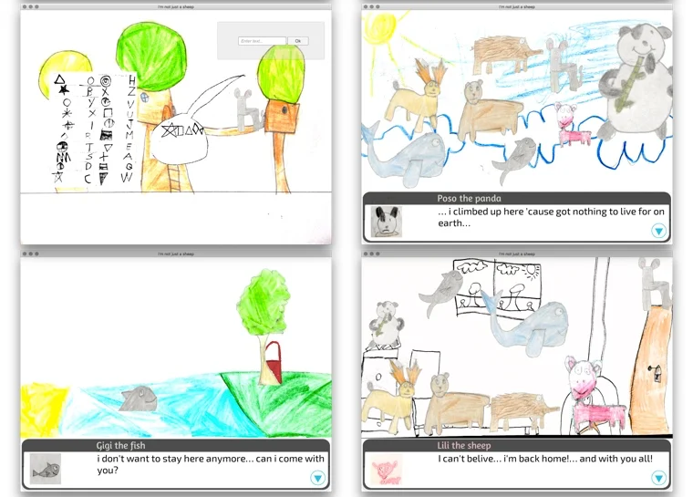

## Download
- scarica app **iOS**: [Apple App Store](https://apps.apple.com/us/app/im-not-just-a-sheep/id110999489)
- scarica app **Android**: [Google Play](https://play.google.com/store/apps/details?id=com.jamurr.notjustsheep)
- progetto Open Source: <https://github.com/jamurr/JAM.NotJustASheep>

## Descrizione

game developed at GGJ16 by Stefano and Fabio

this game was designed and drawn by a 7yo child at his first "real" game production experience] a young sheep starts a journey outside her home world, discovering her internal difficulties allegorized by different animals. talking with them and helping their problems she helps herself into a more mature life. a simple point an click + visual novel story, enjoyable also by adults. [the idea of the game, all characters, puzzles and stories came from young Fabio on saturday morning, after a good and inspiring sleep. we spent all the morning at writing the design doc, and in the afternoon he started all drawings. On Sunday morning we finalized the graphics and storylines with some debug. we could not make the voiceovers ... but we had to sleep and they were not essentiaòs. at the end of the Jam Fabio also won the special 1st price as best game of the local site (Pisa) and a special price as youngest game designer. As dad, it has been one of the most amazing and interesting dad+son experience i had. I'm thinking about organize a special kids game jam next year. please check our website because we'll post a completed version in next days. thank you all!



GGJ site: <http://globalgamejam.org/2016/games/im-not-just-sheep-non-sono-solo-una-pecora>

{: style="height:200px"}
{: style="height:200px"}
{: style="height:200px"}
{: style="height:200px"}

