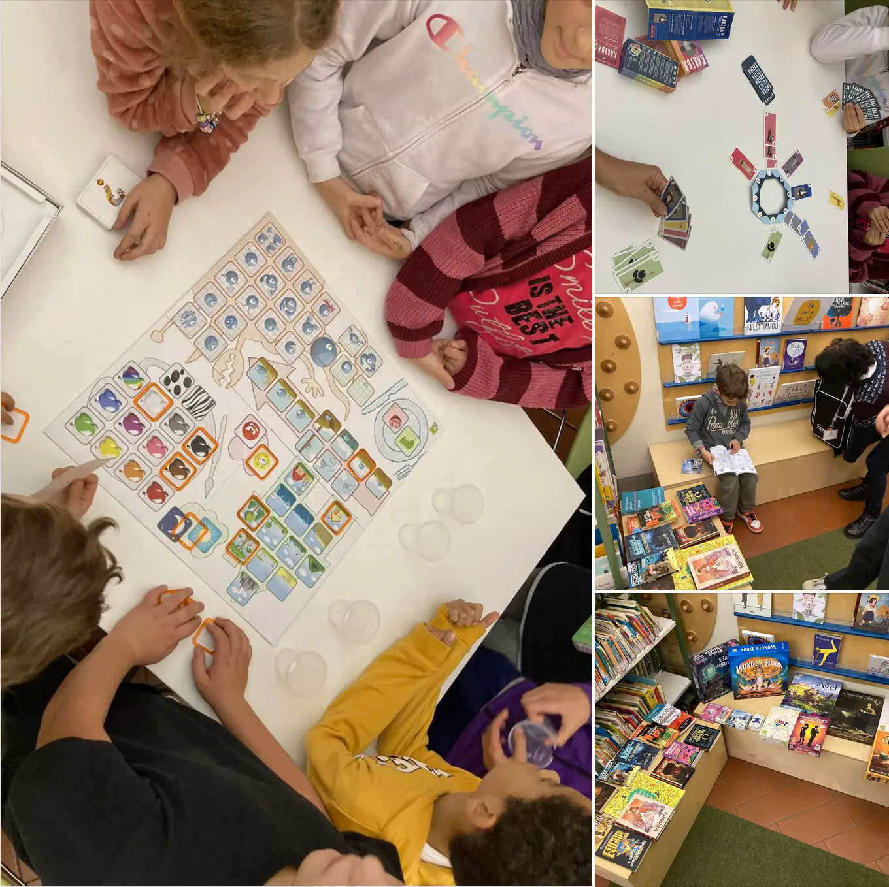
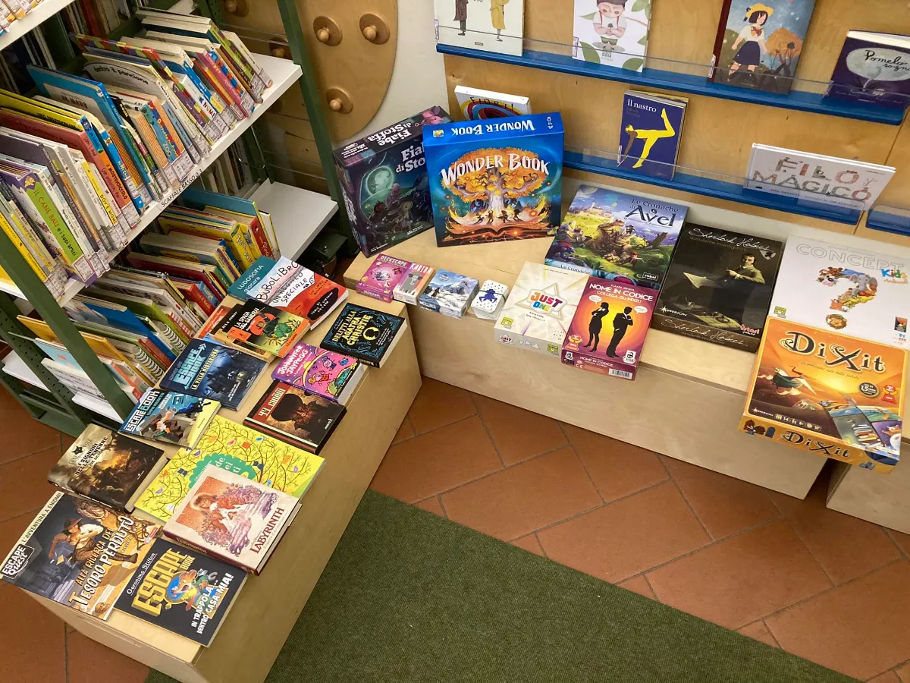

# Giocare tra i libri

Lo sapevate che alcuni libri si possono.. giocare? Venite a scoprire la nuova frontiera dei giochi da tavolo e della carta interattiva in un pomeriggio ludico in biblioteca.

Venerdì 18 novembre terrò un pomeriggio ludico alla Biblioteca Villa Bandini, Firenze. Ingresso libero su prenotazione, 7-13 anni. Tel. 055 6585127. (ci sono solo 15 posti disponibili, ma ne terrò poi altri, se interessati lasciate un riferimento che vi avviseremo)

L’International Games Month è un’iniziativa lanciata dall’American Library Association che in Italia ha visto l’adesione dell’Associazione Italiana Biblioteche. Per tutto il mese corrente le biblioteche saranno il luogo ideale dove gli appassionati del gioco potranno incontrarsi, fare nuove amicizie, sfidarsi e partecipare ai tornei.

