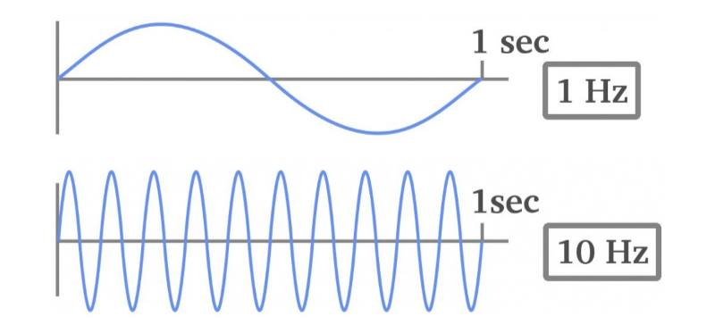

# HackerKid 20107: frequenze

Oggi conoscerai Mister Hz. Lui conta quante volte una cosa succede ogni secondo, è in pratica un frequenzimetro, misura le frequenze. Sarà uno dei tuoi collaboratori per le future missioni.

Rispondi a queste domande:

- qual'è la frequenza dei secondi dell'orologio?
- e la frequenza di un metronomo a 120BPM?
- la frequenza della nota musicale LA (centrale)?
- il tuo computer sposta i bytes di dati con quale frequenza?

se vuoi accelerare il tuo livello ecco domande bonus:

- quale è la frequenza del colore rosso?
- il WiFi (abbiamo il modello 802.11ac) permette di trasmettere dati con che frequenza?
- con quale frequenza fai colazione?

Buone frequenze, 127.

## NOTE
gli Hertz (Hz) sono l'unità di misura della frequenza per quelle cose che hanno un'oscillazione costante.
i suoni sono forme d'onda che "oscillano" con precise frequenze.
anche la luce ha diverse frequenze. a dir la verità la luce è un'onda elettromagnetica che ci risulta visibile se ha una frequenza all'interno di determinati valori.

