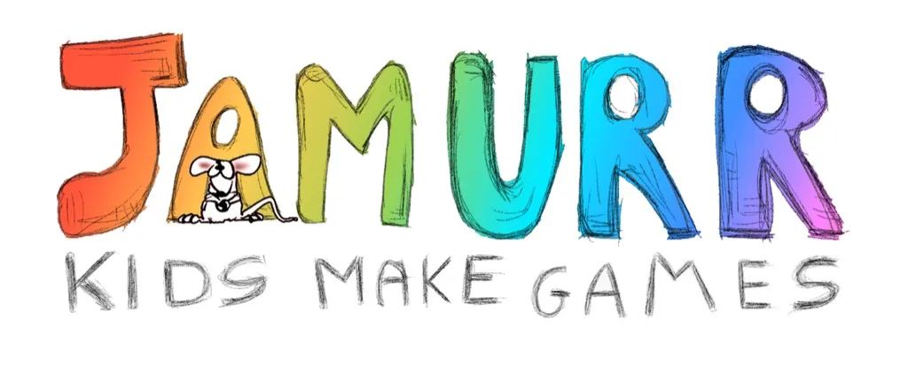

JAMURR è un progetto educativo di utilità sociale, no profit e di volontariato.
Una scuola virtuale, un’ambiente ricreativo e una comunità che ruotano intorno a

1. i bambini
2. i “grandi” (genitori, tutors, sviluppatori e designers)
3. i giochi (sopratutto videogiochi)

creando relazioni intergenerazionali, nuove forme di espressione, di sviluppo reciproco e di intelligenza emotiva.

<iframe src="https://www.slideshare.net/slideshow/embed_code/key/lGczREz4zs44La?startSlide=1" width="597" height="486" frameborder="0" marginwidth="0" marginheight="0" scrolling="no" style="border:1px solid #CCC; border-width:1px;   margin-bottom:5px;max-width: 100%;" allowfullscreen></iframe>

[Slideshare](https://www.slideshare.net/StefanoCecere/jamurr-presentazione-2016)
