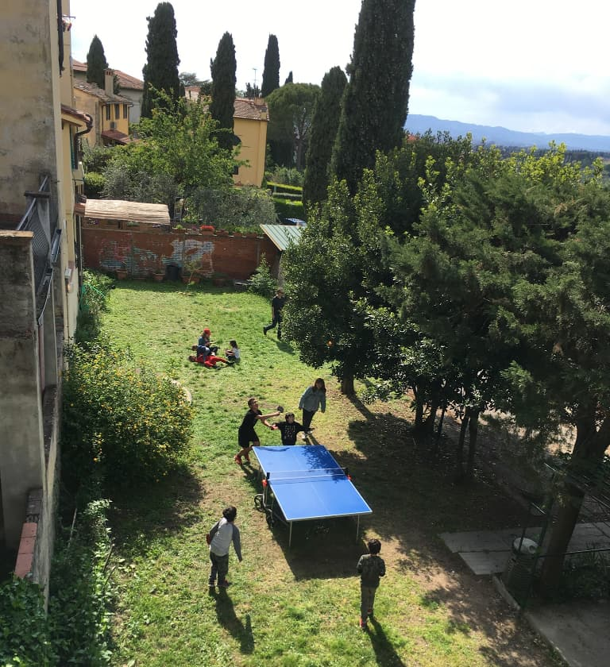
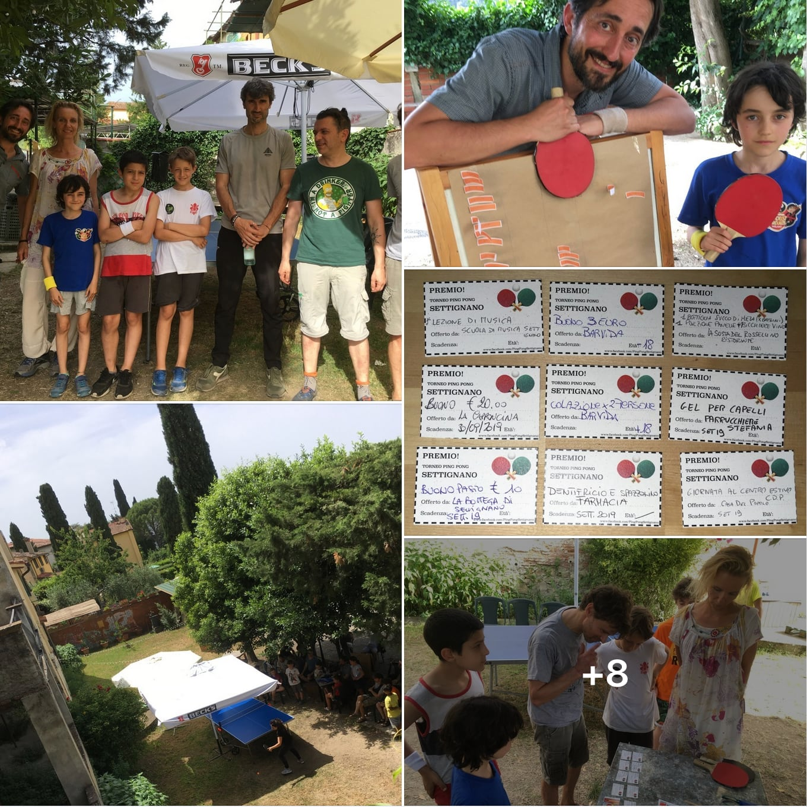
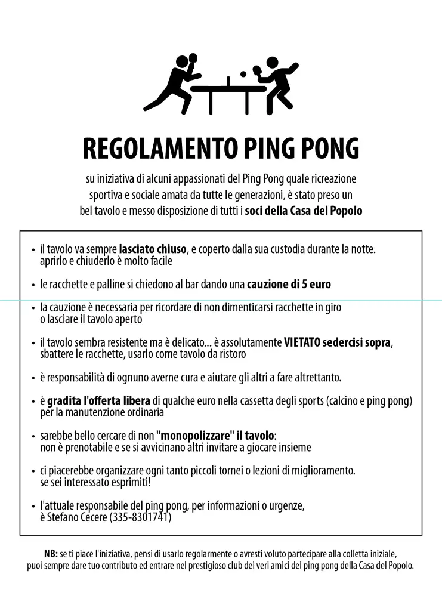

# Tornei di Ping Pong

Primo Torneo Settignano 2019

il nostro primo torneo per inaugurare seriamente (e ripagarci) il nuovo tavolo da ping pong, che abbiamo comprato e portato alla Casa del Popolo con l'intento di condividerlo con il quartiere (perché che ce lo teniamo a fare in giardino per giocarci in due ogni tanto?)

circa 32 partecipanti, dai 10 ai 50 anni, 4 ore sotto il sole ma fortunatamente ombrato da magnifici alberi e ombrelloni, con un po' di venticello

ringraziamo mai abbastanza i negozi di Settignano che hanno fornito i premi.. davvero azzeccati (c'era chi puntava in partenza allo spazolino e dentifricio della Farmacia.. e l'ha vinto!) e chi voleva imparare il clarinetto.. e ha vinto le lezioni alla scuola di musica).. regali semplici ma davvero opportuni.
tutti sono tornati a casa con il polsino colorato e una caramella (grazie Vida per l'idea)

in 4 ore abbiamo fatto tutto.. dalle selezioni iniziali alla Thanos (seccati il 50%) e poi via di alberatura con ripescaggi e un mini girone tra i tre giovani finalisti.

se la cosa ti piace, sappi che la prima di settembre si rifà! probabilmente con torneo di calcino (calcio balilla) aggiunto.
a presto e grazie a tutti!

ww Settignano, famosa per gli scalpellini, la simpatica tranquillità, la Casa del Popolo, ma sopratutto per il Ping Pong 🙂

PS ECONOMICO: tolte tutte le spese, abbiamo raccolto 110 euro.. ce ne mancano solo 100 per ripagarci il tavolo, che ricordiamo è sempre disponibile gratuitamente per tutti! (salvo chi lo tratta male)

