# Escape Us

## storia della creazione di un videogioco

di [Stefano Cecere](mailto:stefano.cecere@fem.digital), Area GBL di FEM

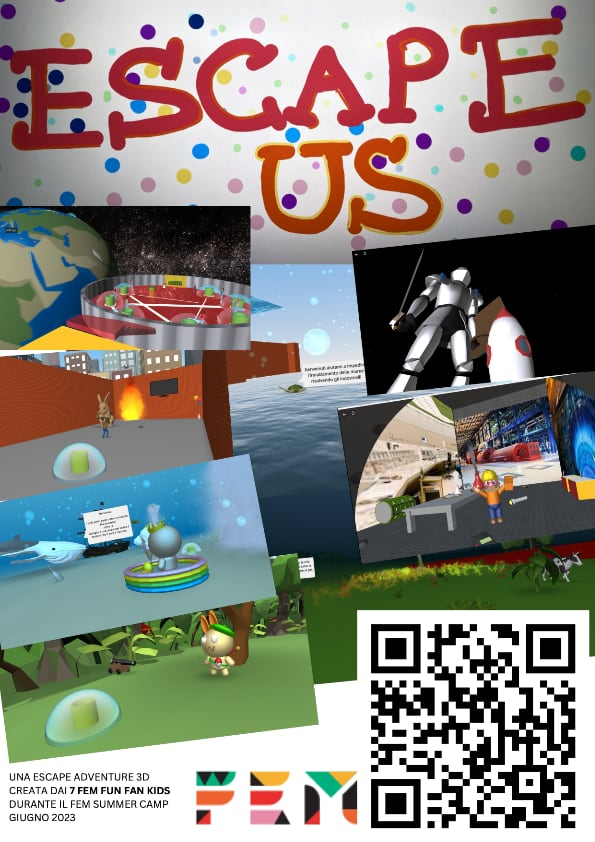

Qui racconteremo cosa abbiamo fatto in una settimana di centro estivo / summer camp al FEM, tra il 26 e il 30 luglio 2023\.

Il tema del camp era ”Creiamo un’avventura in 3D \- laboratorio di game design per ragazzi dai 7 ai 13 anni”. L’avventura avrebbe avuto come tema dato l’Ambiente / Ecosostenibilità (ma questo i ragazzi ancora non lo sapevano) e avremmo usato diversi strumenti digitali per farli lavorare dall’ideazione allo sviluppo alla pubblicazione del videogioco.

Alla partenza del camp i ragazzi erano 7 (sebbene fossimo pronti ad accoglierne fino a 15\) e si sarebbe lavorato solo dalle 14:00 alle 18:00 (con mezz’ora di merenda che poi non volevano fare perché troppo presi dalla creatività).

## **Giorno 1 \- Avventure e Creatori del futuro**

Dopo un benvenuto e una presentazione di chi siamo e cosa facciamo nella vita (Stefano ad esempio di lavoro crea proprio videogiochi) si è fatto subito vedere cosa si sarebbe prodotto entro la settimana: un videogioco completo\!

Entusiasmo.

**Introduzione all’avventura**  
con una serie di slides ([link](https://docs.google.com/presentation/d/1eEKmoppOziLwX\_3hrPPyEK9VO2wXddzoCcOB7Pwpc3Q/edit)) abbiamo parlato di cosa è un’avventura, parlato dei nostri film, libri e videogiochi avventurosi preferiti.

Poi abbiamo introdotto il lavoro di creare giochi:  Cosa fa un game designer? Cosa sono le difficoltà di un gioco? Cosa vuol dire creare un’esperienza che devono fare altri?

Infine una bella discussione se si pensa che giocando ad un gioco si impari qualcosa? se si, cosa? raccontiamo dei giochi che ci hanno fatto imparare qualcosa. (tutti hanno chiaramente indicato alcune competenze e capacità che i videogiochi hanno aiutato a sviluppare).

**Introduzione pratica a CoSpaces**  
Cosa è CoSpaces ([https://cospaces.io/](https://cospaces.io/)) questo strumento di creazione di mondi 3D interattivi? cosa può fare?  
Ricreiamo in 3D la stanza in cui ci troviamo e poi mettiamoci noi stessi, così, giusto per impare lo strumento (ognuno con un suo Chromebook). Poi giochiamo a diversi progetti CoSpaces per capirne la potenzialità e ispirarsi.

## **Giorno 2 \- Tema e Ambiente**

**Introduzione al Tema Ambiente**  
Parliamo e discutiamo di ambiente, futuro e problemi.  
Scriviamo sul nostro foglio di lavoro quelli che più ci preoccupano.

Poi passiamo al come si narra una storia? parliamo di Utopia e di Distopia.  
Cosa e come ci immaginiamo nel futuro? Siamo ottimisti o pessimisti?  
Se il futuro è modificato dalle nostre azioni, e un giocatore in un gioco deve fare azioni… ci può essere un collegamento?

* **brainstorm sulla storia**

iniziamo a parlare di dove ambientare il gioco.  
Il suggerimento è che ogni ragazzo crei un suo personaggio in un suo ambiente, con una meccanica di gioco tutta sua (possibilmente creando diversità per garantire un’esperienza di gioco variegata): il giocatore dovrà risolvere tutti e 7 i mondi per poter sbloccare il livello finale.  
Già si divaga su quale sarà il Boss finale… e il nome di Greta inizia a risuonare.

**definizione e creazione ambienti e personaggi**  
su carta si crea la scheda del proprio personaggio e del proprio ambiente  
in CoSpaces, una scena per uno, si crea la bozza di lavoro.  
lavorare tutti insieme allo stesso progetto è qualcosa davvero entusiasmante.

## **Giorno 3 \- Personaggi e Modellazione 3D e In Scena**

**modellazione 3D con Tinkercad**  
Per creare i propri personaggi da inserire nella storia qualcuno preferisce modellarlo e non usare i modelli predefiniti di CoSpaces.  
Viene disegnato prima su carta e poi modellato in 3D con [https://www.tinkercad.com/](https://www.tinkercad.com/)

**le stanze prendono vita**  
le scene dei propri ambienti vengono colorate e arricchite con il proprio personaggio e i primi dialoghi: cosa ti dice appena entri in quella stanza? cosa devi fare?

**mettiamo in scena**  
finalizziamo la grafica della scena e dei personaggi e qualcuno inizia a pensare alla scena finale

## **Giorno 4 \- Sfide, Programmazione e Audio**

**programmazione CoBlocks**  
introduzione ai CoBlocks, il sistema di programmazione di CoSpaces, simile a Scratch e si inizia ad implementare l’interazione con gli oggetti e i personaggi in scena, arricchendoli di animazioni e i primi suoni.

**sfide ed enigmi**  
esploriamo gli enigmi e i meccanismi: codici segreti, oggetti nascosti, indovinelli.  
li programmiamo e li inseriamo nelle varie scene.  
il bello è che ogni scena è un mondo diverso, e la difficoltà è aiutare tutti nelle varie diversità. ma ci riusciamo bene, anche perché inizia ad esserci collaborazione tra i ragazzi: chi è più bravo in programmazione aiuta chi ha bisogno, chi è bravo ad arredare, chi a registrare i suoni, chi ad arricchire l’ambiente…

**audio e musica**   
facciamo un accenno alla tecnologia e all’audio digitale e invitiamo a registrare con la propria voce i dialoghi e magari a comporre anche la colonna sonora delle varie stanze.  
registriamo gli audio della narrazione dei personaggi e una ragazza particolarmente creativa creerà 8 musiche originali, usando l’ambiente audio online di  [https://www.soundtrap.com/](https://www.soundtrap.com/)

## **Giorno 5 \- Composizione e Playtest**

mettiamo tutto insieme e facciamo test, debug e migliorie, nome e logo del gioco .  
ma come si chiama il team dei ragazzi? in 14 minuti decidono per i 7 FEM FUN FAN KIDS.  
Alcuni ragazzi lavorano insieme per finire per bene il livello finale, con tanto di easter eggs (sapete cosa sono, vero?) e poi lo pubblichiamo.

Ad ognuno diamo un foglio stampato (quello che vedete in testa a questo documento) con il QR code per giocarci a casa con i genitori e poi gli amici.

Congratulazioni e abbracci a tutti, abbiamo fatto davvero un bel lavoro\!

## **Restituzione finale**

Il gioco è giocabile qui (via PC, smartphone o tablet): [https://edu.cospaces.io/YRB-TXA](https://edu.cospaces.io/YRB-TXA)

Abbiamo inserito nel gioco anche un modo per lasciare dei commenti o segnalare problemi [con 👉🏼questa form](https://forms.gle/kVWbCLw2X1R75hz77) 

Se un progetto del genere vi è piaciuto, fatecelo sapere\! Vi inviteremo in anteprima al prossimo, o ne organizziamo un altro se ci fosse sufficiente richiesta.

**Tutor**

- Stefano Cecere

**Assistenti**

- Diego Fabris  
- Letizia balestri

## Foto Gallery

ecco alcuni momenti

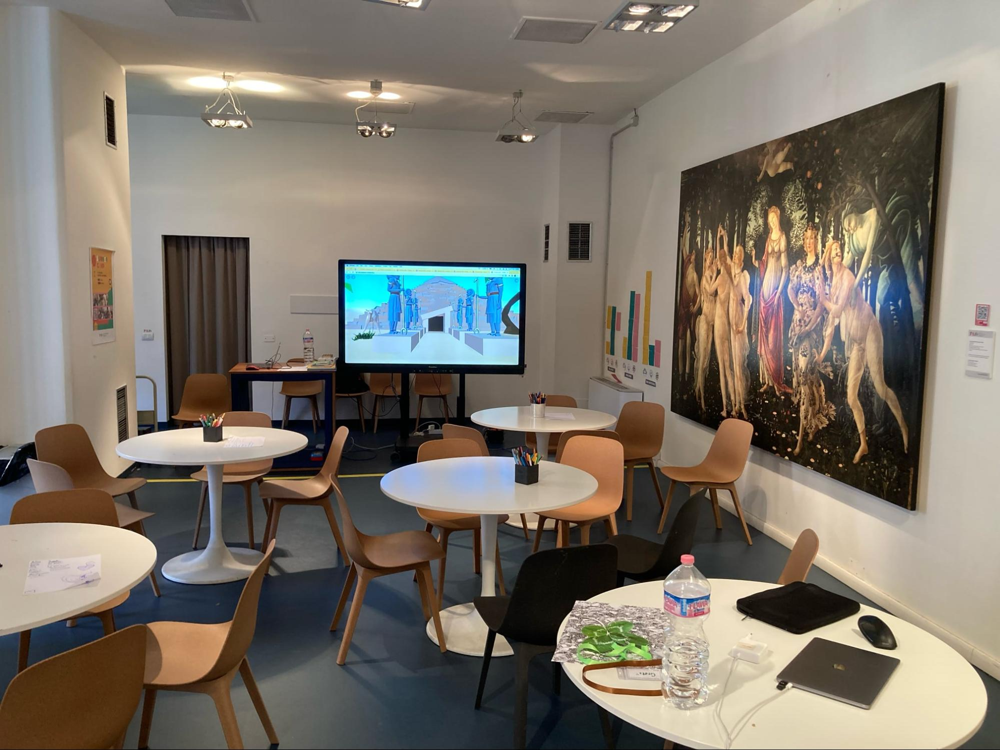
aula pronta

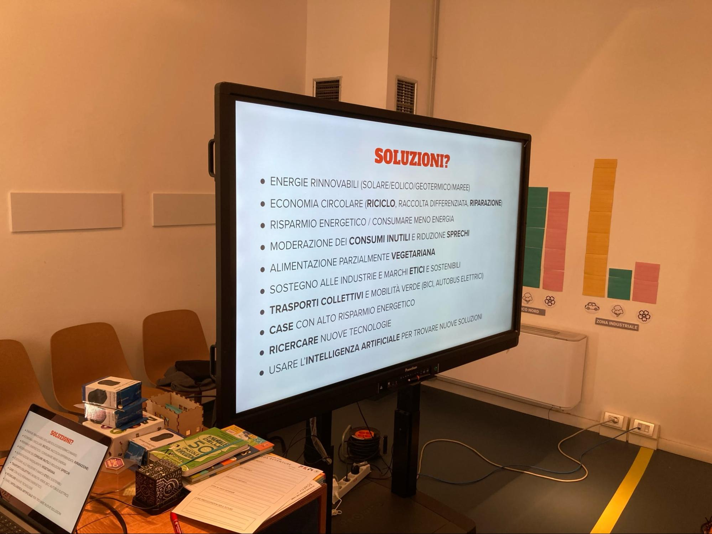
presentazioni. le slides ci aiutano a intavolare le discussioni

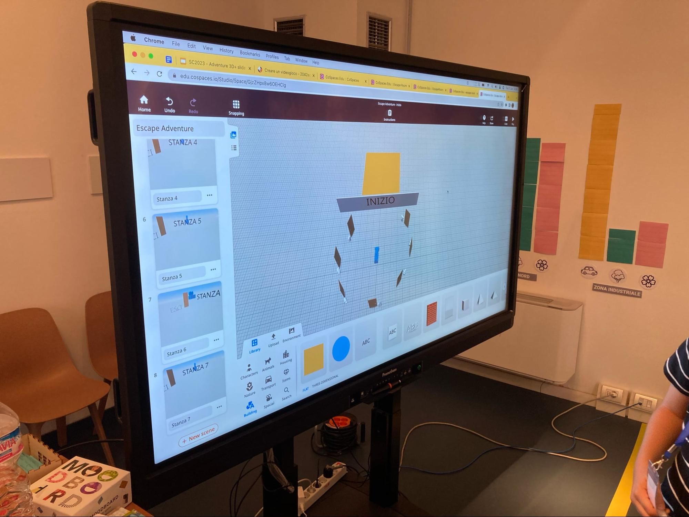
si parte con una stanza vuota e sette porte che portano ad altrettante stanze vuote

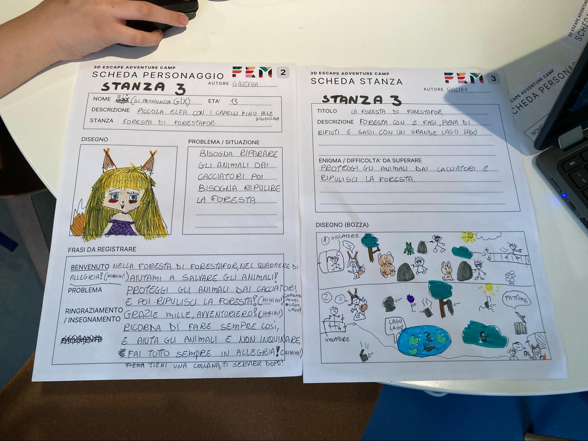
una delle schede personaggio

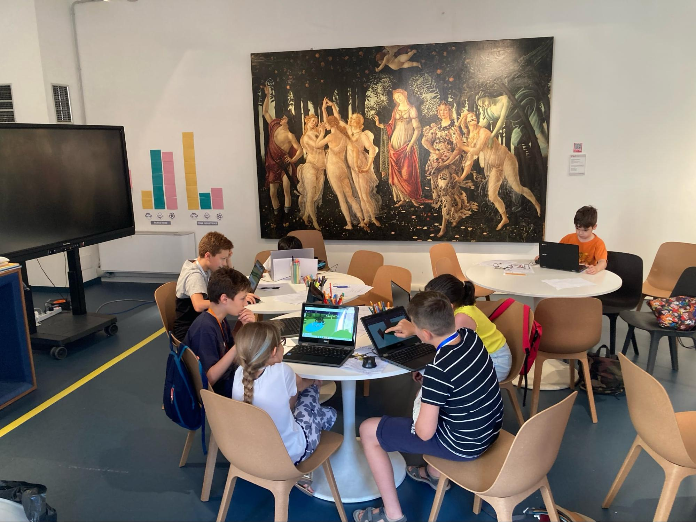
al lavoro\!

- cosa è quella?  
- una mucca infuocata\!  
- dal caldo?  
- uhmmm beh non proprio…

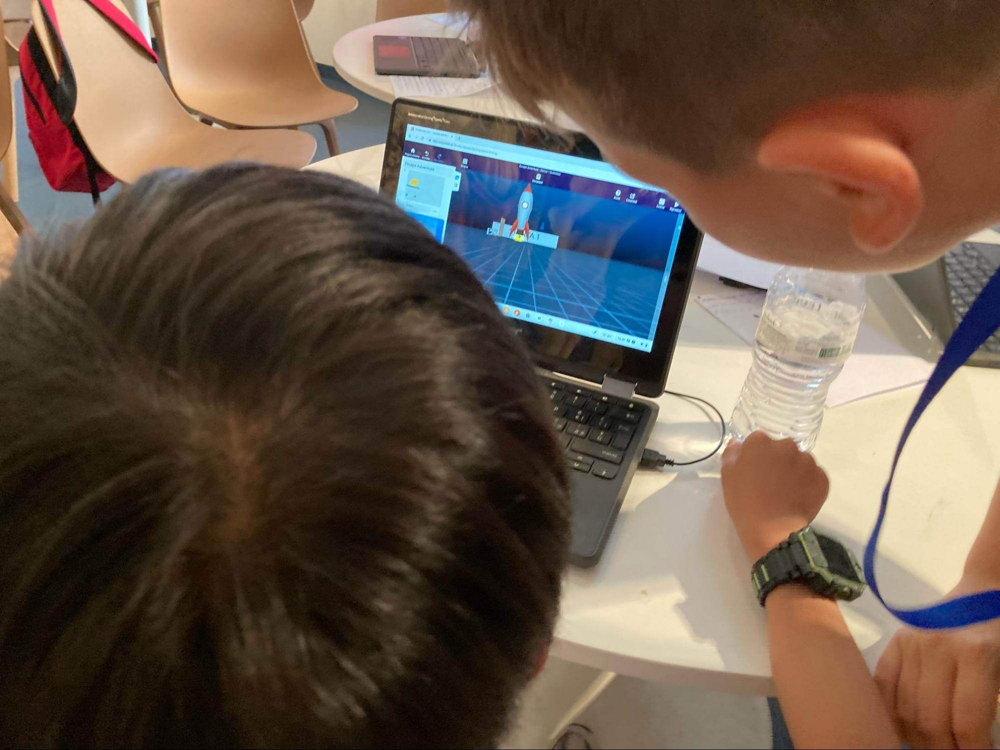

- come faccio ad accendere il fuoco sotto il missile?

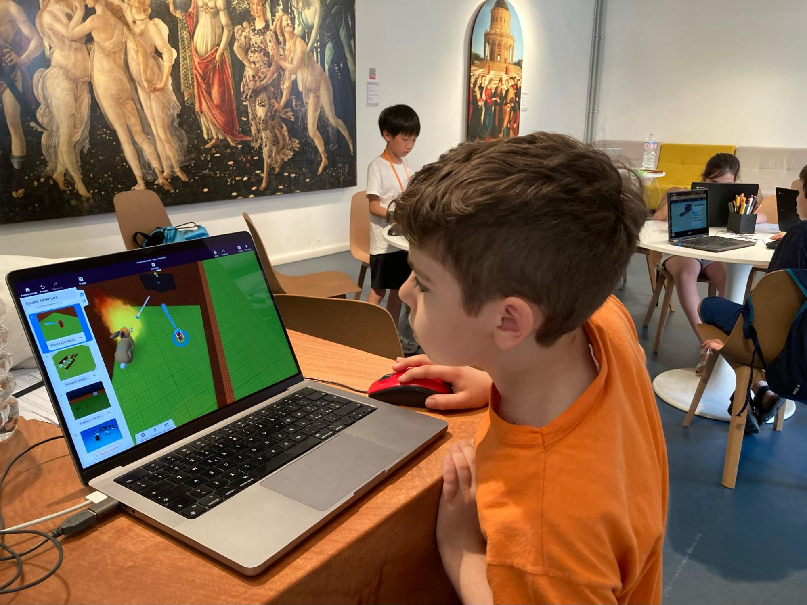
un coniglio gigante, fuochi e prese elettriche… lasciamo a voi trovare i collegamenti

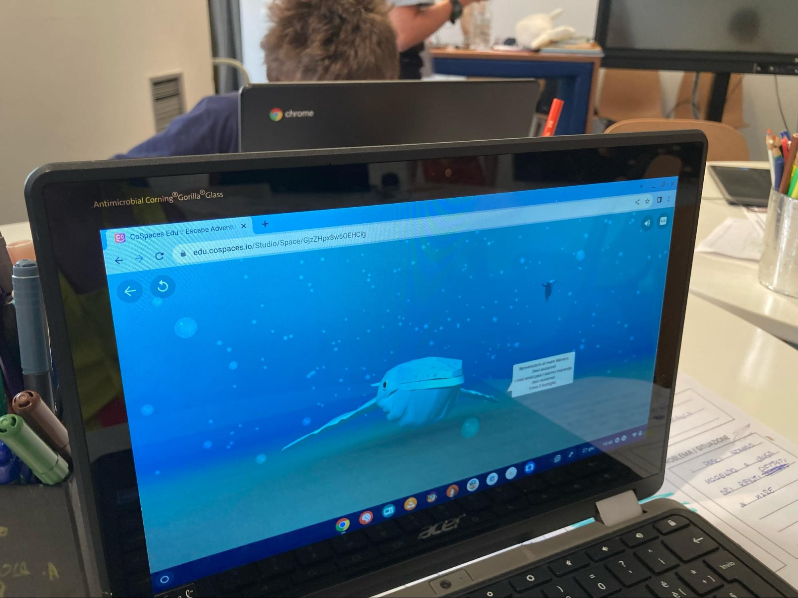
stanza immersiva

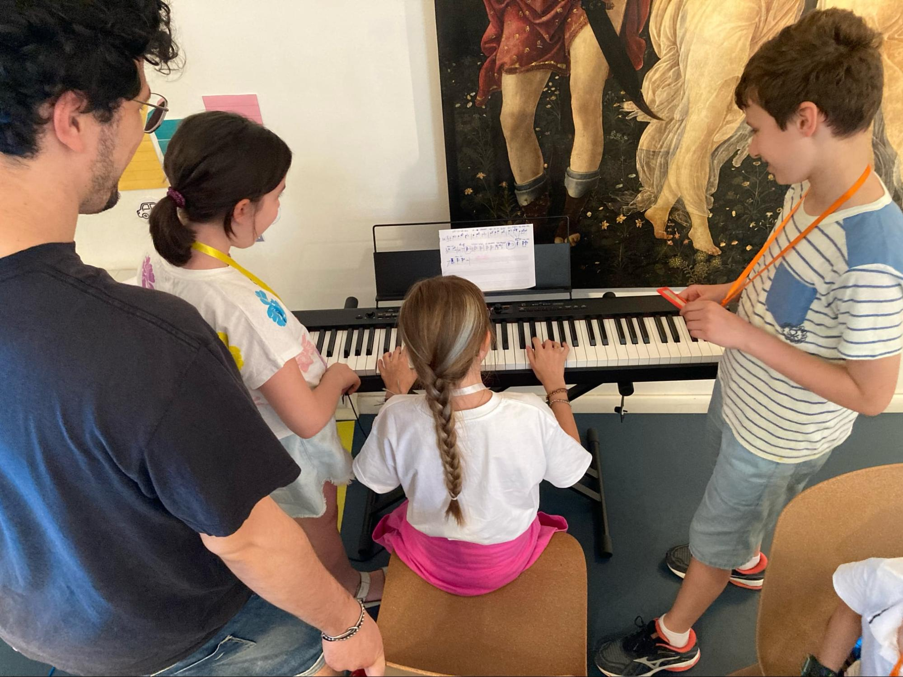
è stata composta anche una vera e propria canzone\!

chi programma e chi suona

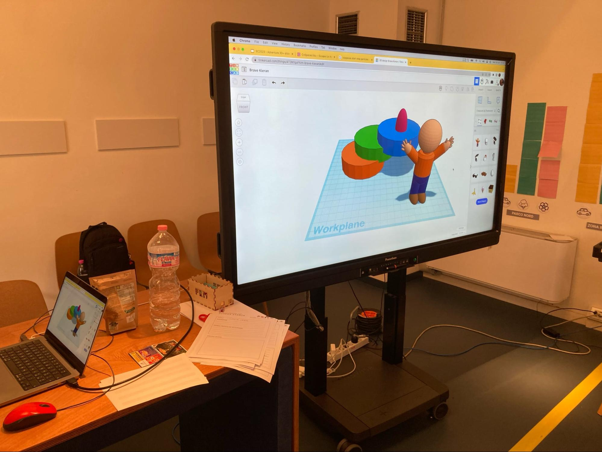
momento Tinkercad per la creazione di nuovi modelli

le stanze sono quasi finite, è il momento di caricarci i suoni

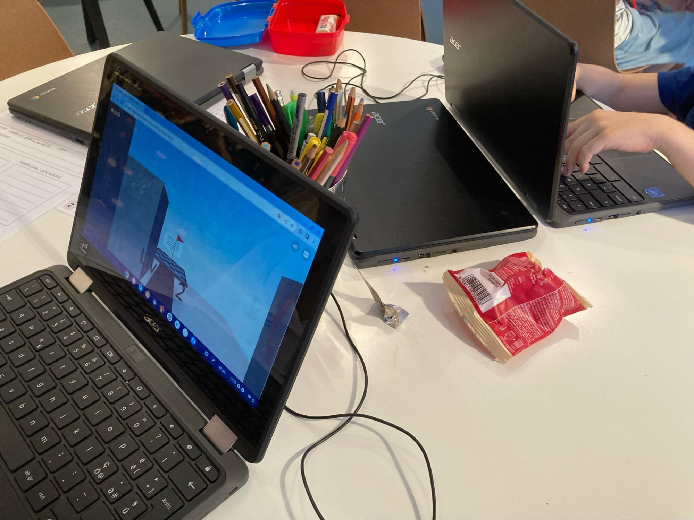
momento merenda

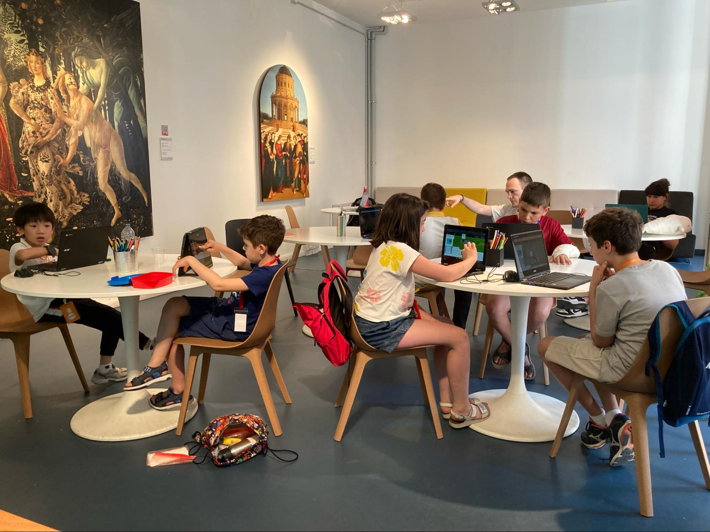
massima cooperazione

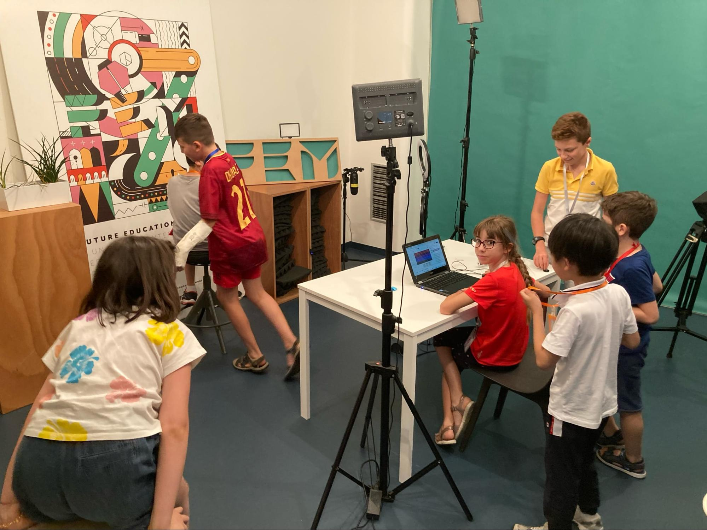
registrazione e ascolto delle musiche  
