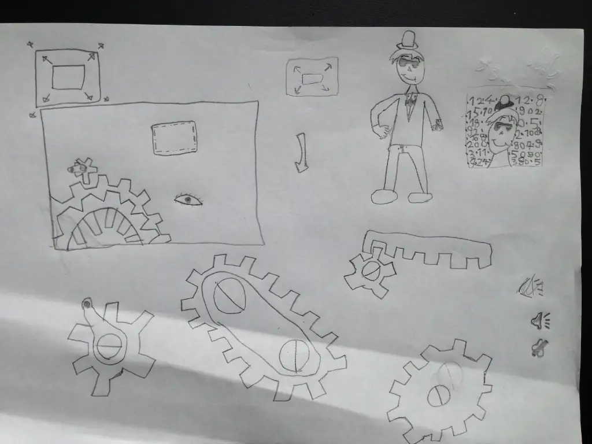

## Informazioni
- Data: maggio 2016
- Luogo: Firenze
- Play Online: https://jamurr.itch.io/spykid

## Descrizione

**-.-. .. .- ---**!!!!!!

come? non sai cosa significa?  
allora non hai giocato abbastanza alle spie, da piccoli!

il nostro Fabio ha pensato che sarebbe utile un "cifratore" di messaggi, utile anche per imparare i vari metodi, tra cui il CODICE MORSE.
e così abbiamo creato questa app "utility" per le giovani spie.
i disegni e le idee sono di Fabio, lo sviluppo e tutto il resto di Stefano.

per ora abbiamo studiato e implementato:

- codice morse
- numerificazione
- reverse
- inverse
- Giulio Cesare (rot13)

## Download
- scarica app **iOS**: [Apple App Store](https://apps.apple.com/us/app/jj-spykid/id1109994886)
- scarica app **Android**: [Google Play](https://play.google.com/store/apps/details?id=com.jamurr.spykid)
- progetto Open Source: <https://github.com/2042ed/JAM.SpyKid>
