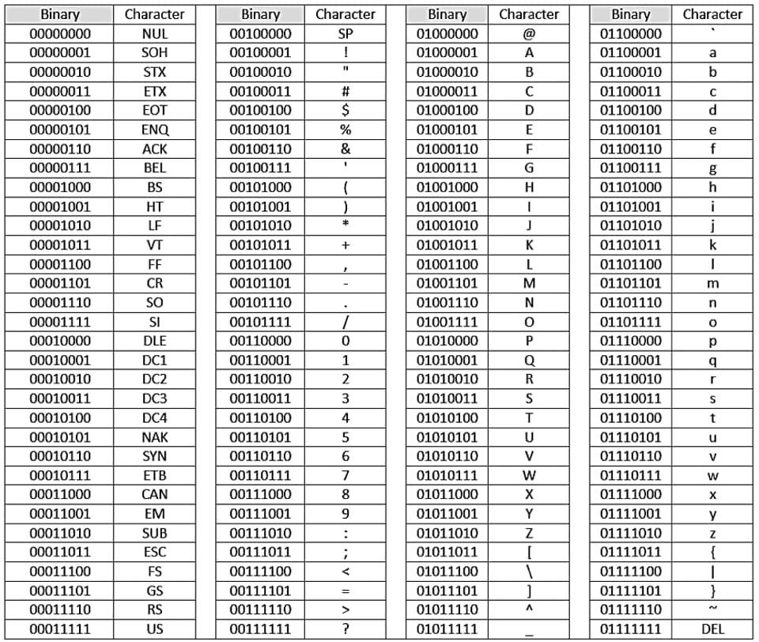

# HackerKid 20104: il carattere conta

La missione di oggi conta molto.

Ieri hai capito che l’unità base dell’informazione è il Bit, la cifra binaria che può essere 0 o 1. E che messi in fila 8 bits formano un Byte, che può rappresentare (con la numerazione binaria, ovvero in base 2) un numero da 0 a 255.  
Grazie ad una tabella di corrispondenza condivisa tra tutti, un byte può anche rappresentare un qualsiasi carattere dell’alfabeto: dalla a alla z, dalla A alla Z, le cifre, i segni di punteggiatura e molti altri, anche non visibili, come gli spazi e i ritorni a capo.

La MISSIONE È: quanti caratteri ci sono in totale in questo messaggio?
Ovvero quanti Bytes sono necessari per memorizzarlo?
Non contarli a mano: vedi se trovi un’alternativa per contarli più velocemente.  
INOLTRE: nel famoso Computer Commodore 64, che ti ricordo si chiamava così perché aveva ben 64 Kb di memoria: quante volte potrebbe starci questo messaggio?

Buon lavoro, Agente 127.

SUGGERIMENTI:

1. un Kb equivale a 1024 bytes.

