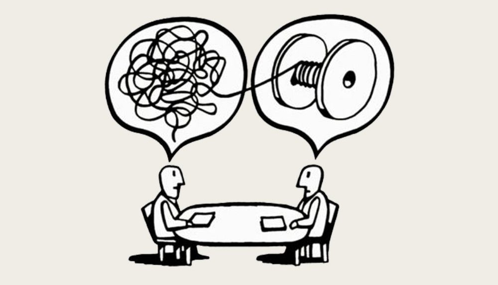

# HackerKid 20108: obiettivo

Complimenti, Agente 127, hai completato la prima settimana di apprendistato per diventare un HackerKid con effettivo impegno e ottimi risultati.
Oggi lo dedicherai al riposo, allo svago, al libero gioco, magari nel bosco dato che è la giornata mondiale dei Parchi, e intanto rifletterai su questa domanda:

COSA VORRESTI OTTENERE DA QUESTO PERCORSO? Qual è un tuo obiettivo? Cosa vorresti essere in grado di fare fra 92 giorni?
(ti ricordo che questo primo livello di preparazione dura 100 giorni)
Pensaci bene. avere un obiettivo e dichiararlo è importante sia per te che per noi.
Buona giornata.

