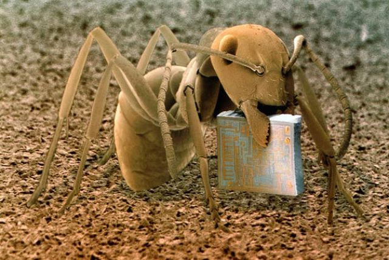

# HackerKid 20110: Memorie digitali e Backup

Buongiorno HK.
Si, si può dire che i computer mangiano delle micropatatine (microchips) :)

Ora che sai identificare le principali tipologie di files, e sai che ognuno di essi è codificato e memorizzato digitalmente, è bene capire DOVE sono memorizzati.
Ieri c'è stato un rischio perdita dati.
Ti sarai accorto che, se spariscono le foto da uno smartphone.. la prima domanda preoccupata è: dove sono andate? Posso recuperarle?

La tua missione di oggi è capire dove vengono memorizzati i tuoi dati: computer, smartphone, Switch, Netflix TV.

Domande:
1) cosa è un Hard Disk?
2) cosa è una chiavetta USB?
3) cosa è il "Cloud" ovvero il salvataggio online?
4) quale è la capacità di memorizzazione del tuo computer (in Gb)?
5) quale è la capacità di memorizzazione del tuo smartphone (in Gb)?
6 extra): se domani uno di questi dispositivi sparisse di colpo. riusciresti a recuperarne i dati? (indizio: cerca "backup")

