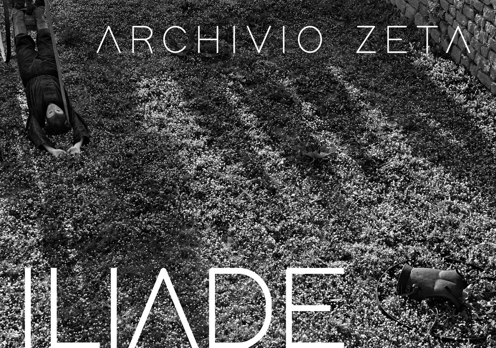

# HackerKid 20111: Archiviare Omero

Agente 127. Dobbiamo fare spazio.
Considerato che:
- 1 carattere occupa 1 Byte
- 1 pixel di un'immagine occupa 3 Bytes
- i video sono girati a 30 Immagini al Secondo (FPS)

Ci serve sapere:
1) Quanto spazio serve per salvare l'Iliade in formato testo?
2) quanto occupa un'immagine Full HD a colori?
2b) la stessa immagine in bianco e nero?
3) un filmato Full HD da 15 secondi?
4) abbiamo un programma Zip che riesce a comprimere i testi del 90%, le immagini del 50%, e i video del 40%. Quanto spazio occuperebbero 1) 2) e 3) se compressi?

buon lavoro

AIUTI:
- trovi tutto il testo dell'Iliade qui:
https://www.rodoni.ch/busoni/bibliotechina/nuovifiles/iliade_h/testo.htm
- Full HD = formato 1920 x 1024 pixels
- le immagini a colori usano un byte per colore primario (RGB - Red, Green, Blue) per ogni pixel
- le immagini in Bianco e Nero usano un solo byte per pixel (il livello di grigio)
- i video sono una sequenza di immagini con una precisa frequenza di immagini al secondo.. per convenzione non si usano gli Hz bensì i Frames Per Second (FPS)

