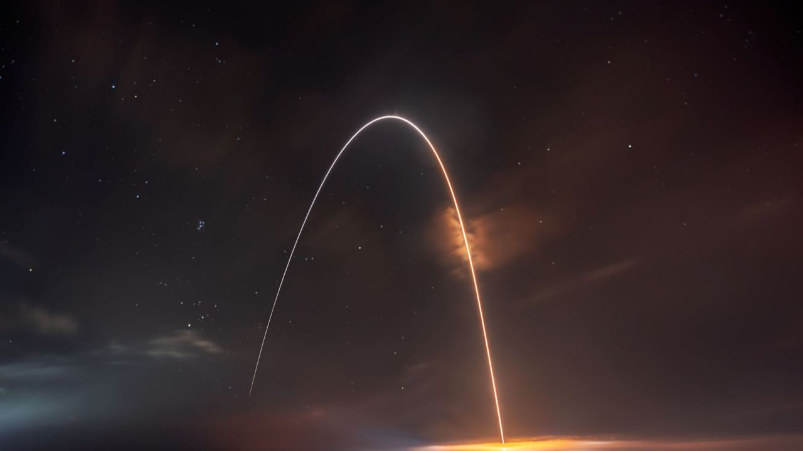

# HackerKid 20115: Viaggi elettromagnetici

HK 127: c'è una richiesta di viaggio e dobbiamo rispondere velocemente.
Non sappiamo più dove è il nostro satellite artificiale segreto. Stava andando verso la Luna ma non lo vediamo. Sappiamo solo che se gli mandiamo un messaggio ci risponde esattamente dopo 2.15 secondi dal nostro invio.
A) A che distanza dalla Terra dove si trova? Ha già oltrepassato l'orbita lunare?

Inoltre dobbiamo trovare il modo più veloce per inviare un messaggio da Firenze alle Chatham Islands, che hanno una posizione geografica molto particolare (quale è?)
Calcola tutti i tempi e decidi quale è in modo più veloce
A) a piedi, velocità 6 Km/h 
B) in auto, velocità 100 Km/h
C) lanciando un missile verso Est, a 800 Km/h
D) lanciando un missile verso Ovest, a 800 Km/h
E) con un ipotetico traforo terrestre, velocità 200Km/h
F) via posta elettronica, considerando che ogni ogni 100Km c'è un router che rallenta la trasmissione di 0,1 secondi

buon viaggio

