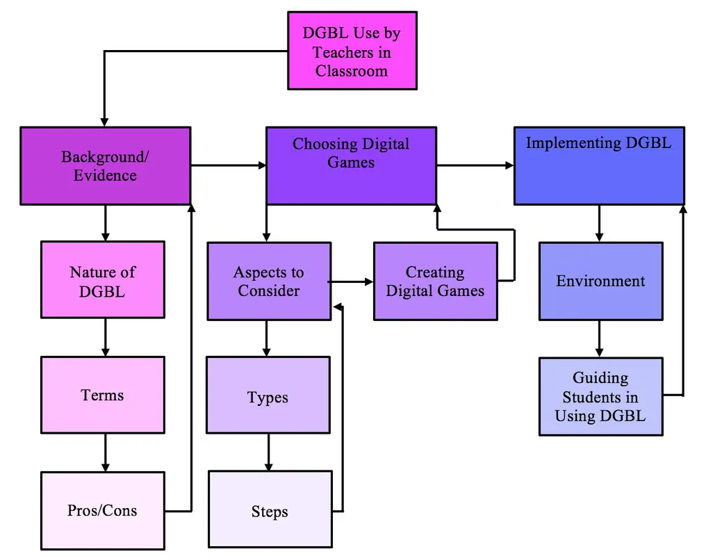
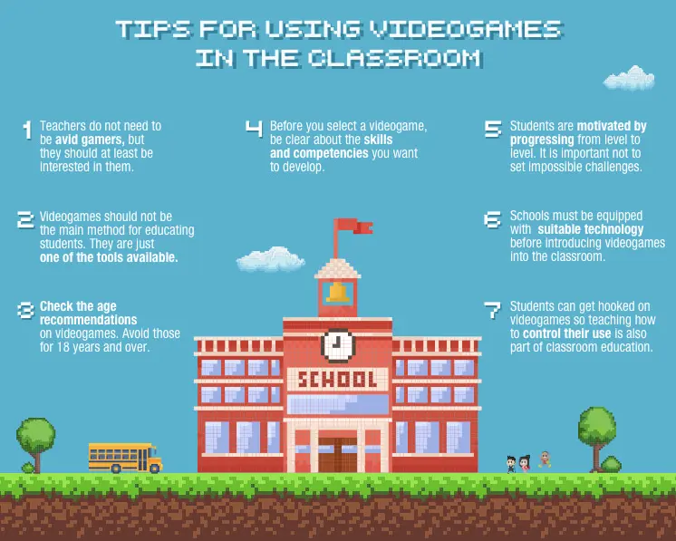
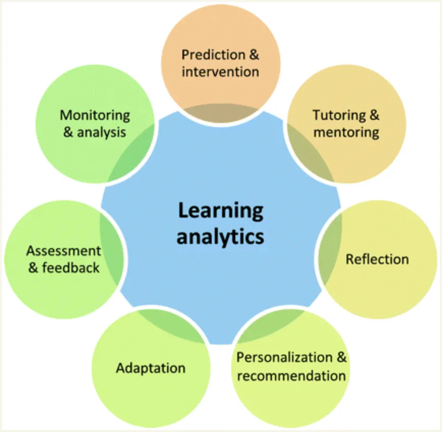

# 5. Guida per l'insegnante

**Obiettivi di apprendimento**  

- Come impostare una sessione DGBL
- Quali sono le competenze che un insegnante deve sviluppare
- Quali sono le sfide del DGBL?
- Di quale hardware abbiamo bisogno e come configurarlo?
- Quali competenze deve avere lo studente per iniziare?
- Come valutare il risultato di un VG
- Cosa sono le analisi di gioco?
- Cosa valutare?

## Come usare la EVG in classe

Dopo aver appreso i benefici dei videogiochi educativi e le caratteristiche di un buon videogioco educativo, arriviamo alla domanda: come incorporare l'apprendimento basato sul gioco per ottenere il massimo beneficio, quando e dove nel curriculum? Inoltre, che dire della gestione della classe, come gestire l'ambiente della classe e degli studenti mentre si gioca?

In questa unità, risponderemo a tutte queste domande e forniremo una linea guida e dei suggerimenti che gli insegnanti possono seguire quando decidono di selezionare e implementare un videogioco educativo.

> 📽 #VIDEO [Uso dei giochi in classe](https://youtu.be/o6IELVV2xLQ)
<iframe height="450" width="800" src="https://www.youtube.com/embed/o6IELVV2xLQ"></iframe>

## Insegnante 2.0

Con l'introduzione della tecnologia in classe, gli insegnanti si stanno allontanando dall'essere gli unici presentatori di informazioni e si stanno spostando verso il nuovo ruolo di "facilitatori".
Questo nuovo ruolo comporta l'emozione di presentare agli studenti un apprendimento basato su giochi digitali che, come è stato dimostrato, aumentano il desiderio di apprendere degli studenti, abbassano i loro livelli di stress e forniscono nuovi modi proattivi di apprendere le competenze necessarie del XXI secolo. Inoltre, gli insegnanti/facilitatori possono contare su "nuovi strumenti di valutazione" che sono simili a rubriche e possono essere utilizzati per valutare e determinare se i giochi coinvolgeranno i loro studenti mentre li insegnano. In conclusione, quando gli insegnanti valutano adeguatamente i giochi per accertarne l'utilizzabilità in classe e poi li implementano correttamente, portano in classe un nuovo livello di apprendimento che rinvigorisce il desiderio di imparare degli studenti, riducendo al contempo lo stress indesiderato che inibisce la loro capacità di eccellere.

## Approccio
L'approccio all'apprendimento basato sul gioco digitale deve essere ben pianificato e organizzato per coinvolgere nell'apprendimento e produrre i risultati appropriati.

Gli allenatori devono imparare a preparare la scena, fornendo informazioni rilevanti sul gioco e sostenendo gli studenti nei loro tentativi di costruire, decostruire e ricostruire forme di conoscenza rilevanti (sia in relazione al contesto del gioco, sia agli obiettivi curricolari e ai fenomeni della vita reale).

Devono acquisire familiarità con i fondamenti teorici del DGBL, conoscere i giochi specifici che utilizzeranno: tecniche, gameplay, curriculum, risultati, assistenza, valutazione. Per tutto questo, forniremo un elenco di giochi di apprendimento digitale come casi di studio per gli allenatori.

È importante conoscere la teoria e gli strumenti, perché i giochi non funzionano da soli e non tutti i rifugiati/adulti/allenatori sono a proprio agio con i giochi elettronici.

## Suggerimenti per l'utilizzo dei VG in classe

### Deve
1. Non è necessario che gli insegnanti siano giocatori accaniti, ma dovrebbero almeno essere interessati al gioco**.
2. I videogiochi non devono essere il metodo principale per educare gli studenti. Sono solo **uno degli strumenti disponibili**.
3. **Controllare l'età consigliata** dei videogiochi. Evitare quelli a partire dai 18 anni.
4. Prima di scegliere un videogioco, è necessario avere ben chiare le **abilità e le competenze** che si vogliono sviluppare.
5. Gli studenti sono **motivati a progredire** di livello in livello. È importante non porre sfide impossibili.
6. Le scuole devono essere dotate di **tecnologie adeguate** prima di introdurre i videogiochi in classe.
7. Gli studenti possono diventare dipendenti dai videogiochi, quindi anche insegnare come **controllare il loro uso** fa parte dell'educazione in classe.

### Plus
- L'educatore dovrebbe giocare al gioco prima dell'intervento, per identificare i suoi possibili limiti. 
- L'educatore deve adattare il gioco allo scenario educativo e correlarlo ai metodi tradizionali di insegnamento. 
- L'intervento di gioco deve avere un limite di tempo specifico che non deve essere modificato. 
- Durante l'intervento di gioco, l'educatore deve prima giocare con gli studenti per assicurarsi che comprendano il gioco e siano in grado di procedere da soli, poi supervisionare gli studenti e associare il contenuto del gioco agli obiettivi educativi. 
- L'educatore dovrebbe chiedere un feedback agli studenti dopo l'intervento e tenere conto delle loro considerazioni e preferenze per la progettazione delle prossime esperienze di GBL.

## Una sessione di apprendimento basato sul gioco digitale
Possiamo riassumere una sessione di DGBL in queste cinque fasi:

### 1. Introduzione al videogioco
L'insegnante spiega il gioco e aiuta a installarlo sui dispositivi degli studenti.
Poi racconta i risultati attesi dal gioco.

### 2. gioco/esperienza
attività autonoma: lo studente diventa giocatore

### 3. risultati del gioco / punteggi
attività autonoma: il giocatore finisce di giocare e controlla il punteggio.

### 4. riflessione / analisi
lo studente e l'insegnante analizzano insieme il risultato

### 5. formazione di concetti astratti + applicazione al mondo reale

## Competenze dell'insegnante
L'insegnante deve sviluppare o almeno conoscere qualcosa su questi argomenti:

- TIC / Competenze digitali di base
- Esperienza minima di gioco
- Comprensione profonda di come un gioco possa aiutare l'apprendimento e delle sue differenze con un libro/corso classico.
- Riconoscere le abilità dei diversi giocatori e supportare il loro gioco
- Coinvolgere gli studenti nel gioco e nella progressione

## Sfide
Potrebbero esserci alcune difficoltà e sfide da risolvere per ottenere risultati migliori nelle sessioni DGBL.

**Curriculum**: è difficile trovare giochi che si adattino al curriculum attuale o identificare come un certo gioco possa collegarsi al curriculum.
Consultate [commonsense.org/education] (https://www.commonsense.org/education) per avere delle idee. Ricordate che il modo migliore per usare i giochi è come rinforzo supplementare per l'insegnamento tradizionale. Non cercate giochi che insegnino il vostro programma di studi. Cercate invece giochi che possano affrontare la stessa area tematica da una prospettiva diversa.

**Correlato al gioco**: identificare l'accuratezza e l'adeguatezza del contenuto del gioco. Contenuti irrilevanti o distraenti del gioco che non possono essere rimossi.

**Atteggiamento**: persuadere tutte le parti interessate e i non giocatori del valore educativo del gioco.

**Supporto agli educatori e agli insegnanti**: renderli consapevoli di come utilizzare i giochi in modo più efficace nell'educazione.

**Tecnologia**: molti insegnanti non hanno familiarità con la tecnologia. Non c'è problema. La maggior parte degli scritti sull'apprendimento basato sui giochi si concentra sui media digitali, ma la verità è che non è necessario disporre di dispositivi. Alla scuola Quest To Learn di New York, il game design è un modo di pensare, un paradigma. Gran parte del loro programma di studio utilizza giochi cartacei piuttosto che digitali. 

**Valutazione**: Le valutazioni tradizionali spesso non sono in linea con il GBL, quindi è necessario considerare nuovi modelli e approcci.

Gli **sviluppatori** incoraggiano e sostengono gli sviluppatori di giochi nella creazione di giochi educativi migliori.

## Moderazione
L'impatto dei videogiochi sulla società è stato oggetto di numerosi studi. Ad esempio, uno psicologo dell'Internet Institute dell'Università di Oxford ha pubblicato uno studio che stabilisce quanto tempo i bambini dovrebbero dedicare ai videogiochi. Egli riferisce che coloro che giocavano meno di un'ora erano più stabili emotivamente, mentre coloro che giocavano per circa tre ore al giorno sviluppavano problemi sociali. Pertanto, quando si parla di videogiochi, la **moderazione è fondamentale**. 

## Come implementare la GBL?
Ci sono molte strategie e modi per gli educatori di incorporare l'apprendimento basato sui giochi e le EVG nel loro curriculum e nella loro classe. Ecco tre modi che gli insegnanti possono seguire per implementare l'apprendimento basato sul gioco:

### Giochi come esperienza condivisa
Le EVG selezionate giocano maggiormente sull'esperienza, dando agli studenti la sensazione di essere in gita. **Come in una gita**, agli studenti vengono prima fornite istruzioni su cosa aspettarsi e poi viene data loro la libertà di esplorare un luogo fuori dalla scuola. E poi, tornati in classe, **gli istruttori facilitano e sottolineano i collegamenti del gioco con il programma scolastico**. Questi giochi forniscono un significato agli studenti.
Per esempio, in MineCraft gli studenti costruiscono strutture e "quando arriva la notte e i rampicanti attaccano, solo gli studenti che sono rimasti nelle strutture fortificate sopravvivono". Dopo il gioco, discutiamo delle difficoltà di creare una colonia in un ambiente ostile. Gli studenti capiscono i pericoli dell'insediamento di nuovi mondi perché li hanno sperimentati".

### Giochi come testo
Questi giochi permettono agli utenti di decidere il destino del gioco. Il gioco è costruito su un modello che utilizza le scelte dei giocatori per raccontare una storia. Tra questi si possono citare [Firewatch](http://www.firewatchgame.com/), un gioco open-world sull'essere un guardaparco; [Life Is Strange](https://lifeisstrange.square-enix-games.com/en-gb/), una storia emozionante di amicizie e bullismo in una scuola privata; [Her Story](https://www.herstorygame.com/), un poliziesco procedurale non lineare; e [1979 Revolution: Black Friday](https://www.gamesforchange.org/games/1979-revolution-black-friday/), un thriller politico ambientato durante la rivoluzione iraniana.
Ogni gioco racconta una *storia*.
**Per valutare l'apprendimento** con questi giochi, gli insegnanti possono utilizzare Office 365 o Google Docs. Per esempio, l'insegnante di letteratura inglese Paul Darvasi fa giocare i suoi studenti al gioco di esplorazione punta e clicca [Gone Home](https://gonehome.com/), che parla di una famiglia disfunzionale. Ambientato nel 1995, il gioco utilizza dispositivi letterari come l'atmosfera, il tono e il tema. L'insegnante fa sì che gli studenti prendano delle schermate come prova e le aggiungano a un documento condiviso. Le schermate raccolte portano poi a progetti come il confronto delle recensioni e la scrittura delle proprie.

### Giochi come modelli
Questi giochi sono costruiti su sistemi modello del mondo reale. Offrono agli studenti l'opportunità di creare i propri modelli all'interno del gioco. Un insegnante afferma di far giocare gli studenti a [Werewolf] (https://teambuilding.com/blog/werewolf-game-rules) e di discutere "le diverse azioni che rispecchiano gli eventi dei processi alle streghe di Salem, del maccartismo e di altre cacce alle streghe. Faccio giocare gli studenti anche al gioco da tavolo [Pandemic] (https://www.zmangames.com/en/games/pandemic/) e al gioco mobile [Plague, Inc] (https://www.ndemiccreations.com/en/22-plague-inc). Questi giochi illustrano come le malattie viaggiano nelle reti interconnesse del mondo. Gli studenti imparano come la peste bubbonica abbia viaggiato lungo la Via della Seta". Afferma che questi giochi modellano le cause che hanno effetti, i quali successivamente hanno effetti che insegnano l'abilità del **21° secolo del pensiero sistemico**.

## Altri strumenti
Gli insegnanti possono anche creare la propria forma di EVG creando giochi di apprendimento in Google Classroom

> 📽 #VIDEO [Come creare giochi didattici in Google Classroom](https://www.youtube.com/watch?v=5TOXvl3Vig4)
<iframe height="450" width="800" src="https://www.youtube.com/embed/5TOXvl3Vig4"></iframe>

## Valutazione preliminare e configurazione degli studenti 

### Impostazione del dispositivo
Installare il gioco sul dispositivo ed eseguirlo una volta.
Se necessario, effettuare alcune regolazioni di Android (ad esempio, le notifiche).

## Valutazione dell'apprendimento dai giochi digitali

Il modo in cui un gioco viene valutato è cruciale se si vuole che abbia uno scopo, che sia considerato appropriato dagli studenti e che li incoraggi a impegnarsi nell'esperienza di apprendimento.
Ci sono sette aspetti che dovrebbero essere esaminati per determinare l'efficacia dell'apprendimento basato sui giochi.

- **Prestazioni dell'allievo** - se l'apprendimento ha avuto luogo e se c'è stato un miglioramento delle prestazioni dell'allievo. 
- Motivazione** - i livelli di motivazione, interesse e partecipazione degli studenti al gioco.
- **Percezioni** - le opinioni degli studenti su aree quali l'esperienza del tempo che passa, il realismo del gioco, la complessità, il supporto ricevuto e i livelli di competenza percepiti all'interno del gioco.
- Atteggiamenti** - sentimenti degli studenti e degli insegnanti nei confronti della materia stessa e dell'uso dei giochi per l'apprendimento all'interno di tale materia.
- **Collaborazione** - la regolarità e l'efficacia della collaborazione. (Connolly et al. sostengono che questo aspetto è facoltativo e dipende dalla progettazione del gioco; io sostengo che nel contesto dell'apprendimento degli adulti con i giochi la collaborazione è una parte importante della progettazione dell'apprendimento).
- **Preferenze** - inclinazioni degli studenti e degli insegnanti verso, ad esempio, diversi stili di apprendimento o modalità di interazione.
- Apprendimento basato sul gioco **Ambiente** - fattori associati al gioco stesso, come la progettazione dell'ambiente, l'uso di scaffolding, l'usabilità, i livelli di presenza sociale e il modo in cui il gioco viene utilizzato.

### Strumenti di valutazione: Analisi
La parte analitica è la più importante 

### Sondaggio sul coinvolgimento
Questo questionario può essere utilizzato dopo il completamento di un'attività per valutare il livello di coinvolgimento rispetto a un'altra attività. Per analizzare i risultati e confrontare i livelli di coinvolgimento tra due attività diverse, occorre procedere come segue.

- Assegnare un valore a ogni risposta, dove fortemente in disaccordo = -2 e fortemente d'accordo = 2.
- Per le risposte negative (ad esempio, "non saprei dire quale effetto abbiano avuto le mie azioni") invertire la scala.
- Sommate i punti totali per ottenere un valore di coinvolgimento nell'attività.

Pensando all'attività appena svolta, indichi il livello di accordo con le seguenti affermazioni:

> Fortemente in disaccordo (-2) | Disaccordo (-1) | Né d'accordo né in disaccordo (0) | D'accordo (1) | Fortemente d'accordo (2)

- Volevo completare l'attività
- Ho trovato l'attività frustrante
- Sentivo di poter raggiungere l'obiettivo dell'attività
- Sapevo cosa dovevo fare per completare l'attività
- Ho trovato l'attività noiosa
- Non era chiaro cosa potevo e non potevo fare
- Era chiaro cosa avrei potuto imparare dall'attività
- Mi sono sentito assorbito dall'attività 
- L'attività era inutile
- Non ero interessato a esplorare le opzioni disponibili
- Non mi importava come finiva l'attività
- Ho sentito che il tempo è passato velocemente
- Ho trovato l'attività soddisfacente
- L'attività non mi permetteva di fare ciò che volevo
- Non sono riuscito a capire l'effetto delle mie azioni
- Non mi è piaciuta l'attività
- Il feedback che mi è stato dato è stato utile
- Ho trovato facile iniziare l'attività

---
## Revisione dell'unità
- Alla fine... cosa pensi del DGBL?
- Quale pensate sia l'atteggiamento migliore nell'usare i giochi in classe?
- Di cosa avete bisogno per migliorare le vostre sessioni di insegnamento?
- Avete intenzione di giocare di più ai videogiochi da domani?
- Vi è piaciuto questo corso?
- Avete imparato qualcosa di nuovo?
- Cosa ti è piaciuto di più?
- Avete qualche suggerimento per migliorare questo corso?
