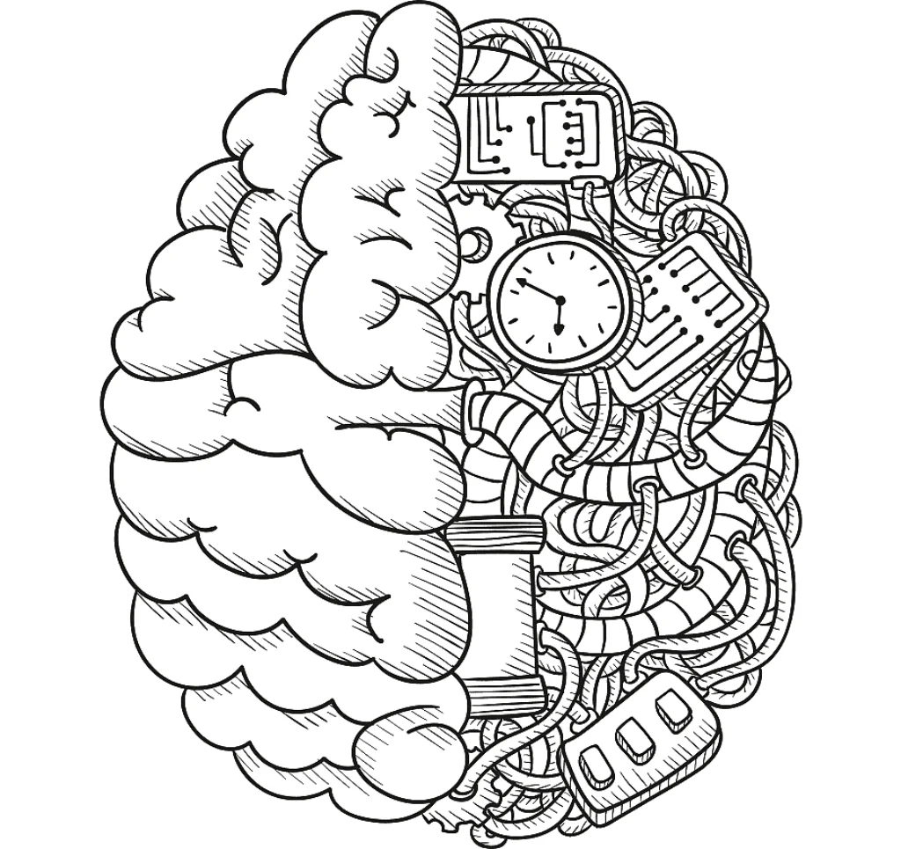
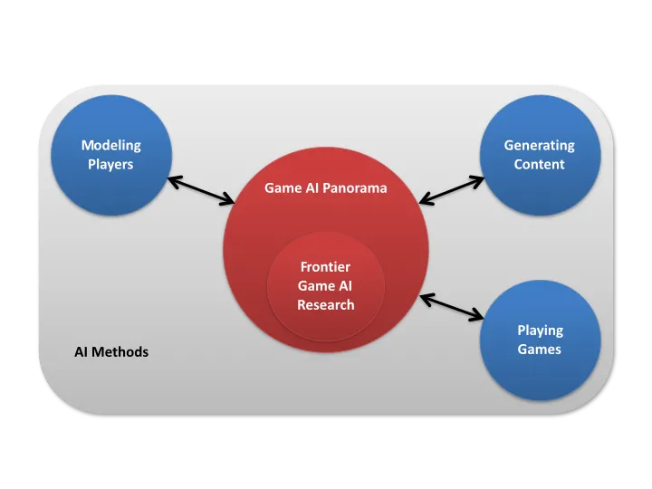

# Introduzione

L'Intelligenza Artificiale (Artificial Intelligence, A.I.) tenta di replicare e simulare l'intelligenza e il comportamento umano (*human behaviour*) imitando come il cervello umano elabora le informazioni (*reverse engineering*). Ad esempio, le **reti neurali artificiali** sono modellate sul modo in cui funziona il cervello umano.

## L'Apparato Umano

Gli esseri umani hanno
  
- un apparato sensitivo composto da **cinque sensi** di base: visivo, uditivo, cinestetico (movimento), olfattivo e gustativo
- un apparato di elaborazione dei segnali
- un apparato per esprimere le azioni nel mondo

che corrispondono a queste tre funzioni:

- Sentire
- Pensare
- Agire

Nel voler ricreare un "Agente Intelligente" abbiamo dato vita a diverse aree di ricerca e sviluppo (R&D) multidisciplinare:

- Ascoltare e parlare (Speech Recognition and Speech Synthesis)
- Comprensione del linguaggio (Natural Language Processing - NLP)
- Vedere (Computer vision and Pattern Recognition)
- Ricordare le cose (Long, Short, Working Memory)
- Pensare (Common sense reasoning and Decision Making)
- Muoversi

### Come lavora il cervello?
I nostri cervelli cercano patterns. sempre.  
Siamo bravissimi a identificare i più piccoli indizi di ripetizione.  
Antropormofizziamo tutto.  
Viviamo delle narrazioni, ma non abbiamo memoria precisa come un computer, creiamo narrative.

## AI & Videogames

Il Videogioco, un quanto medium multimediale e interattivo che necessità di coinvolgere il giocatore in modi realistici, adattativi, reattivi, spesso in conflitto con altri giocatori "intelligenti", è il destinatario ideale ma anche il*playground* ideale per lo sviluppo, l'implementazione e il test delle AI.

Il connubio game-developer <> AI researcher è sempre più stretto..

## Cosa può fare?

A grandi linee le tree aree di utilizzo della AI nei giochi sono:

- giocare (NPG e player)
- creazione di contenuti
- analizzare il gameplay e modellare il giocatore

### 1. NPCs (non-player characters)

<https://youtu.be/u3j59Z3iXdM>

Qui è dove l'AI viene utilizzata di più nei giochi. Questi sono personaggi del gioco che agiscono in modo intelligente come se fossero controllati da giocatori umani. Molto spesso vengono usati "alberi decisionali" per guidare il comportamento di questi NPC. Questi comportamenti possono anche essere ricreati "imitando" giocatori umani.

### 2. Pathfinding

Il pathfinding implica spostarsi da un punto all'altro cercando la strada ottimale.
Ma la "ricerca" della strada ideale può anche avvenire negli spazio di gioco, nel futuro, analizzando sistemi di informazioni.

### 3. Decision-making

Prendere decisioni, a livello tattico o strategico. Cambiare comportamento.

### 4. Game Analytics e Data mining

L'AI consente ai game designer di eseguire **data mining sul comportamento dei giocatori** per aiutarli a capire come le persone finiscono per giocare, le parti che le persone giocano di più e cosa fa sì che gli utenti smettano di giocare . Ciò consente agli sviluppatori di giochi di migliorare il gioco o identificare opportunità di monetizzazione.
Le AI possono giocare lo stesso gioco su diverse piattaforme per identificare eventuali specifici bug

### 5. Procedural content generation

Le AI possono aiutare a creare automaticamente nuovi contenuti, storie interattive, condizioni ambientali, livelli e persino musica. 

### 6. Player experience modeling

L'intelligenza artificiale del gioco può capire l'abilità e lo stato emotivo del giocatore, quindi adattare il gioco in base a quello. Ciò potrebbe anche comportare un bilanciamento dinamico della difficoltà del gioco in cui la difficoltà del gioco viene regolata in tempo reale, a seconda dell'abilità del giocatore. L'intelligenza artificiale nei giochi potrebbe persino aiutare a capire l'intenzione del giocatore.

## I vantaggi dell'AI nei giochi

### 1. I giochi diventano più intelligenti e realistici

Usando tecniche come l'apprendimento dei pattern e il **reinforcement learning**, gli NPC nei giochi si evolvono grazie all'autoapprendimento dalle loro azioni. I giochi diventano anche piuttosto realistici perché interpretano e rispondono anche alle azioni del giocatore. Ci sono anche molti programmi che non necessitano di interfacce umane e sono in grado di creare automaticamente mondi virtuali.

### 3. Adaptive: rendere i giochi più intuitivi

L'uso dell'intelligenza artificiale nei giochi aiuta a rendere i giochi più intuitivi. Inoltre, il gioco può capire l'abilità e l'esperienza del giocatore e regolare il livello di difficoltà del gioco in tempo reale.

### 4. Challenging: eliminare la prevedibilità

Il gioco diventa imprevedibile quando viene utilizzato un comportamento non deterministico. Ciò che accade nel gioco non può nemmeno essere previsto dallo sviluppatore del gioco. Questo crea un'esperienza sempre nuova e aumenta la durata del gioco poiché il gioco non diventa prevedibile e noioso dopo averlo giocato alcune volte.

### 2. Risparmio di tempo e costi

Normalmente, lo sviluppo di un gioco richiede molto tempo e denaro da investire in esso. E non sei nemmeno sicuro di quanto bene il mercato accetterà il gioco. L'intelligenza artificiale può aiutare a ridurre drasticamente il tempo necessario per creare un gioco e risparmiare molte risorse che verrebbero spese per lo sviluppo del gioco.

## Che tipi di AI ci sono nei giochi?

> "Se sembra un pesce e nuota come un pesce, probabilmente è un pesce"

I tipi più comuni di AI nei videogiochi sono:

### Tecniche Deterministiche

Le tecniche deterministiche sono le più utilizzate. Il comportamento deterministico  è molto prevedibile. Non c'è alcun elemento di incertezza. Sono tecniche piuttosto veloci e facili da implementare, comprendere, testare e debuggare. Il problema è che i metodi deterministici costringono gli sviluppatori ad anticipare tutti i possibili scenari e pre-codificare tutto il comportamento. Questi metodi non consentono l'apprendimento o l'evoluzione, il che rende i comportamenti del gioco prevedibili e potenzialmente limitanti la durata del gioco stesso.

Possiamo individuare qui tre diverse metodologie di implementazione:

- **Hack**  
  soluzioni ad hoc
- **Euristica**  
  regole empiriche
- **Algoritmica**  
  programmate come si deve

### Tecniche Non Deterministiche

Il comportamento non deterministico ha un certo livello di incertezza. Ad esempio un NPC che apprende le mosse e le tattiche di un giocatore e si adatta per contrastarle. Gli sviluppatori non avranno bisogno di anticipare tutti i possibili scenari o comportamenti. Questi metodi possono persino apprendere ed estrapolare da soli e agevolare un comportamento che emerge senza che ci siano istruzioni esplicite.

## Vincoli e limitazioni

- **Infallibilità e frustrazione**. Di solito si suppone che il gioco fornisca intrattenimento e sfida piuttosto che sia "ottimale", non si vuole un nemico *imbattibile*.
- **Realisticità**. Spesso è necessario che gli agenti appaiano "realistici", in modo che i giocatori possano sentire che stanno gareggiando contro avversari quasi umani. Il programma AlphaGo è stato in grado di diventare molto migliore degli umani, ma le mosse scelte erano così lontane dalla comprensione tradizionale del gioco che avversari esperti direbbero che "mi sembrava quasi di giocare contro un alieno". Se un gioco sta simulando un avversario umano la AI deve **prendere decisioni credibili piuttosto che ideali.** (effetto *Uncanny Valley*)
- **Tempo Reale**. Le AI non possono monopolizzare l'utilizzo della CPU per lungo tempo per prendere una decisione. Anche impiegare solo 10 millisecondi per prendere una decisione è troppo perché la maggior parte dei giochi ha solo tra 16 e 33 millisecondi per eseguire tutta l'elaborazione per il fotogramma successivo della grafica.
- È ideale se almeno una parte del sistema sia `data-driven` anziché codificata, in modo che i *non* programmatori possano apportare modifiche e che possano essere apportate più rapidamente.

## Domande
- come lavora il cervello?
- come percepiamo l'intelligenza negli altri?

> **Il nostro lavoro (di game developers): creare una bella esperienza.**  
> tutto deve supportare questo lavoro. anche le AI.

## Come si fa a implementare una AI in un videogioco?
E' fondamentale conoscere:

1. le caratteristiche del gioco
- numero di giocatori? (competitivo? collaborativo? entrambi?)
- spazio di azione e livelli di ramificazione
- casualità
- osservabilità
- granularità del tempo

1. le caratteristiche degli algoritmi utilizzabili

Da queste due considerazioni si può decidere quale metodo usare e per cosa.
