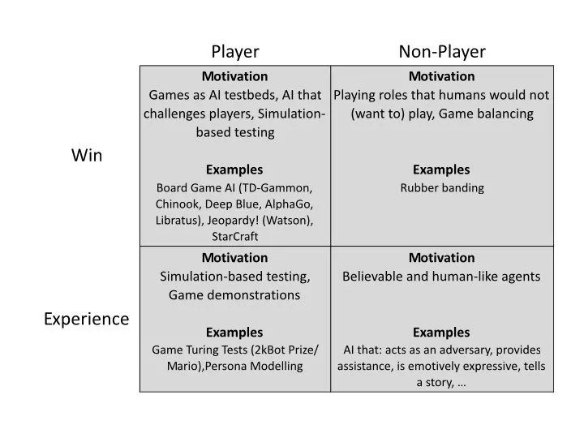
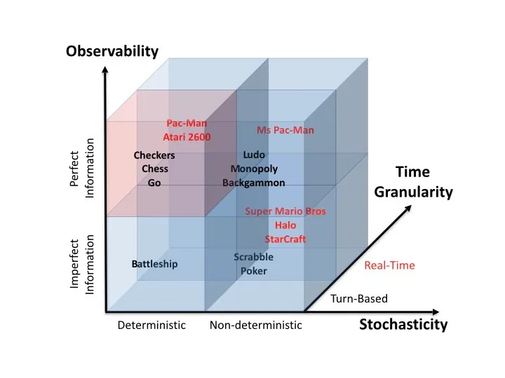
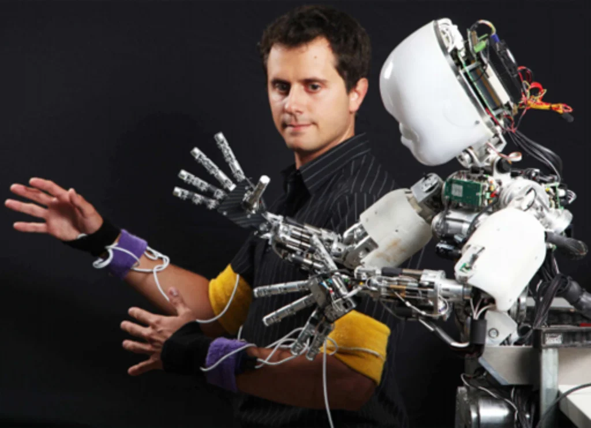

# Play

La AI gioca e aiuta a migliorare i giochi e arricchire l'esperienza del giocatore.

AI può giocare con due obiettivi:
1. play **well** 
	a) il giocatore (play test e valutazione game design)
	b) gli NPC (per bilanciamento difficoltà dinamica)

2. play **believably**
	a) debug e simulazione
	b) credibilità e umanizzazione

##  1. NPCs (non-player characters)

### AI Nemico
Una IA nemica ben implementata è caratterizzata dalla credibilità del movimento degli NPC avversari, dal modo in cui conversano, si comportano e reagiscono a qualsiasi situazione creata dal giocatore.

### AI amica / compagna
I compagni AI forniscono volti amichevoli in un ambiente ostile. Aiutano nella navigazione, nella risoluzione di enigmi e nel combattimento. Alleviano la solitudine.

Vantaggi:

- Non pre-programmati
- Meno prevedibili
- Più furbi
- Possono imitare i migliori giocatori (umani)

Un buon giocatore AI:

- deve permettere al giocatore di barare
- non deve essere troppo prevedibile
- ma neanche deve essere perfetta
- lascia il giocatore "vincere"

Case Studies: Halo

## Board Games
- GAME TREE CALCULATION
	- MINIMAX
	- MONTE-CARLO TREE SEARCH

- BOARD EVALUATION
Con una funzione di valutazione:
Stimare il valore o la bontà di una posizione in un albero di gioco.

Con un approccio genetico:
si modifica la funzione di valutazione mutando alcuni parametri.

## Card Games

## Classic Arcade Games

## Strategy Games

## Racing Games
- PATH FINDING
- STEERING BEHAVIORS

## Shooters and Other First Person Games

## Serious Games

## Interactive Fiction

## Other Games

---

## Approfondimenti pratici

[DeepMind Made A Superhuman AI For 57 Atari Games!](https://www.youtube.com/watch?v=dJ4rWhpAGFI)

MarI/O – Machine Learning in Video Games  
- <https://youtu.be/qv6UVOQ0F44>

Designing safer cities through simulations  

- <https://blogs.unity3d.com/2018/01/23/designing-safer-cities-thr>
- <https://blogs.unity3d.com/2020/12/11/automate-your-playtesting-create-virtual-players-for-game-simulation/>

Unity Machine Learning - Reinforcement Learning Demo  
- <https://www.youtube.com/watch?v=fiQsmdwEGT8>

Multi-Agent Hide and Seek

- [OpenAI Multi-Agent Hide and Seek](https://youtu.be/kopoLzvh5jY)
- [OpenAI Plays Hide and Seek…and Breaks The Game! 🤖](https://www.youtube.com/watch?v=Lu56xVlZ40M>)
- [DeepMind’s AI Plays Catch…And So Much More! 🤖](https://www.youtube.com/watch?v=uuzow7TEQ1s)

AI Learns to Park - Deep Reinforcement Learning  
- <https://www.youtube.com/watch?v=VMp6pq6_QjI>

