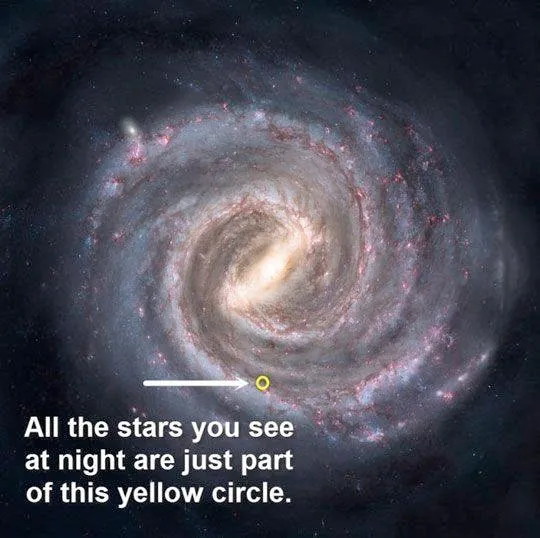
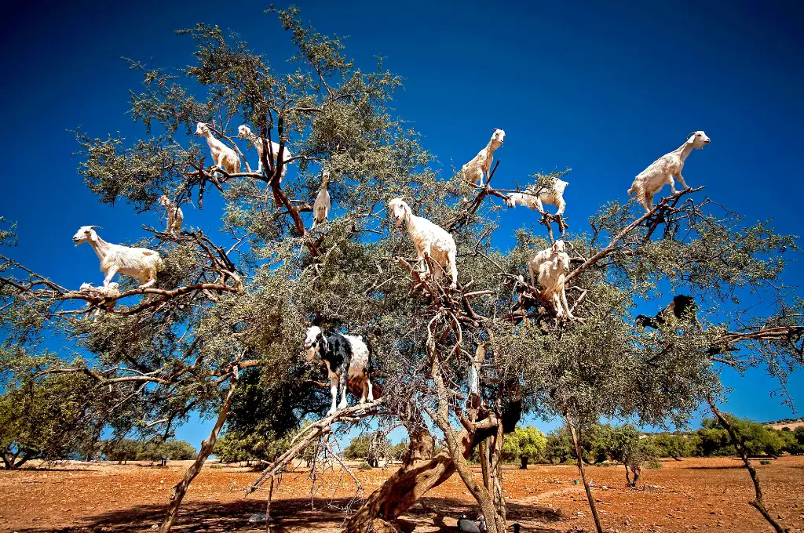
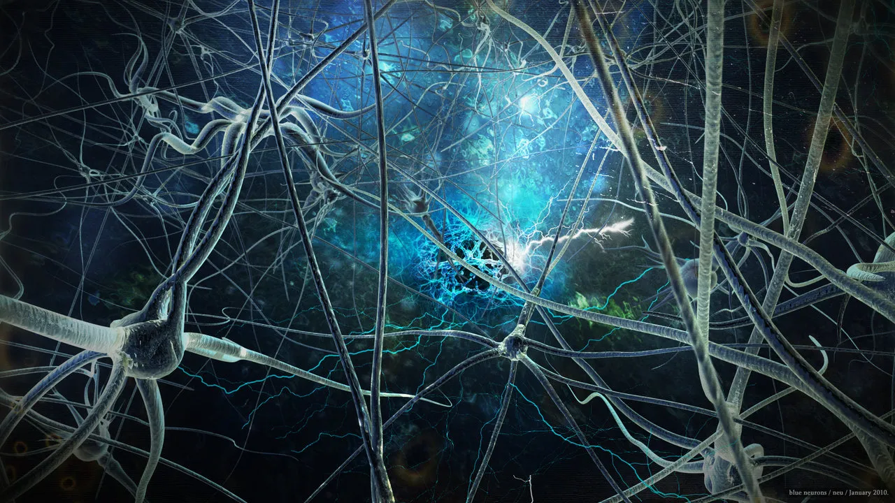
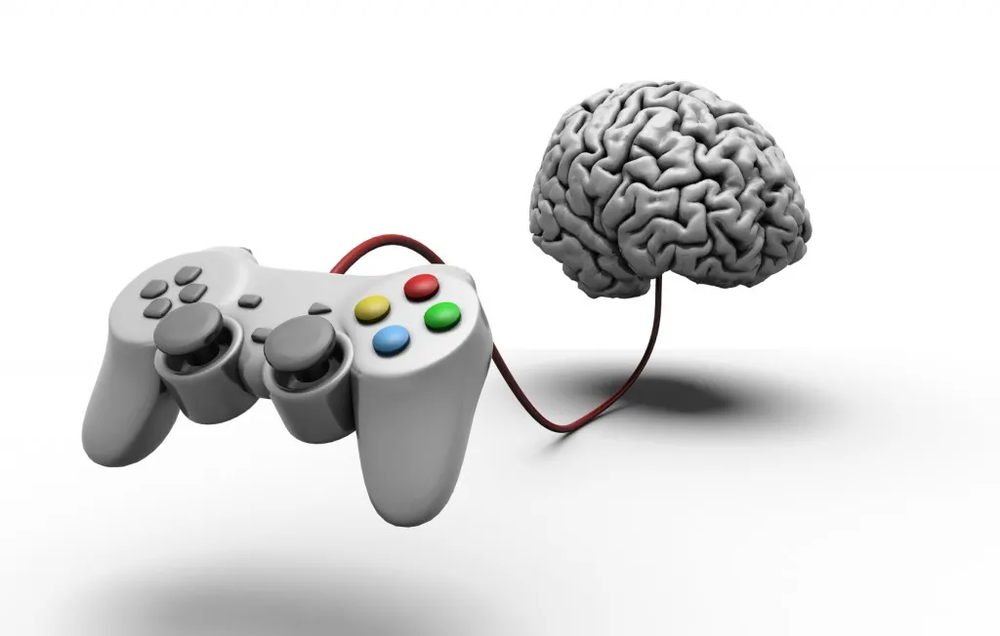
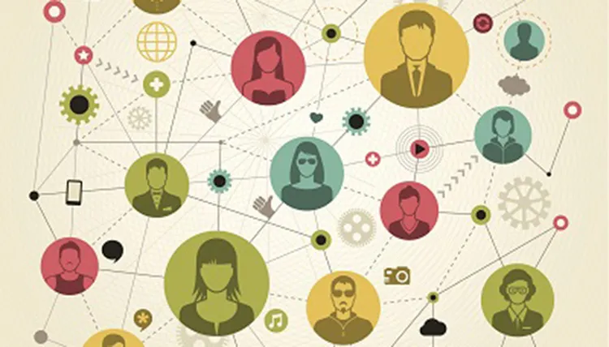
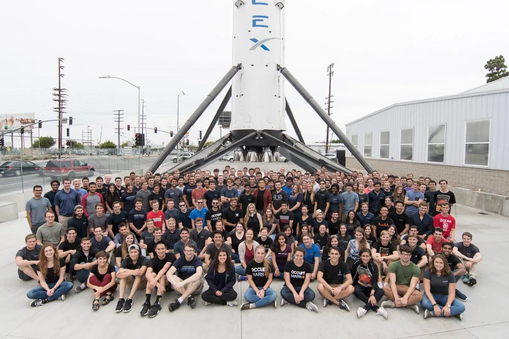
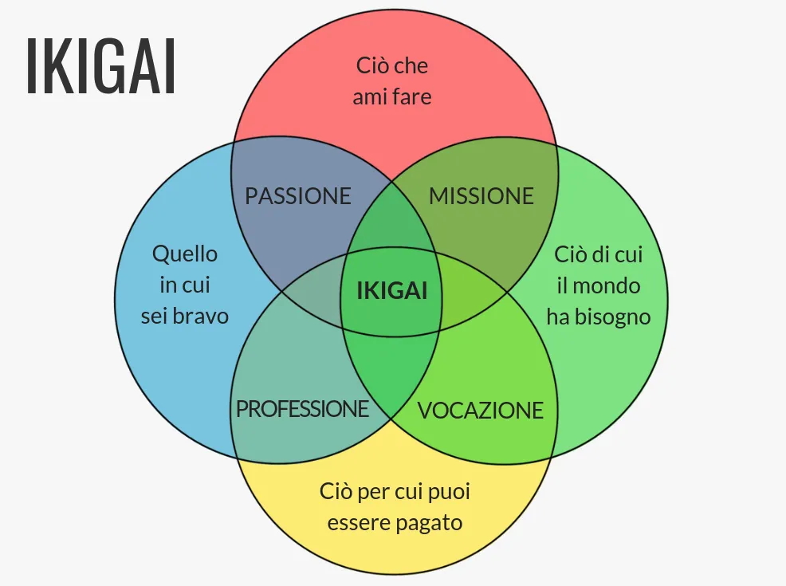
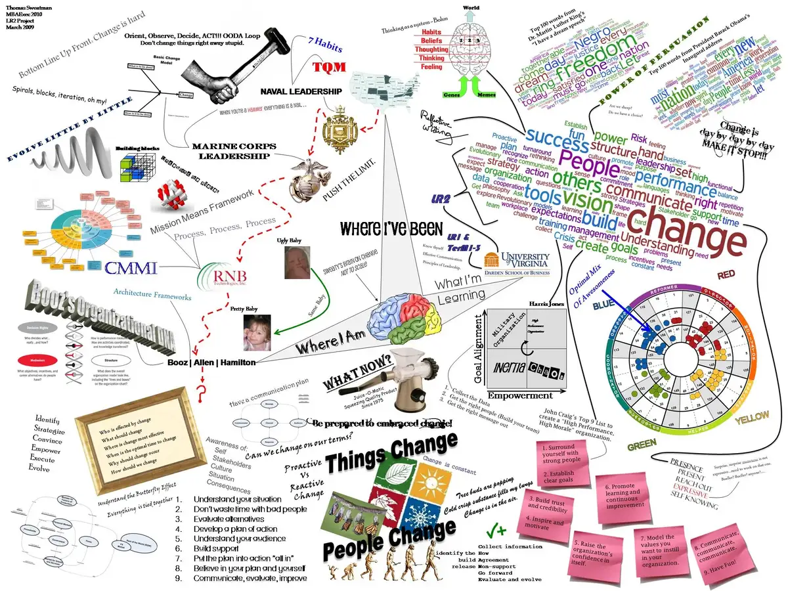
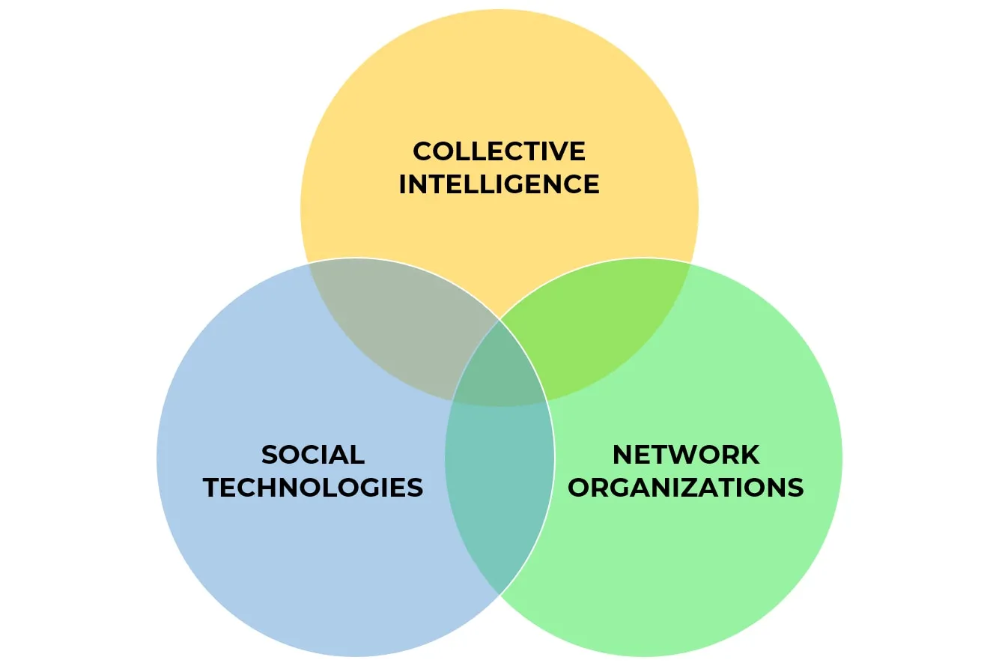
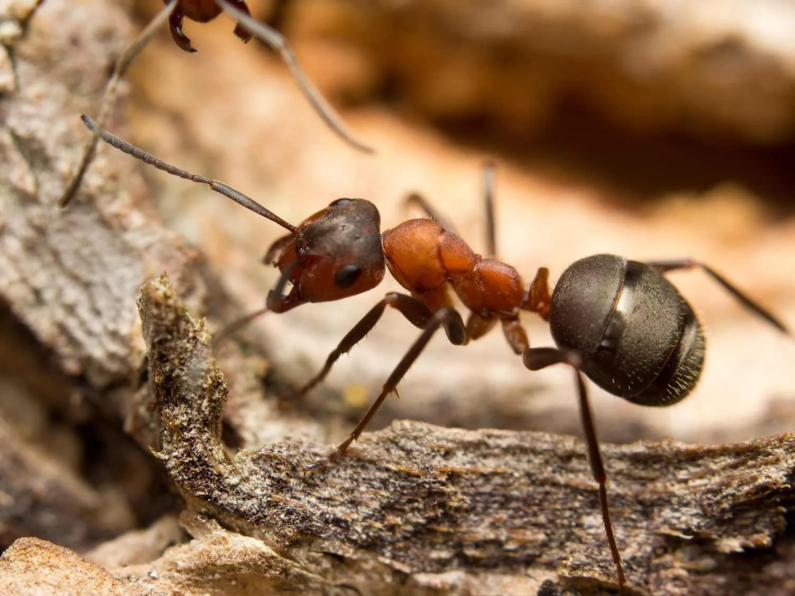

# Intelligenza Collettiva

## Contesto Esistenziale

## Capre

## Connessioni

neuroni + albo alunni: nesso?

# la costruzione della memoria
<https://www.youtube.com/watch?v=hb7tjqhfDus>

# giocatori

giocatori e i loro cervelli, esperienze si costruiscono con la multisensorialità e ripetizione

giocatori e i loro cervelli, esperienze si costruiscono con la multisensorialità e ripetizione

videogiochi sono media multidisciplinari: gli strumenti perfetti
# lavorare insieme non è facile

per forza devono essere sviluppati in tanti a difficoltà a lavorare insieme

serve un'immagine coerente, ma sopratutto una sua utilità esperienziale

# Intelligenza Collettiva

# spaceX
SpaceX: lavoratori.. sono in missione, che va al di la del prestigio personale o dei soldi, o del nerdame: aiutare l'umanità

# Ikigai

serve un IKIGAI personale
e un mito sociale

# cosa sono i miti?
possono essere storie che traghettano i popoli in difficoltà

una storia condivisa che dia l'energia per preoccuparsi del progetto comune, prima che del proprio Io. 

# azione individuale e collettiva

il rischio è che tutti facciano il meglio per sè, e il minimo per il progetto.

# diagramma stupidità

# comportamento emergente

si mettono regole e procedure  

# reti organizzate +  tecnologie sociali 

# human centric

# formiche

