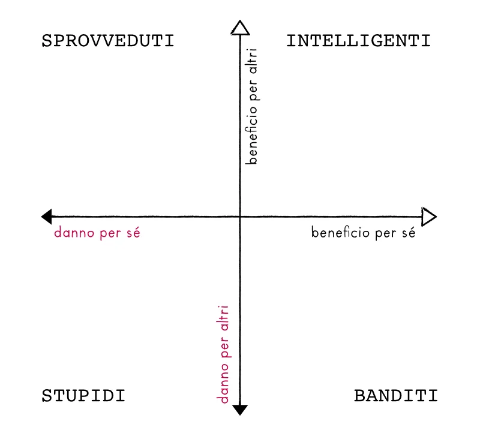
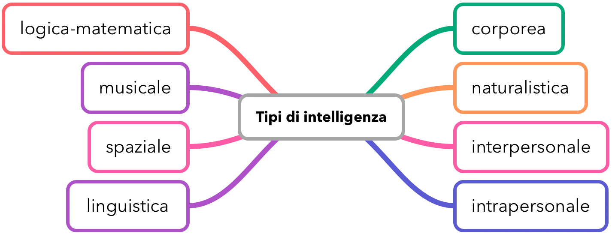
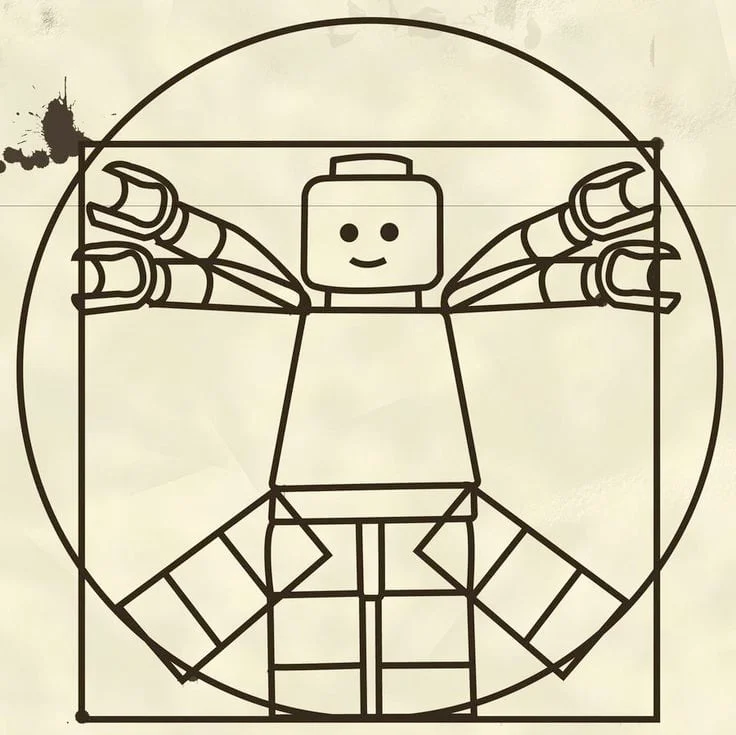
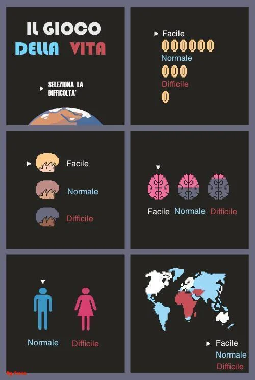

# Ludus e Sofia

> Ludo, dal latino *ludus* =  giocare  
> Sofia, dal greco *sophia* = conoscenza

Cosa significa *giocare* possiamo intuirlo, ma cosa intendiamo per *conoscenza*, Sophia?
Come in Filosofia, non si intende l'erudizione, ancora meno il sapere date e fatti con cui vincere ai quiz. E' qualcosa che ha che fare con il curiosare su come funziona il mondo, noi stessi, noi in relazione al mondo... potremmo definirla come *una coscienza curiosa che cerca la conoscenza esistenziale*

E il gioco?

Se c'è chi cerca la Sophia con lo studio, chi con la meditazione, chi nell'ebbrezza, chi nel viaggiare, c'è chi la cerca giocando.
Con il gioco come strumento di ricerca, di conoscenza, di *auto*conoscenza, di relazione con gli altri e con le cose, come simulazione di sistemi complessi ben più ampi, ma che forse possiamo goderci in una versione microcosmica.

Non so se qualcuno abbia mai letto il *Giuoco delle Perle di Vetro* di Herman Hesse dove in mille pagine si parla di questo gioco universale, senza mai riuscire a definirlo o spiegarlo (ops, spoiler), perché in effetti non si può spiegarlo. Però tra giocatori ci si riconosce. 

> E allora mettiamoci in gioco
> perché la vita è un *gioco molto serio!*

## Sviluppo integrale

Ci interessa svilupparci in modo equilibrato: mente, cuore, corpo e spirito.

- stai concentrata! non essere stupido!
- stai tranquilla! sii socievole! non essere triste!
- stai dritta! stai rilassato!

Secondo voi sono esortazioni che funzionano? Risposta ovvia: no. Ma lo facciamo sempre, vero?
Se concordiamo che alcuni ordini non funzionano sull'essere di una persona, iniziamo a considerare di cosa è composta una persona.
Con estrema semplificazione ma anche un po' di buon senso, possiamo identificare in ogni Essere Umano tre aree principali: 
 
1. **intellettuale** 🧠 comprende la mente, il ragionamento, l'immaginazione
2. **emotiva** 🧡 vive di sentimenti, sensazioni, commozioni
3. **corporea** 💪 ci permette di sopravvivere, percepire e agire nel mondo

Dalla loro combinazione ne viene fuori l'essenza del nostro essere: la nostra *coscienza*, che insieme al nostro *spirito* ci definiscono e ci identificano.
Lungi da questo libro l'approfondire questi temi tanto belli quanto complessi, è sicuramente utile averne una idea perché qui ci interessano queste due considerazioni:

1. siamo tutti diversi ma costruiti con le stesse componenti, che vanno ben al di là della semplice biologia ed estetica del nostro corpo
2. l'armonia e la bontà di qualsiasi sviluppato esigono un **equilibrio** di tutte le sue componenti

Se qui abbiamo abbozzato il nostro Essere dal punto di vista dello **spazio**, altrettanto importante è considerarlo dal punto di vista dei  tre **tempi** in cui vive la nostra coscienza:

1. **passato** 📜 lo ricordiamo
2. **presente** 👀 lo percepiamo
3. **futuro** 💡 lo immaginiamo e progettiamo

Per il **passato** vince la **memoria** che ci restituisce quello che è successo prima. Teniamo presente che non c'è solo la memoria centrale del cervello, ma anche quella del corpo, dello stomaco, dei muscoli (la famosa *memoria meccanica*).  

Nel **presente** vince la **percezione**: cosa mi dicono i miei sensi? Facciamo bene differenza tra la percezione pura, e l'*interpretazione* che diamo a quanto percepiamo. E non solo i nostri sensi possono essere limitati e/o diversi gli uni dagli altri, quindi dandoci segnali differenti, ma la coscienza spesso influisce sul meccanismo di riconoscimento delle percezioni, facendoci credere altro. E diamo il benvenuto alle Signore Credenze. *Credo che vincerò questa partita, si*

Infine per il **futuro** regna **l'Immaginazione**, il sogno lucido, il progetto, l'azione calcolata che mi porterà lì. Condita con Fantasia e Creatività, o con Previsione e Pre-calcolo, l'Immaginazione ci porta avanti nel tempo.

Bene. Tutta questa introduzione alla nostra fisiologia umana ci servirà per capire come giochiamo, perché giochiamo, a cosa giochiamo.

### I primi 6 anni

> Vignetta
> Datemi un bambino per i primi 5 anni di vita e poi fatene quello che volete (Maestro Buddista)

Nei primi anni di vita si forma quello che si può chiamare il Nucleo della Coscienza, la parte più profonda del nostro Essere che contiene le basi del nostro carattere, i "meccanismi di risposta" ovvero come reagiamo a ciò che percepiamo. Non entriamo in dettagli troppo scientifici, però suona abbastanza naturale, no, se ci pensiamo?
E la cosa bella, o brutta, è che questo nucleo di coscienza ce lo portiamo avanti per tutta la vita!
Ad esempio se uno registra in profondità delle esperienze di abbandono, o di non fiducia negli altri o in se stessi, o il sentirsi impotente o incapace di costruire e di capire le cose... è probabile che questo atteggiamento di base persisterà nell'evoluzione del proprio carattere.

Certo, uno potrebbe decidere da grande di ribaltare la sua vita e mettersi a studiare pianoforte a 50 anni o cambiare radicalmente carattere, magari in contrapposizione a quello che si era prima.. ma forse non è facile per tutti il farlo.
Molto meglio dedicare più attenzione alla crescita dei nostri giovanissimi, ai famosi primi 5/6 anni. Non che dobbiamo evitare loro qualsiasi trauma, per carità, però neanche lasciarli al loro destino e relegare alla sola tv o nonni o baby sitters o scuola la loro formazione.
(A meno che uno riconosca di essere un genitore per caso e non vuole preoccuparsi.. allora meglio una nonna premurosa o un tablet con app intelligenti!)

Oltre alla radice del carattere, qui si formano un po' gli equilibri, o meglio gli squilibri, tra i propri centri e si vedrà come si crescerà.

### Conosci te stesso

*Nosce te ipsum* ci avrebbero detto una volta. E non è che se una cosa è vecchia non sia più valida. Ricordiamoci che siamo Homo Sapiens da molti millenni e non siamo cambiati molto (non ancora almeno.. grandi rivoluzioni in arrivo, ndr)... basti pensare che il nostro sistema genetico impazzisce ancore per un po' di zucchero e grassi.. come se fossero cose rare e indispensabili a sopravvivere a lunghi inverni gelidi come 12.000 anni fa.
Antrobiologia a parte, conoscersi è importante. Non lo facciamo spesso. E mettersi in gioco è il modo migliore per scoprire le nostre virtù e le nostre carenze, per *capire che tipo di giocatori siamo*.

### Curiosità

*Cosa è la curiosità? Si può imparare ad essere curiosi?*
Ancora meglio: si può indurre ad essere curiosi?

Converrete che una persona curiosa, cercherà di andare a cercarsi le risposte. E nel cercarle imparerà innanzitutto a ... cercare.
E chi sa cercare e sa di dover cercare, è già un passo avanti a chi sta ad aspettare che la scienza e la fortuna cadano in testa. In un mondo che sta cambiando alla velocità della luce, forse questa virtù sarà una delle chiavi di sopravvivenza.

Dovremmo fare attenzione a questa faccenda della curiosità, e ci permettiamo di condividere quello che potrebbe essere un buon atteggiamento per stimolare la curiosità:

1. essere curiosi è bello. concediamo agli altri di esserlo. ma anche a noi stessi!
2. non aver paura di chiedere il perché o il significato delle cose
3. cambiare spesso gioco, punto di vista, interesse. Non è un male cambiare. anzi la curiosità ci porta ad esplorare cose nuove e dobbiamo essere pronti ad accettare il cambiamento
4. frequentare persone curiose. sembra banale, ma il detto chi va con lo zoppo inizia a zoppicare funziona anche al contrario! vai con il curioso ed impara a curiosare, vai con l'artista e impara a guardare con altri occhi e creare cose nuove
5. non fomentare le paure.. il famoso SCENDI CHE CADI E MUORI è la peggiore cosa che si può dire ad un bambino che sta salendo su un albero. molto meglio: SE TI SENTI SICURO CONTINUA A SALIRE, SE HAI PAURA NON PREOCCUPARTI TI RAGGIUNGO
6. non ridere della curiosità o ingenuità.

ah.. e poi già il leggere questo libro è un bel curiosare no? 
di fatto non eri curiosa di leggere cosa avremmo scritto sul come giocare insieme? se sei qui e non sei già saltata alle conclusioni forse siamo su una barca di curiosi.

### Autoliberazione

> Alcune cose uno può deciderle e risolverle solo in autonomia
> L'aiuto esterno spesso non funziona oppure rovina il gioco

Lo sapete quale è un buon modo per rilassarsi velocemente?
E' aumentare la tensione progressivamente fino al massimo, trattenerla e poi mollarla di colpo. Il livello di tensione scenderà sotto quello iniziale, con una sensazione di rilassamento.
Forte, vero? Il concetto di fare una cosa che sembra l'opposto di quanto uno penserebbe di dover fare (ricordate in Cars quando Saetta non conosceva il controsterzo e andava sempre fuori pista?)
Oppure uno pensa che il rilassamento debba venire da fuori.. da un massaggiatore, ad esempio, da un bicchiere di vino, da un divano...

È più interessante che uno acquisisca gli strumenti e le metodologie per essere autonomo, che non dover dipendere sempre da qualcuno o qualcosa.
Inoltre molte cose possono solo nascere da motivazioni interiori, altrimenti sono forzature a cui ci si adatta ma che non funzioneranno mai bene.
Si può intuire come il giocare, anche da soli, possa essere una pratica che uno può fare intenzionalmente per migliorarsi

### Come funziona il cervello

Non vogliamo metterci il cappello del neurologo, tranquilli, ma sapere una cosa è importante:  
Assodato che il cervello è una struttura di circa 80 miliardi di neuroni collegati in rete tra loro, e che la cosa importante non sono tanto i neuroni in se, ma le loro connessioni,

- sapete come si sviluppano e si migliorano le connessioni cerebrali?

Con **la ripetizione**.

La ripetizione di cosa, direte?
con la ripetizione di qualsiasi cosa! con l'esercizio.
Non nasciamo "imparati", pre-connessi direbbe un neurologo, ma è il nostro esercizio di routine, il fare una cosa tutti i giorni, cantare, sonare, leggere, pensare...

Qualcuno sente già il suono del monaco buddista di cui sopra che ripete incessantemente una preghiera? O del pianista al secondo anno che fa suona costantemente le scale?

E come si rinforzano al meglio queste connessioni?
Con la *ripetizione in uno stato emotivo positivo*.

Guarda caso: *fare le cose divertendosi* è il modo migliore per "imprimere" il cervello in una certa direzione

Qualcuno ha parlato di fare esercizi divertenti? in un libro che parla del giocare?

## Intelligenza
Cosa è l'Intelligenza?
Non entreremo nel mondo accademico scientifico, ma in quello pratico:

### Diagramma della stupidità
E' facile definire un'azione "intelligente" quella che porta il maggior beneficio sia a se stessi che agli altri, possibilmente con il minor dispendio di fatica (energia).
Per questo il diagramma della stupidità (di [Carlo Cipolla](https://it.wikipedia.org/wiki/Carlo_M._Cipolla)) dovrebbe essere appeso in tutte le aule di scuola e ufficio di politici e imprenditori e cucine di casa:

### Tipi di intelligenza
La cosa peggiore è che per quel poco che sappiamo, riduciamo l'intelligenza ad un "quanto sei intelligente!" e la relativa quantificazione nel Q.I. (Quoziente di Intelligenza) che è calcolato dalla capacità di risolvere problemi sopratutto di tipo cognitivo/logico.

Ma ci sono molti tipi di intelligenza!
Ad esempio la scelta più intelligente sarebbe quella di abbracciare il tuo nemico in un atto emotivamente destabilizzante. Sfido un computer ad arrivare a tale soluzione.

- corporea
- naturalistica
- interpersonale
- intrapersonale
- linguistica 
- spaziale
- musicale
- logica-matematica

## Cresciamo Insieme

Un genitore nasce insieme ad un figlio.
E non c’è libretto delle istruzioni su come diventare un bravo papà o mamma. Il dialogo, inteso anche come relazione, è la chiave di sviluppo. E il fare cose insieme. Imparando l'uno con l'altro e dall'altro. Ma con un'attenzione: i genitori sono i modelli che i figli seguiranno. Il gioco lo intavola il genitore.

### Il Papà

> TODO #TODO/vignetta  
> Figlio attento a cosa fai!
> Attento a cosa fai tu, Papà. Perché io seguo te

> Sai figliolo che fino a pochi decenni fa noi non avremmo giocato così tanto insieme fin dal giorno 2?

Non so quanto sia vera, ma è verosimile, che una volta i padri iniziavano ad interessarsi ai propri figli solo dopo lo svezzamento e l'educazione base, a 14 anni, quando erano "uomini".

Per fortuna non è più così, e vorrei fare un appello ai papà del mondo: preoccupiamoci e organizziamoci per stare più tempo con i nostri figli e fare attività ricreative insieme.

> Il mio sogno di padre è diventarvi inutile

### L'ambiente familiare

Negli ultimi 100 anni si è trasformata davvero molto anche la famiglia tipica occidentale e gli spazi di crescita dei ragazzi.
Non più famiglie numerose e allargate, ma nuclei famigliari sempre più piccoli, spesso quasi mono-genitoriali, con meno spazi pubblici di aggregazione e una società che ha spinto forte sull'acceleratore dell'individualismo che non del collettivismo.

Anche i tempi sono diventati più frenetici, tutti con mille impegni, e non è facile trovare dei lunghi momenti di pace condivisa, anche perché nel tempo libero ognuno fa un po' le sue cose.

In tutto questo il nucleo famigliare, per quanto piccolo, è importantissimo. E sebbene le relazioni sociali avvengono per altri medium sempre più tecnologici, **dobbiamo**, e **possiamo**, **valorizzare le relazioni sociali che abbiamo in casa**, sopratutto se possiamo farlo con esperienze divertenti e che portano benefici sia individuali che collettivi.

### La reciprocità

> io aiuto te, tu aiuti qualcun altro

Nelle relazioni è frequente uno sbilanciamento di interesse, di peso, di capacità.
Certo un genitore aiuterà a vita i propri figli, in un indiscusso dare disinteressato. Ma chi riceve l'aiuto.. cosa fa?
Non è bello ricevere e basta. Fosse anche solo perché è tossico!
Davvero: essere aiutati e basta, ti mette in una situazione di inferiorità, ti abbassa l'autostima e quindi la capacità di riscatto, mal che vada non ti va venire voglia di renderti autonomo e diventi dipendente dall'aiuto esterno.

Ma noi non funzioniamo bene così. E sebbene qualcuno potrebbe intavolare "io aiuto te e tu aiuti me", meglio che niente ma un sistema chiuso non va da nessuna parte.

Molto più interessante sarebbe *aprire* il sistema di relazioni.
Prendo l'aiuto ricevuto e lo restituisco ad un altro, e così via, in una catena di aperture.
E' una forma di gioco molto valida, che ci mette in gioco e mette in gioco altri, tutti consapevoli di cosa stiamo facendo.

## Mettersi in gioco

Eccoci arrivati ad un dunque.  
Troverete spesso tracce dell'uomo di Vitruvio in questo libro o in generale per chi mi conosce, questo non solo perché mi considero un Nuovo Umanista, ma perché ho ritrovato in questo simbolo una filosofia di vita:
- Essere Umano è quello che siamo
- dovremmo metterlo al centro e preoccuparci dell'essere umani
- siamo esseri pensanti ovvero in grado di elaborare anche in modo complesso quanto percepiamo
- siamo esseri attivi, ovvero in grado di agire attraverso il corpo e con strumenti
- siamo esseri interattivi, ovvero reagiamo e rispondiamo al mondo esterno con idee e progetti
- siamo esseri sociali, ovvero sappiamo e ci piace relazionarsi con gli altri. a dire il vero viviamo in una società così complessa che la socialità è una questione di sopravvivenza ineluttabile

*si, ho scritto ineluttabile ;)*

tutto questa pappardella solo per dire che il giocare è un'esperienza dove *il giocatore agisce*, dopo aver percepito ed elaborato, fa la sua mossa, con relazione alle regole del gioco e sopratutto gli altri giocatori.

Si può non definire *il gioco come un'attività umanista*?

## Il Gioco dell'Oca NON è un gioco

Facciamola semplice: nel gioco dell’Oca il giocatore non sceglie niente, tira semplicemente i dadi e conta. E’ pura fortuna. E’ il caso a giocare, non lui.  
Poi qualcuno si diverte a stare insieme a vedere l’oca, così come qualcuno si diverte a giocare a Tombola o altri giochi dove il bello, l'emozione, è solo sperare di avere fortuna.  
Queste esperienze (che qualcuno chiama giochi, nota bene) sono invece ascrivibili all’”azzardo” e non li consideriamo in questo librino. Tanto meno li consigliamo a mano che uno voglia fare pratica di calcolo probabilistico ;)

## Cosa è un Gioco vs Giocattolo

> Allora cosa è un gioco? E' un'esperienza limitata da regole con un obiettivo

Ci sono molte definizioni valide e molte discussioni sulla definizione migliore di gioco e non entreremo nel merito, qui ci interessa solo differenziare il GIOCATTOLO/LIBERO GIOCO dal GIOCO:
- il giocattolo non ha regole ne obiettivi ben definiti.
- il gioco, protagonista di questo contesto, è un'esperienza che ha regole che devono essere comprese e onorate e obiettivi da perseguire.

Ad esempio il gioco degli scacchi non funziona se un giocatore muove il cavallo in modo scorretto, o non persegue l’obiettivo primario di fare scacco matto al Re avversario.

Già qui entriamo in un mondo interessante, perché _per giocare serve una postura mentale_, prepararsi e predisporsi a giocare.

## Non ci sono più i giochi di una volta
No, non esistono solo Monopoli, Risiko, Fortnite o Candy Crush!
Che siano i classici giochi da tavolo o i videogiochi più famosi, qui scopriremo come esistono nuove generazioni di giochi che faranno venire voglia di obbligare i figli a giocarli il più possibile, e noi con loro.
Sono molte le attività che si possono fare nel tempo libero, e vedremo come il giocare può essere integrante allo studio, all'esercitarsi, al conoscersi, al migliorarsi, al rendere la vita individuale e sociale più sensata.

## Giocare in famiglia

> *Fabio:*
> Il mio consiglio è di leggere bene le istruzioni, oppure prendete tutto quello che trovate dentro la scatola, osservatelo e inventatevi delle regole per giocarci.

L’ambito domestico è il più immediato oltre che quello che più urgentemente di altri necessita di essere ravvivato.
Migliorare la comunicazione, il rispetto, il divertimento, la cooperazione, l’empatia, la consapevolezza di limiti e virtù… sono alcune delle cose che l’introduzione di una vita quotidiana più ludica comporta.
La televisione vista insieme è un classico che sta scomparendo a favore di tanti schermi individuali quanti siamo in casa. Ed è comunque un qualcosa da vivere passivamente addormentandosi sul divano.
Sedersi intorno ad un tavolo o impugnare i controllers tutti insieme per una partita, è un’altra cosa. Pronti?

## Giocare con i bambini

I bambini e i ragazzi hanno mentalità ed esperienze diverse da quelle degli adulti, inoltre spesso percepiscono, ragionano e immaginano in modo imprevedibile.
Una delle leggi base di questo libro è *giocare insieme* il più possibile, ma per farlo bene è meglio preparasi. Ecco alcuni consigli che valgono per ogni tipo di gioco:

1. **obiettivo**: il fine ultimo è divertirsi insieme e se possibile imparare qualcosa per migliorarsi.
2. **età**: ricordarsi che loro sono bambini e noi adulti. siamo tutti giocatori ma ruoli e caratteristiche sono diverse. anche i gusti cambiano e ognuno ha i suoi. trovare il "gioco giusto" è un'arte.
3. **difficoltà**: rendere il gioco non troppo facile ne troppo difficile. si possono dare degli handicap a chi è più grande o bravo, eventualmente altri obiettivi di gioco o regole aggiuntive. (la cosa può essere anche tacita ad esempio lascio giocare il bambino di 5 anni con le regole normali, e io mentalmente mi metto la sfida di arrivare secondo, ma non terzo)
5. **ragionamenti** a voce alta. aiuta tutti.
6. non essere impazienti. se il gioco non diverte più o diventa frustrante meglio lasciare stare
7. **sbagliare** e spiegare cosa si è sbagliato quando si perde o si fa una mossa sfortunata. fermarsi un attimo e valutare insieme: cosa è successo? cosa non avevi visto? quale sarebbe stata una scelta migliore?
8. **caso**: differenziare esito casuale da scelta ragionata. il dado casuale è spesso l'unica possibilità per un bambino di battere un adulto (che giochi senza abbassarsi il livello), per questo preferire giochi con componente casuale è una buona scelta, sopratutto all'inizio
10. **durata**: partite brevi ma intense. per i giochi da tavolo durata ottimale di una partita è mezz'ora, massimo un'ora. può durare di più se si spezza in due parti, eventualmente in due giornate (alcuni giochi lo permettono)
11. **ritmo**: lasciare il tempo di fare la propria mossa ma che siano turni veloci quando tocca ad un adulto: non stare più di un minuto a pensare in silenzio, altrimenti si viene a noia. eventualmente ragionare a voce alta per coinvolgere gli altri e decidere insieme
12. **scelta del gioco**: scegliere insieme il gioco da fare. se scelgono loro, meglio, saranno più motivati.
13. alternare giochi **competitivi** a giochi **cooperativi**. nei cooperativi il rischio è che ci sia un giocatore alpha, più bravo che guidi gli altri. è cosa da evitare con i piccoli. cercare di coinvolgerli il più possibile. in alternativa i giochi competitivi sono per loro più gratificanti (piace vincere in autonomia contro tutti) e imparare dalle sconfitte
14. **non reprimere** il proprio entusiasmo! sfruttare l'occasione per rilassarsi e inventare nuove espressioni verbali o gestuali
15. sperimentare **variazioni** sulle regole, sopratutto se inventate dai ragazzi. se il fine è divertirsi insieme e cambiare scenario, aggiungere poteri e fare eccezioni alle regole può essere divertente se tutti sono d'accordo.
16. **estetica**: un gioco meno astratto, ma con personaggi ben definiti e uno scenario narrativo sono ovviamente più coinvolgenti. anche la presenza di componenti particolari (che siano astronavi o personaggi mostruosi, PowerUp o dadi speciali) può entusiasmare. Anzi anticipo che qualcuno dice che un buon gioco è 50% gameplay e 50% "estetica".

## Giocare insieme

- allora noi si gioca insieme. ma nel senso che io e te non siamo nemici e vince il più bravo. dobbiamo collaborare per uscire tutti dal deserto prima che ci sommerga la sabbia o moriamo di sete
- costruendo l’astronave?
- esatto. i pezzi dell’astronave sono sparsi sotto le dune di sabbia. non sappiamo dove siano! dobbiamo cercarli
- ok
- tu cerchi in quella zona e io in questa ok?
- ok!
- se trovi dell’acqua poi possiamo condividerla. perché se uno di noi muore di sete, perdiamo tutti.

4 cose:
1. spiegare come funziona una cosa è il modo migliore per capirla meglio, e sviluppa la capacità di esprimersi
2. capire che si può essere alleati, o almeno che è necessario collaborare, per uscire da una situazione complessa, e che se uno perde perdono tutti, è una grande comprensione
3. trattare questi temi con un gioco, che ti tiene incollato anche con la bellezza e il design, divertendosi, è molto meglio che non ... cosa?
4. il gioco permette di sperimentare. ti lascia agire e fare scelte. di fare errori e reiterare i metodi di analisi delle scelte migliori. a differenza di un video o un libro. è questo aspetto di interazione giocatore/sistema uno dei punti di forza dei giochi come strumenti per imparare qualcosa.

## Giocare e imparare

> Imparare giocando, Educere Ludendo, educare con il gioco, esercitandosi si apprende, Didattica Ludica, Edutainment… sono molte le espressioni che potremmo usare e dozzine i libri scritti su questi temi.

Giocare a scuola non è più un'eresia.
Anzi, è sempre più una metodologia educativa.
Se intendiamo il gioco come una ambiente protetto e ben definito di "simulazione", perché non sfruttarlo per mettersi alla prova o imparare qualcosa di proposito?
Abbiamo già accennato che già il solo giocare è un'attività educativa e formativa. Se fatto con consapevolezza si può massimizzare cosa si vuole imparare.

C'è però una considerazione importante da fare nel mondo dei giochi "educativi", più che altro una questione di approccio: ci sono i giochi progettati specificamente per un obiettivo didattico, oppure ci sono i giochi nei quali si impara necessariamente qualcosa perché altrimenti non si vince.

Nel primo caso, nei giochi progettati apposta, bisogna essere molto chiari.. tipo "ragazzi ora giochiamo a questo gioco che ci farà imparare i pianeti del sistema solare, oppure le tabelline o i sinonimi e contrari".
Nel secondo caso si dice: ragazzi ora si gioca a questa avventura.. attenzione vi servirà molta memoria dei dati delle carte, capacità di fare velocemente dei calcoli e comunicare al meglio con i vostri compagni di squadra, altrimenti sarà difficile che vinciate".

Non nascondo che in linea di massima il secondo approccio è più interessante e potenzialmente più coinvolgente, ma più difficile perché non è specifico con un obiettivo didattico.

## Come scegliere un gioco
> tu che conosci.. mi consigli un gioco bello?
> documenti e libretto, prego

## Atteggiamento Ludico

> L'uomo non smette di giocare perché invecchia,
> ma invecchia perché smette di giocare.
> G.B.  Shaw

Cosa è un Atteggiamento Ludico?

### Outdoor
Non c'è solo il camminare sulle strisce per strada o contare i trattori blu quando si viaggia in macchina...

Ogni essere umano ha necessità di **esplorare**. 

### Gioco della vita

qui entriamo il politica e la cosa si fa seria.

## Giochiamo meglio e cambiamo il mondo

Non penso che possa esistere IL progetto, LA idea, qualsiasi cosa che abbia il potere di una bacchetta magica per cambiare il mondo.

Anche perché sarebbe sbagliato.

Già, perché lo cambieremmo secondo il nostro punto di vista, secondo la nostra personalità e desideri, quando invece il mondo è una sistema complesso di miliardi di esseri umani tanto diversi quanto ognuno valido.

Quello che possiamo aspirare è che ci si aiuti il più possibile, si migliorino le relazioni e le comprensioni, e che magari tutti abbiano una educazione minima sui temi fondamentali.

Lo so sono temi grossi.. qualcuno li chiama i "massimi sistemi", ma qui si parla di giochi e non è forse il nostro mondo un enorme gioco con 7 miliardi di giocatori e regole più o meno complicate, ma con un obiettivo semplice: finire il gioco felici di averlo giocato?

## Giocare tutto

