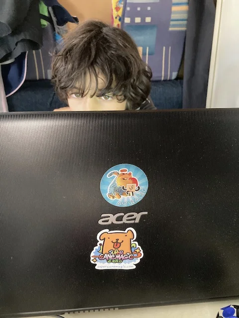
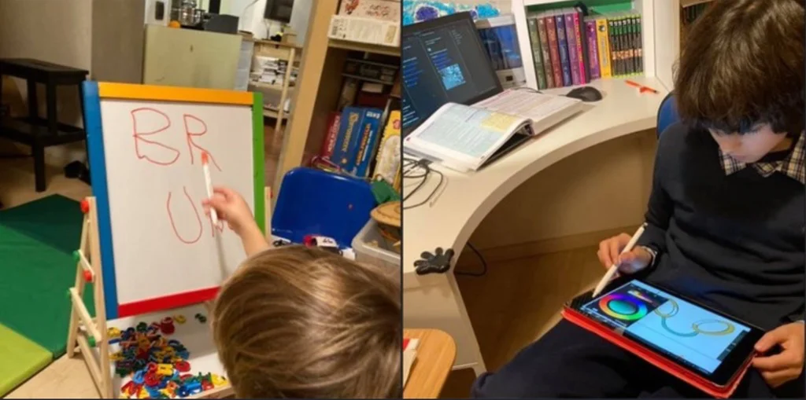
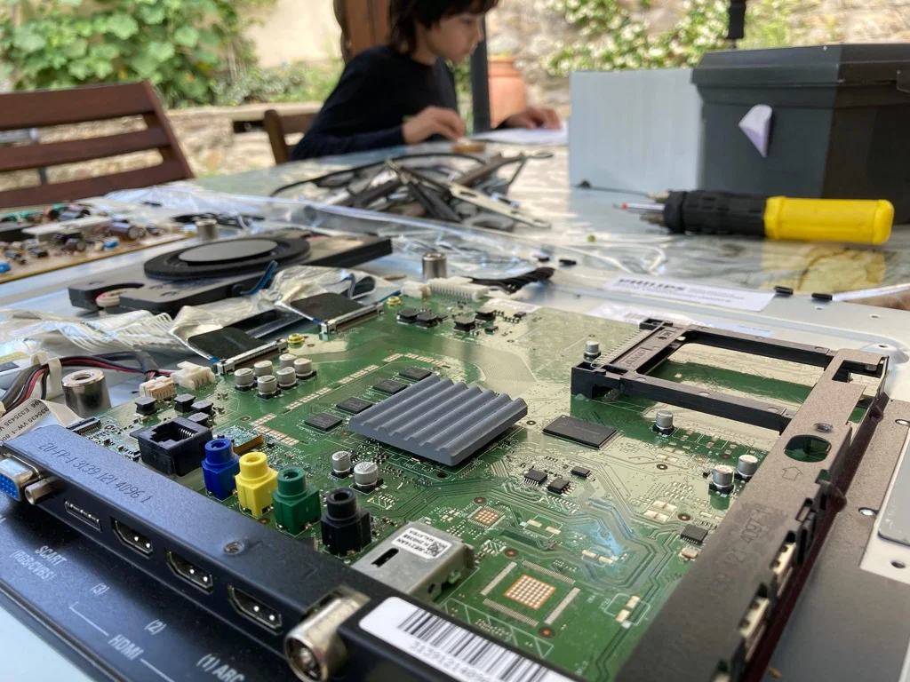
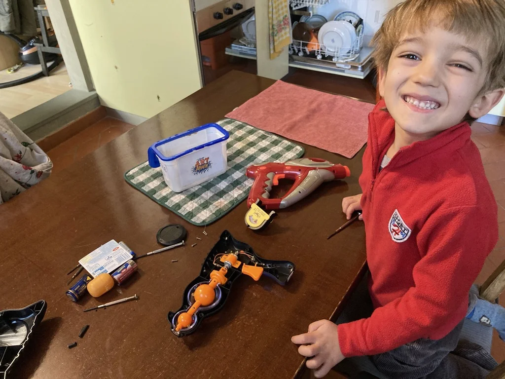
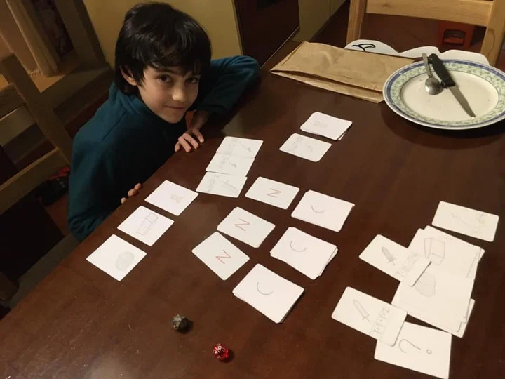

# STEAM & Hacking

> **S**cience  
> **T**echnology  
> **E**ngineering  
> **A**rt  
> **M**athematics  

Un bel acronimo vero?  
Negli ultimi anni sta crescendo l'attenzione all'educazione integrale su questi temi, non solo perché la nostra società è sempre più tecnologica, ma perché conoscere le basi del pensiero creativo e costruttiva sarà una chiave per vivere consapevolmente il futuro.

La matematica sta diventando sempre più un linguaggio universale per modellare e comunicare. Se una volta era appannaggio di pochi che la capivano subito, oggi ci si può avvicinare in modo graduale e personalizzato e divertente!

In molti paesi del mondo si inizia a parlare di attività STEM già dalla prima elementare. Poi si è aggiunta la A che a mio avviso ha radicalmente cambiato tutto, una A che sta per Arte ma che rappresenta **tutte** le arti umane, il linguaggio, la danza, il teatro, la musica, le arti visuali e i nuovi media, quindi aggiungendo ai concetti scientifici la ricerca e l'espressione creativa: STEAM.

Sono molte le aziende che producono giochi e progetti STEM/STEAM.
Ora che conoscete gli acronimi sapete di cosa si tratta e potrete cercarli.

## La Tecnologia è un mezzo, non un fine

La tecnologia è ciò che crea gli strumenti pratici per mettere in relazione la Scienza e l'Intenzione, il proposito.
E' un mezzo per ottenere risultati e non deve essere intesa come un fine a se stesso.

Questo è un assioma, ovvero una frase indiscutibile. E' così e basta.
e ricordarcelo non può che fare bene a tutti.

## Perché un PC è fondamentale

e non una console o tablet

## Digitale vs Analogico

che sia digitale o analogico: non c’è differenza.
ogni strumento ha pregi e difetti, virtù e inconvenienti.
il primo è pazzo di tablet, ma qui preferisce scrivere sulla lavagna.
il secondo progetta tutto a matita. ma per fare dei disegni che poi vanno in digitale preferisce usare il tablet.
non ci sono categorie assolute. solo il godersi lo strumento giusto per il fine giusto.

## Hacking
Cosa è invece l'Hacking? E' quella cosa brutta che fanno gli hackers che entrano nei computers?
Beh.. si, non solo però.. se negli anni '80 l'hacker era l'esperto informatico che sapeva entrare nei sistemi (ah, doveroso è guardare il film WarGames insieme ai figli dai 9 anni in su) grazie alle sue ricerche e conoscenze, oggi si usa Hack per il concetto di modifica, miglioramento, trucco con cui si cambia una cosa per usarla in altri contesti.. celebre è il sito LifeHacker che spiega ad esempio tutti i trucchi per migliorarsi la vita.

E' un termine molto popolare nella cultura nerd, tecnologica, contemporanea, e implica:

1. non aver paura di aprire le cose per studiare come sono state fatte
2. conoscere le metodologie di produzione
3. modificare o ricreare qualcosa o migliorarla per adattarla a nuovi scopi o semplicemente per esplorare nuove possibilità

Nel nostro ambito dei giochi il poterli hackerare equivale a cambiarne le regole, miscelare giochi, capire come sono stati create le carte non solo dal punto di vista estetico ma sopratutto matematico e di game design.
Prendere un gioco e ricrearlo con nuovi contenuti, magari dopo aver capito le regole che sottendono i meccanismi di gioco.

E' qualcosa di non facile, lo ammetto, ma che i ragazzi fanno già in modo naturale. Tutto sta nello stimolarli e non biasimarli se disfano le cose per rimontarle a modo loro!

Eventualmente metteteli poi in contatto con altri game hackers, che ci si diverte insieme ;)

## Apro e Aggiusto

Hai un oggetto tecnologico o un giocattolo che non funziona più?
Prima di buttarlo per sostituirlo con un nuovo, provate ad aprirlo insieme.
Non serve essere ingegneri per farlo e neanche avere l'illusione di riuscire ad aggiustarlo. Ma il solo fatto di metterli ad aprire, a *vedere cosa c'è dentro* e magari discutere insieme su come è stato realizzato, è oro formativo e pedagogico.

Si capisce (e prima lo si fa meglio è) che dietro alle cose ci sono progetti, persone, altri oggetti, tutto intrecciato in un sistema che quando si rompe un pezzo crolla, ma che basta capire quale pezzo e come aggiustarlo, che ci si avvicina ad una visione sistemica delle cose.

> Visione Sistemica: niente è isolato, tutto è collegato ad altre. vedere queste connessioni e relazioni aiuta a capire il mondo

e così che sia un pianoforte digitale con un tasto rotto, un televisore che non visualizza più niente, o una pistola laser che non si accende una lucina, prendiamo insieme cacciaviti e apriamo!

### Ninja Craft

perché giocare ai soliti giochi se ne puoi creare uno nuovo tu? Fabio nelle ultime settimane (da dopo la Global Game Jam) era particolarmente impegnato in un progetto segreto. e ora l’ha svelato collaudandolo insieme: Ninja Craft.

devi combinare adeguatamente le materie prime per creare le armi con cui attaccare l’avversario. con sottili regole matematiche per le quali si arriva inevitabilmente ad una vittoria al filo di spada finale.

l’occasione è ottima per parlare di probabilità, inferenza della scelta tattica, regole e divertimento

ad esempio lo sapevate che il “gioco dell’oca” non è un gioco? o meglio: è così solo casuale e il giocatore non interviene in niente, che tu sia Einstein o un gatto a giocare, è irrilevante. è tutto solo caso! mentre gli Scacchi non hanno nulla di casuale (al massimo chi inizia per primo)

per questo quando giochiamo ad un gioco, oltre a godercelo, lo analizziamo un poco per capire come è stato pensato e realizzato.

