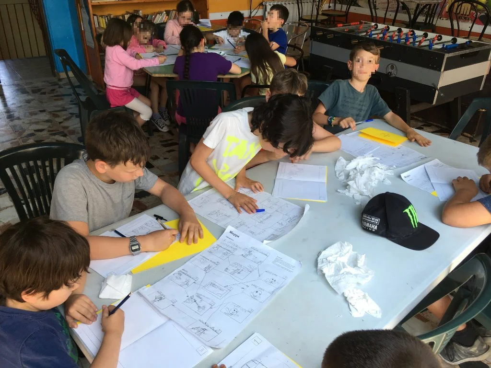
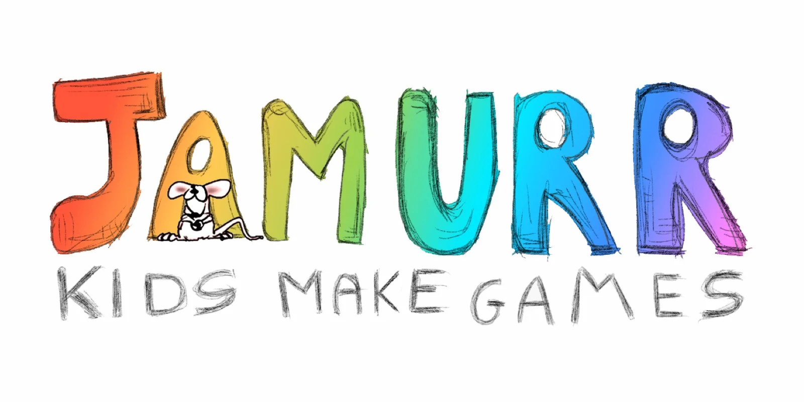
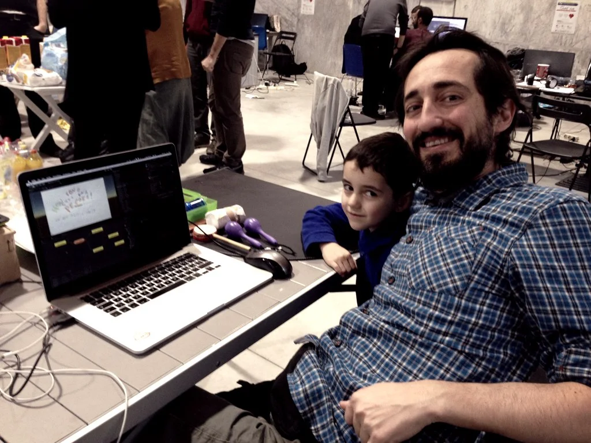
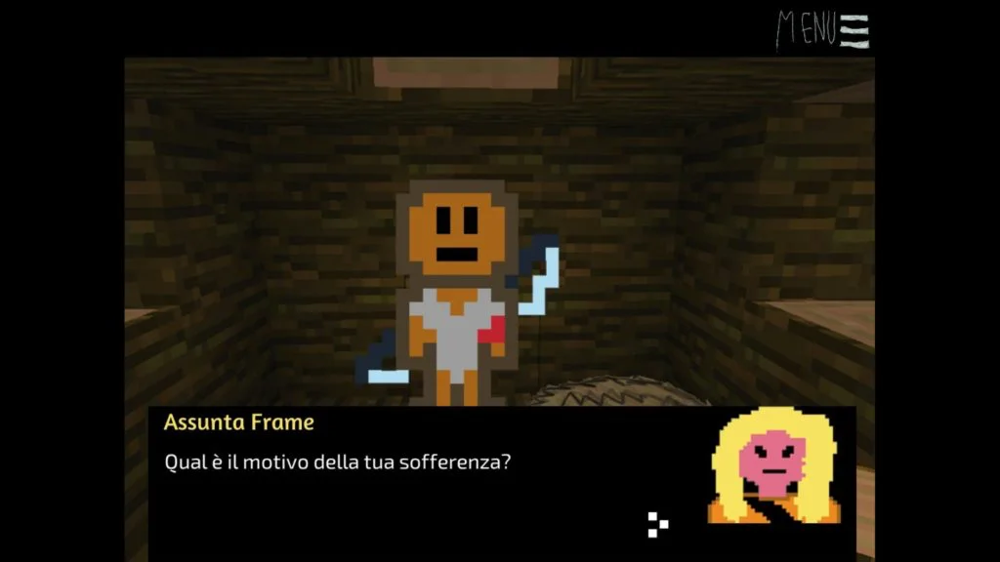
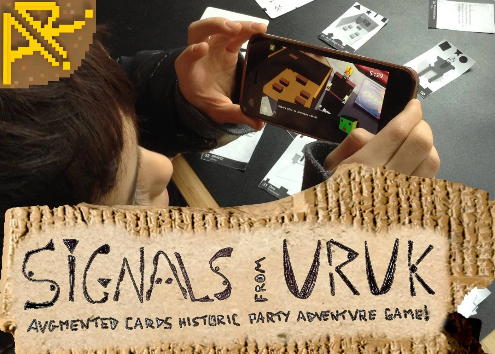
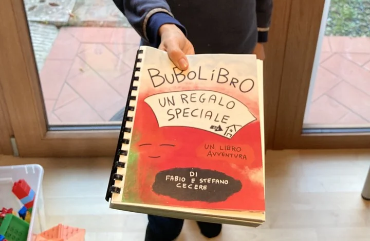

# Laboratori e progetti
> Giocare ad un gioco è bello. ma _crearlo_ è meglio!
> Ecco un po' di attività che abbiamo inventato che potrebbero ispirarvi

Mi è capitato più volte di spiegare ai ragazzi come funzionano le cose, perché sapere cosa c'è dietro agli oggetti e alle invenzioni, vedere come si sviluppa un'idea in un progetto e poi realizzarlo, è una delle chiavi per diventare soggetti attivi e non solo consumatori passivi della vita.

Qui elenco tre laboratori che possono essere facilmente riprodotti da qualsiasi genitore un po' creativo e/o pratico. Ho pubblicato tutti i materiali e istruzioni e video sul mio sito nel caso ti interessano.

## Laboratorio Librogame

Per imparare a creare un videogioco, è importante capire come si costruisce una storia dove il lettore/giocatore possa interagire e fare delle scelte.
In questo laboratorio faremo vedere come dietro ai videogiochi ci sono dei "diagrammi di flusso e scelta" con enigmi e difficoltà da superare.
Aiuteremo quindi i ragazzi a inventare una semplice storia-gioco e a produrla su carta, per portarsi a casa il proprio "libro gioco", pronto per essere condiviso ed eventualmente trasferito su un computer (magari in un prossimo laboratorio)

## Laboratorio Elettronica e Robots

Un laboratorio introduttivo all'elettronica e ai robots, spiegando ai ragazzi il principi base dell'elettronica e poi facendoli costruire un piccolo "robottino".

Con un po' di sudore freddo e voce autorevole abbiamo accolto i 44 (!) bambini mostrando un bel video sulle avanguardie dei robots e sul perché ci interessa iniziare a capire come funzionano: ovvero **il nostro futuro è necessariamente una collaborazione uomo-macchina**, e per non rischiare di soccombere è meglio sviluppare uno spirito attivo-costruttivo, anziché passivo-ignorante.
Ho quindi spiegato i **principi dell'energia elettrica**, dai fulmini agli elettroni al principio di funzionamento della dinamo delle biciclette e poi dei motorini elettrici, fino alle videocamere delle auto a guida autonoma (che ormai sono nelle auto di molti genitori)

I 45 minuti teorici sono volati, con dozzine di domande e interventi, e ci siamo quindi trasferiti in un salone per la costruzione.

Ognuno aveva a disposizione un motorino, pile, interruttori, ventole e ruote, da montare su un "bicchiere" di carta con eventuali pennarelli come gambe e con tappi e bastoncini di legno da usare come decorazioni o modifiche.
Con l'indispensabile aiuto e collaborazione di Fabio e Giacomo (altrimenti seguire 40 bambini era impossibile) dopo un'ora i primi lavori erano già in fase di collaudo: molti "ventilatori", qualche bicchiere disegnatore e diverse macchinine... in totale circa 25 creazioni sono state portate a casa.

La creatività dei ragazzi, di cui alcuni di appena 5 anni!, e la loro capacità di maneggiare fili elettrici, bi-adesivi, incastri meccanici impensabili, e il loro divertimento nell'inventare e costruire, hanno reso il laboratorio davvero coinvolgente.
Molti hanno poi chiesto altri componenti per migliorare le proprie macchine a casa, e così abbiamo deciso di fare un secondo laboratorio "avanzato", magari durante le vacanze di Natale.

## Jamurr e Kids Game Jam

> I bambini oltre che giocare amano creare i loro giochi e inventare nuove storie.
> I videogiochi sono ottime occasioni per aiutarli a sviluppare nuove forme di collaborazione e di espressione, sopratutto emotiva.

Come esistono le Jams musicali, dove diversi musicisti si incontrano e suonano insieme “improvvisando” su un tema dato, così sono nate le “Game Jams”, dove persone interessate ai giochi e videogiochi si ritrovano e, dato un tema e un paio di giornate, lavorano insieme per ideare e costruire qualcosa di giocabile.

I partecipanti alle Game Jams non devono essere per forza professionisti, anzi spesso si affacciano persone alle prime armi, sebbene siano fondamentali per finire un prototipo coerente e funzionante, che nei team di lavoro ci sia almeno una persona con l’esperienza tale da coordinare o trainare il progetto e renderlo presentabile.

A noi interessano le Jams dove partecipano i bambini, in collaborazione tra loro e con i loro “grandi” (sopratutto genitori), dove i giovani possano aprire la propria creatività e fantasia, interagendo con i grandi nel dare una direzione e renderla producibile. Il lavoro è davvero un’esperienza di insieme dove c’è più interscambio di idee e capacità di improvvisare bene, più che capacità tecniche.

Da qui le Kids Game Jams.

Più che le parole, meglio far parlare i progetti fatti e le loro storie!

sito:<https://stefano.cecere.org/jamurr/>

## Videogioco "Non Sono solo una Pecora"

Nel 2016 partecipai alla Global Game Jam annuale.. ma non ricordo bene perché o come decisi di proporlo anche a Fabio, che accettò con entusiasmo! andammo a Pisa per tre giorni e lì nacque il progetto che avrebbe un po' cambiato le nostre vite: il videogioco Non sono solo una Pecora.
Una semplice storia interattiva, 10 scenari lineari dove la protagonista, la Pecora, incontra altrettanti amici animali ognuno con un problema esistenziale che andrà a risolvere con enigmi di vario tipo, fino al gran finale. Fabio creò i personaggi, gli enigmi, li disegnò a matita insieme ai fondali. Insieme scrivemmo i testi, io feci il montaggio digitale e recuperai delle mie vecchie musiche al pianoforte.
Che dire: fu il gioco premiato! e Fabio vinse un corso di disegno di fumetti!

## Videogioco "7 Frames"

Questo gioco è stato sviluppato in una Kids Game Jam. Ovvero 7 bambini (dai 7 ai 12 anni) si trovati durante l’Internet Festival 2016, al MixArt di Pisa, ed è stato dato loro un TEMA, che era: “SE NON CI FOSSERO GLI ALTRI…” In poche ore i ragazzi in concertazione (JAM) tra loro e con la supervisione dei genitori, dovevano ideare e creare il prototipo del gioco. Ognuno con le proprie capacità e preferenze ha dato del suo meglio.

<https:///stefano.cecere.org/project/7-frames/>

## Gioco ibrido "Signals From Uruk"

Da molti anni lavoravo con la Realtà Aumentata e Virtuale. e così alla Internet Festival Game Jam del 2018, con il nostro gruppo di game jammers, inventammo un gioco di carte storico / educativo da risolvere usando la Realtà Aumentata.
Ambientammo il tutto ad Uruk (perché Fabio ed Enea in quinta elementare stavano proprio studiando i Sumeri) e perché non rendere lo studio un gioco divertente?
Mettiamo tutto il programma scolastico dentro l'avventura e la facciamo creare da loro!

<http://jamurr.org/2018/01/signals-from-uruk/>

## Gioco da Tavolo "4 Space Potatoes"
A gennaio 2020 abbiamo organizzato per la prima volta la Global Game Jam a Firenze.
Fabio partecipò con i suoi amici con l'idea di realizzare un gioco da tavolo.
Ne uscì 4 Space Potatoes, un gioco collaborativo dove si deve sopravvivere su Marte e aggiustare la propria serra / base per coltivare le patate di sopravvivenza prima dell'arrivo del cataclisma.

Sono state 48 ore molto divertenti, e per i ragazzi il primo gioco pubblicato su BoardGameGeek 

<https://www.boardgamegeek.com/boardgame/303719/4-space-potatoes>

## HackerKid
Nel 2020, complice il LockDown prolungato, abbiamo sperimentato un po' di cose, tra cui il progetto HackerKid che consisteva in una "missione" che inviavo a Fabio tutte le mattine, con una situazione, degli elementi di teoria, dei dati e il problema vero e proprio che doveva risolvere entro sera.

## Librogioco "BuboLibro"
> un libro avventura per bambini, creato da fratello per il fratellino.

Mappando tutta casa nostra, Fabio ha creato un libro avventura dove ogni pagina è un luogo e si naviga saltando di pagina in pagina, trovando oggetti, affrontando situazioni pericolose, trovando sorprese nascoste fino a sbloccare il regalo finale, che sarà poi il regalo vero e proprio per il compleanno del fratello.

Il progetto è relativamente semplice, e in un video abbiamo spiegato come l'abbiamo fatto: [progett](../lab/jam/bubolibro.md)

## Attività PlayFriday

> Come ritrovarsi tra ragazzi una volta alla settimana a giocare sui tavoli

> [!tip] Fabio
> vengono i miei amici a giocare ai giochi che più mi piacciono

Il progetto PlayFriday nasce nel 2019 per dare uno spazio e un tempo ad un gruppo di ragazzi (età media 9-12) per giocare esclusivamente giochi da tavolo. Volevo uno spazio che non fosse una casa di qualcuno, non solo perché nessuno di noi ha una stanza/taverna adeguata e isolata, ma sopratutto per incentivare un'autonoma organizzazione e aggregazione intorno ai giochi in uno spazio pubblico.
Abbiamo iniziato trovandoci io, mio figlio ed un suo amico che giocavano a Carte Pokemon, e in poche settimane si sono passati parola fino ad essere un gruppo fisso di circa 8 giovani.
Ecco qui alcuni dettagli su come ho organizzato la cosa, perché so che altri vorrebbero organizzarla e non è difficile.

Ho scelto il venerdì tardo pomeriggio perché il sabato non c'è scuola.
C'è sempre almeno un genitore ad accompagnarli, ma l’idea e l’intento è che i ragazzi imparino ad essere sempre più indipendenti sia nell'organizzazione che nel giocare.  
La serata inizia verso le 17:00 con i primi che arrivano a preparare i tavoli e scaldare i giochi, l'appuntamento condiviso è poi dalle 18:00 e spesso ci si ferma a cenare insieme per continuare i giochi più impegnativi anche fino alle 23:30. Io o altri genitori di solito facciamo da “facilitatori”: introduciamo un nuovo gioco, ne spieghiamo le regole e guidiamo la prima partita.. poi vanno da soli.

Molto spesso giochiamo anche noi grandi, perché ci piace giocare e stiamo esplorando quanto il gioco sia un'esperienza sociale che ci fa conoscere, scoprire nuovi aspetti di noi stessi, degli altri e delle relazioni che abbiamo.
Nella stanza è vietato qualsiasi “distrazione digitale” e barare.. il gioco è un divertimento serio, il **rispetto dell'"etica" del gioco** è importante e per giocare bene è opportuno impararne le regole per giocare bene (spesso le facciamo spiegare dai ragazzi ai nuovi arrivati, perché **saper spiegare** una cosa è una prova importante) ed entrare nella sfera del gioco insieme agli altri.  
A volte teniamo qualche momento di "lezione" sul tema dei giochi, della matematica (elementi base di statistica) e delle tattiche o strategie più interessanti per giocare meglio e divertirsi di più.

La serata è aperta a tutti ma non facciamo troppa diffusione perché il passaparola è la metodologia migliore per uno sviluppo graduale e integrale.
Abbiamo la fortuna di avere nel quartiere una [Casa del Popolo](https://www.facebook.com/settignanocdp/) (Settignano - Firenze) davvero bella, aperta e spaziosa. Possiamo pure scegliere se stare isolati e tranquilli nella biblioteca, oppure nella sala un più grande e con un po' di passaggio vicino all'ingresso e al bar.

### Interesse
Far conoscere l’esperienza del gioco di società, imparare divertendosi a giocare meglio e a socializzare. Stimolare la curiosità e l’indipendenza. i giochi non sono tutti uguali. sono in evoluzione. c'è tutta una nuova generazione di giochi, più collaborativi, più divertenti, che stimolano diverse intelligenze: quella “normale”, quella emotiva, quella collettiva, che aiutano a sviluppare la cooperazione e il dialogo.
E non secondario lo sviluppare uno spazio sociale e culturale e ricreativo con le nuove generazioni.

### Luogo e organizzazione
Una grande stanza confortevole, pubblica. Noi siamo all'interno della Casa del Popolo. Ma andrebbe bene anche una sala condominiale, un bar, un oratorio.
Lo so purtroppo gli spazi ricreativi pubblici di quartiere scarseggiano.. ma è necessario cercarli o crearli.
Il ritrovo è dalle 17:00 quando aprono i ragazzi (io di solito arrivo più tardi). Alle 20:30 si cena e si riprende alle 21:30.  
I genitori accompagnatori sono sempre benvenuti a giocare con i ragazzi o tra di loro. Basta un adulto responsabile per badare alla banda. Ottimo se poi faccia da facilitatore introducendo un gioco alla settimana.
Ultimamente sono i ragazzi stessi a portare i loro giochi preferiti: io li invito a studiarsi bene le istruzioni così da imparare a spiegarle agli amici.

<https:///stefano.cecere.org/project/playfriday/>
