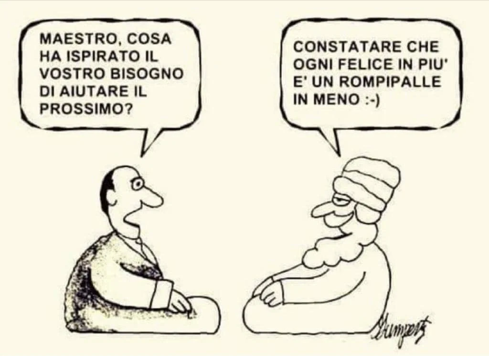

# Introduzione

> Si può scoprire di più su una persona in un'ora di gioco, che in un anno di conversazione.
> Platone

## Perché questo libro?

Perché da dodici anni convivo 
Per raccontare la sintesi di anni di vita nel mondo dei giochi contemporanei, sia come giocatori che come sviluppatori e ricercatori e sopratutto come **papà** e **figli**, per darvi quelle che pensiamo siano le basi minime per conoscere questo mondo, scoprire nuovi giochi e sopratutto giocare di più.

L'assioma base di questo libro è che **dobbiamo giocare tutti di più e meglio**, e la famiglia è un ottimo ambito dove iniziare a farlo, oltreché essere una delle migliori pratiche educative e pedagogiche per i ragazzi e per le relazioni sociali. Essendo poi uno dei nostri massimi propositi il migliorare la crescita di *tutti* i bambini e ragazze, la cosa migliore è condividere e coinvolgere.

> **Distinzione di genere**
> In questo libro non faremo distinzione di genere, maschi e femmine sono uguali per capacità e interesse. Ma non staremo a sottolinearlo allungando ogni frase con "bambini e bambine, ragazzi e ragazze", né useremo artifici come \* e dittonghi. Quando parleremo al maschile intenderemo anche il femminile e viceversa.

## Per chi è questo libro
> Questo libro è per chi ne sa poco di giochi e vorrebbe giocare meglio, sopratutto in famiglia, sviluppando un sano e vantaggioso atteggiamento ludico

Innanzitutto questo è un libro per chi di giochi ne sa poco (un amico mi chiedeva: *"fai finta che noi non sappiamo proprio nulla, parlaci come a dei nabbi"* ... ah se un termine tecnico o contemporaneo non lo conoscete, è spiegato nel Glossario in fondo al libro), poi per chi ne sa qualcosa ma non abbastanza e, infine, per chi desidererebbe giocare di più ma crede di non avere più tempo o capacità nel coinvolgere altri a farlo. Infine per chi è sempre curioso di tutti i libri che parlano di giochi !

Genitori, ragazze, bambini, fratellone, sorelloni, nonni, Ministre dell'Educazione, politici ed insegnanti potrebbero trovare qualcosa di utile nelle prossime pagine.

NB: L'appello ai politici è importante: **il gioco è uno strumento politico**. Vedremo perché.

## Come leggerlo
> per una lettura essenziale leggete solo i riquadri come questo. mi stai leggendo vero?

Innanzitutto con gli occhi. Sfogliatelo tutto, guardate le figure, le foto, magari fermatevi a caso su qualche pagina soffermandosi sui **titoli** e sui **grassetti**.
Quando avrete assimilato le parole chiave con cui abbiamo *taggato* i vari giochi, potrete bazzicare nel database delle schede (c'è anche un indice di ricerca per tag che nella versione eBook e PDF sono pure link attivi).
La terza lettura la farei con la mente, valutando la propria situazione personale *"sto giocando in questo periodo della mia vita? si? no? perché? vorrei giocare di più ma quali sono le difficoltà? Non ho compagni? Non conosco giochi che mi piacciono? Non ho spazio? Non ho tempo? Non ho spazio-tempo?"*
Insomma un lavoro di introspezione. Ogni famiglia farà le sue valutazioni.
Di sicuro è importante che all'inizio qualcuno faccia da *facilitatore* e guidi coinvolgendo gli altri. Basta un titolo, spegnere la tv (quella passiva da divano, non quella attiva dei videogiochi), e mettersi in gioco.

## Su questo libro
I giochi sul mercato sono tantissimi. anzi: sono sempre di più. Che siano analogici o in digitale, la produzione cresce velocemente ed è impossibile starci dietro. Non è nostra pretesa esaudire ogni possibile recensione, ci limiteremo a parlare dei progetti che conosciamo e che ci piacciono e non è scontato che siano quelli che fanno per voi (noi siamo un po' nerd e tecnologici, sappiatelo).
Per questo è importante sapere giusto il minimo indispensabile per destreggiarsi in autonomia per trovare i vostri giochi, presentarli e giocarli al meglio. C'è anche un capitolino su come i giochi vengono progettati, perché sapere un po' come lavora un cuoco può aiutarci a capire se una pietanza ci piace o no, se è cucinata bene o meno, convenite?

Ultima cosa: questa guida è nata come una raccolta di un decennio di studio, appunti e giocate, riorganizzati per farne un libro, ed è in continua evoluzione!

## Chi sono gli autori

**Stefano Cecere** fa il papà, sviluppa videogiochi, insegna e studia l'intersezione tra **gioco**, **tecnologia** e **filosofia**.

Nato con i primi home computer e sintetizzatori digitali, ha studiato ingegneria, filosofia e musica, iniziando a lavorare giovane con lo sviluppo di progetti interattivi, i concerti rock (giocando.. ehm.. *playing* con artisti come Battiato e Jovanotti), l'editoria multimediale, le tecnologie web, la Realtà Virtuale e Aumentata, l'Intelligenza Artificiale e i videogiochi applicati alla società e alla formazione (ad esempio il pluripremiato *Antura and the Letters* per insegnare l'arabo ai bambini siriani).

Unendo sempre la ricerca e lo sviluppo con la divulgazione e i laboratori per condividere quanto imparato, sopratutto con i giovanissimi. Oggi studia Scienze dell'Educazione e Filosofia della Scienza, sviluppa giochi e videogiochi e tiene corsi sulle nuove tecnologie dei videogiochi, la collaborazione e il Nuovo Umanesimo, producendo nel mentre dei libri e dei video con tutto quanto. Ha impegnato gli ultimi 12 anni a studiare insieme ai suoi figli ed è sempre online.  
Il suo sito è [stefanocecere.com](https://stefanocecere.com)

Questo libro non sarebbe nato e non sarebbe così senza i contributi attivi di:

**Fabio Cecere** frequenta la seconda media e gli piace giocare e inventare giochi.

É il figlio del suddetto e per condizione necessaria, ma anche grande fortuna, è cresciuto in un ambiente molto creativo, tecnologico e ludico. A 5 anni inventava enigmi e giochi ed ha avuto la possibilità di evolvere questa passione progettando e producendo alcuni videogiochi. Lo trovate su Discord in uno dei suoi tanti servers, dentro qualche mondo di Minecraft, su Among Us e su BoardGameArena.

**Bruno Cecere** è il nostro "beta tester", cavia privilegiata e disturbatore ufficiale.
