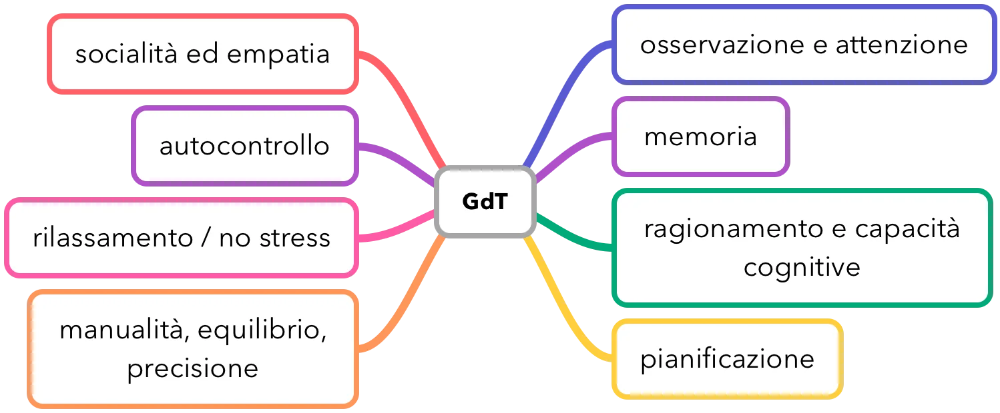
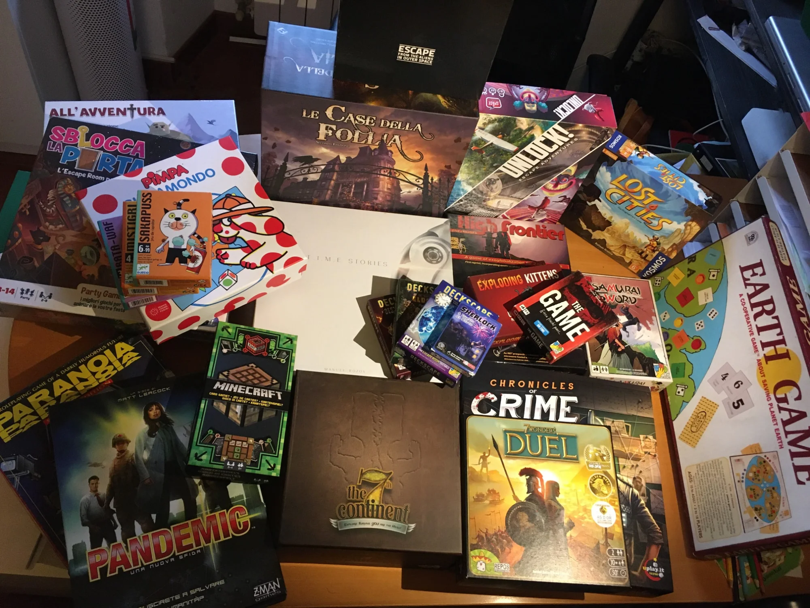
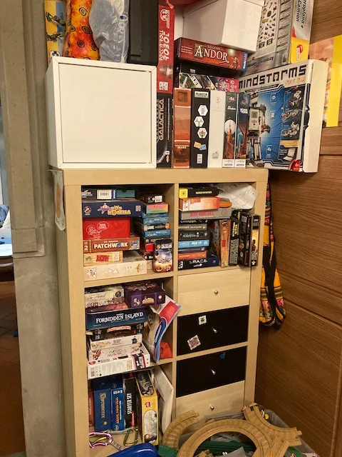

# Giochi da Tavolo

I Giochi da Tavolo (GdT), o Giochi di Società o Giochi in Scatola, chiamateli come volete, hanno una storia millenaria e si può dire che hanno da sempre accompagnato l'evoluzione degli uomini nel divertimento, nello studio e nella preparazione.
Rimando ad un buon libro sull'argomento[^libro_StoriaGiochi]

[^libro_StoriaGiochi]: L'Arte del Gioco, Emiliano Sciarra, 2010

Negli ultimi vent'anni c'è stato un crescente interesse per questi giochi, forse in risposta al preferire una serata intorno ad un tavolo con gli amici che non guardare tv o videogiochi, o forse perché la "nerd" generation sta prendendo potere, ma io penso sopratutto perché molti autori e distributori stanno iniziando a creare giochi oggettivamente belli, quasi entusiasmanti! e negozi anche della grande distribuzione stanno stanando questa nicchia rendendola di pubblico dominio.

In questo capitolo cercherò di approfondire sopratutto le *virtù* dei GdT, cosa li rende speciali, e come conoscerli per poterli scegliere e giocare al meglio.

1. necessario e possibile conoscere tutte le regole del gioco
2. umani in competizione o in cooperazione
3. regole modificabili o interpretabili

## I "classici" eterni e no
Scacchi, Dama, GO, Backgammon, Briscola, Scopa, Scala 40... solo per citare i primi della lista dei giochi da tavolo e di carte che vengono in mente, non solo sono giochi validissimi e immortali, ma sono dei giochi così popolari che conviene conoscerli un minimo, fosse anche solo per non rimanere isolati dovesse presentarsi un'occasione di giocare con nuovi amici.  
Tra tutti consiglio gli scacchi che ha il giusto equilibrio tra regole semplici ma non banali e profondità di gioco che permette a tutti di giocare e imparare.
In questo libro non tratterò questi giochi classici solo perché li dò per scontati.
Diverso discorso è per i classici giochi da tavola.. che a mio avviso possono benissimo essere non giocati più (vedi Monopoli o Risiko) ma perché hanno delle regole che sono state superate da migliori.  
Accenno solo due esempi: durata delle partite troppo lunghe e se un giocatore parte male o muore presto viene escluso dal gioco. Questa cosa NON deve succedere, sopratutto se si gioca in famiglia e si cerca più il buon divertimento allo sterminio dei propri avversari.

## Regole e Facilitatori
> *Fabio:*
> Il mio consiglio è di leggere bene le istruzioni, oppure prendete tutto quello che trovate dentro la scatola, osservatelo e inventatevi delle regole per giocarci.

La differenza tra giocattolo e gioco, tra puro divertimento e giocare, sono appunto le regole. Devono essere chiare. E prediligo quelli che si imparano in massimo 15 minuti, o che si possa iniziare a giocare conoscendo le regole minime, da approfondire giocando.
La figura del "facilitatore" dei giochi è importante: è colui che ha già fatto una partita di prova o ha già studiato il gioco per poterlo intavolare velocemente. A volte basta guardarsi un video su YouTube (ce ne sono ormai per tutti i giochi).

## Benefici

Pedagogisti, neuroscienziati, gerontologi e mistici immortali hanno dimostrato scientificamente questi benefici

### Concentrazione e attenzione
Saper osservare con attenzione e sopratutto imparare a concentrarsi.
È importante che il gioco sia giocato fino alla fine senza distrazioni. questo vale sopratutto per i grandi che sono da esempio: non sfruttare i tempi di mossa avversari per controllare il telefono o fare altro. Siamo tutti in gioco a fare una cosa. Il modello e l'ambiente sono fondamentali per migliorare le capacità di concentrazione.

### Ragionamento e pianificazione
Tutti i giochi impegnano il nostro *motore a tre tempi*, ovvero la mente nelle fasi di 1) percepire 2) ragionare 3) agire.
Aggiungendo pure la memoria per rievocare al meglio il passato, abbiamo tutti gli elementi per formulare strategie a futuro tra cui scegliere quella più interessante per il nostro obiettivo.

Una **strategia** non è che un piano a lungo termine, da raggiungere con passi intermedi che rispondono più a delle **tattiche**, obiettivi brevi.

Per scegliere bene spesso dobbiamo saper guardare da diverse prospettive e considerare tutte le possibilità, e se fossimo in un gioco cooperativo si aggiunge la consultazione e il confronto con gli altri ed eventuale argomentazione a persuaderli della nostra proposta di azione

In sintesi: una bella palestra per l'Intelligenza!

### Sviluppare abilità nascoste
Spesso uno non sa di avere determinate capacità finché non si trova in una situazione in cui servono. Magari si ipotizza di non averle (*"Figurati se sono in grado di improvvisare una canzone davanti a tutti!*"")e si ha il terrore di tale prove (tipo fare calcoli a mente velocemente quando si crede di essere negati in matematica), ma un gioco potrebbe sorprenderci e metterci di fronte a delle sfide impreviste, è il nostro turno e lì ci si mette alla prova!

### Manualità, equilibrio, precisione
Anche nei Giochi da Tavolo a volte è necessaria destrezza o capacità di usare le mani per fare qualcosa di non banale.. che sia il costruire un castello di carte o mettere in equilibrio dei pezzi, tirare biglie con precisione o coprire una carta prima degli altri, magari con un'esclamazione precisa. Non c'è solo la mente che lavora, ma tutto il coordinamento cervello, occhi, orecchie e mani.

### Rilassamento, anti-stress e anti depressivo
Ognuno decide i suoi tempi e a meno che si abbiano amici frenetici e antipatici, il sapere di avere tempo per fare la propria scelta e la soddisfazione di una mossa ben fatta, rilassa ed è dimostrato che riduce lo stress!  
Inoltre per i giocatori ansiosi o con difficoltà di comunicazione e relazione, un gioco da tavola che ha regole ben "strutturate" è un ottimo ausilio! perché il bambino sa cosa deve fare al suo turno, può prepararsi.
Sopratutto quelli con difficoltà verbali: se la regola del gioco chiede di preparare un'espressione verbale, può aiutare anche i più timidi!

### Pazienza e Attesa
Non avere fretta è un'arte. Saper attendere è un'altra.
SI può imparare ad essere pazienti? Non lo sappiamo, ma di certo mettersi in situazioni dove è necessario pazientare è una buon esercizio.
Si può poi sfruttare il tempo dell'attesa per pensare su quello che stiamo facendo. Pensare fa bene, pensare con attenzione fa benissimo, più lo facciamo e più diventiamo bravi a farlo. 

### Autocontrollo
Imparare a riflettere sulle proprie azioni, ragionare prima di agire.
Non tradire la propria strategia, non farsi scoprire un bluff... altro?
imparare a perdere: perché si perde? errori o sfortuna?  
Alle prime partite si può tollerare magari qualche eccezione alle regole, sopratutto se un giocatore non sa gestire bene la sfortuna o la perdita. ma piano piano si può aiutarlo a seguire le regole e incoraggiare nei momenti difficili.
l'autocontrollo e la gestione della sconfitta non avviene in automatico!

### Coinvolgimento e Socialità
È necessario trovarsi con altri e sedersi intorno ad un tavolo, magari con una merenda o uno spuntino pronto.
già questo è un uscire dall'isolamento sociale.
poi è necessario saper ascoltare gli altri e *sentirli* come fossimo noi stessi, fosse anche solo per capire in che situazione sono e o aiutarli o sconfiggerli (il poter vedere il tabellone di gioco permette a tutti di vedere tutto tranne le carte nascoste in mano)
tutto questo permette di migliorare le proprie relazioni sociali e confidenza in se stessi e negli altri

### Empatia e Solidarietà
Sopratutto nei giochi collaborativi, è necessario conoscere al meglio altri, le loro e le proprie virtù e carenze, per agire come un unico giocatore.
Se il gioco non prevede comunicazione tra i giocatori, nemmeno a gesti, deve nascere qualcosa che si avvicina all'Empatia, al sentire e pensare quallo che sente e pensa l'altro.
Alcuni giochi (vedi *The Mind*) sono progettati apposta per provare questo legame mentale. Meraviglioso.
ALtra forma di empatia è il riconoscere la difficoltà dell'altro, e magari il volerlo aiutare non tanto a vincere, quanto a prendere la decisione migliore.
In questo caso l'avversario si fa amico solidale, e il divertimento può anche essere il valutare insieme una situazione difficilissima o solidarizzare per destini sfortunati.
Comunque vada, chi gioca insieme intorno ad un tavolo, si rialza con qualcosa di guadagnato.

### Fallimento e Successo
La cosa bella è che i giochi sono dei "simulatori", posso provare liberamente nuove strategie o migliorare il mio stile. In ogni caso non è detto che si vinca, anzi spesso una buona sconfitta è più interessante e divertente che non una vittoria.
E saper accettare sul fallimento e rivedere i propri errori è importante. quanto è importante.

### Risolvere controversie o arrabbiature
anziché litigare e brontolare / punirsi a vicenda, intavolare un gioco da tavola può essere una valida alternativa.
c'è addirittura chi ipotizza che anziché

### Economici ed eterni
Molti giochi da tavolo sono relativamente economici, sopratutto se si cercano quelli *compatti*, ovvero con scatole piccole, hanno un costo medio tra i 15 e i 25 euro.
Come un libro o una serata in due al cinema o a mangiare una pizza. Però un gioco così può essere eterno: ci puoi giocare quanto vuoi, dove vuoi, con chi vuoi. Puoi prestarlo a chiunque e infine anche rivenderlo (c'è un grande mercato dell'usato).

## Caratteristiche
Il gioco da tavolo presenta numerose caratteristiche interessanti che se conosciute possiamo valorizzare.

### Regolamento esplicito e condiviso
questa è la cosa che più mi piace dei GdT: i "confini" del gioco sono ben definiti e condivisi con gli altri.
C'è poi una etica che impone a tutti i giocatori di seguire le regole.. e quanti litigi se le regole non sono chiare e ci sono diatribe di interpretazione! qualcuno può fare le analogie con il sistema delle leggi di un paese e i relativi avvocati ;)

### Hackers
li puoi modificare. è una caratteristica che piace moltissimo ai bambini sopratutto.
si possono creare nuovi scenari, nuove carte, limitare alcune regole, permetterne altre.

### Offline e non consumano pile
se oggi hai un gioco in scatola, puoi stare tranquillo che lo potrai rigiocare tale e quale anche tra 10 o 20 anni (non si può dire lo stesso con un videogioco)

sono inoltre un ottima alternativa alla tecnologia digitale per andare offline, magari quando andare fuori non è possibile.
rimarrete sorpresi quanto ai ragazzi piace intavolare un gioco!

### A.I. Bot
Nel momento in cui le regole sono esplicite, uno può ragionare sul proprio ragionamento (un atto mentale notevole che forse solo noi esseri umani siamo bravi a fare) e quindi perché non provarlo a "riprodurre" come procedura indipendente, creando una sorta di "giocatore artificiale"?
non ci crederete ma ci sono in giro delle regole per creare giocatori in IA (Intelligenza Artificiale) per molti giochi!
oppure le regole prevedono già queste regole per un eventuale gioco in solitario o in cooperativa.

## Tipologie e Parole chiave

In qualsiasi negozio o sito di giochi da tavolo è prassi organizzarli per tipologia principale. Eccone una dozzina che bene conoscere, ma rimandiamo al [Glossario GdT]({{< relref "800_glossario)) in fondo al libro dove le descriviamo tutte.

- 2 Giocatori
- Astratti
- Collezionabili
- Compatti
- Cooperativi
- Deckbuild
- Di ruolo
- Dungeon
- Escape
- Family
- Gestionali
- Legacy
- Party
- Solo 
- Strategici

## Perché?

- un'ottima divertente alternativa all'uso di smart phones, computer e videogiochi
- Promuove l'educazione attraverso la storia, la lingua, matematica
- stimola l'immaginazione e la creatività
- può essere una vira d'uscita dal ruolo imposto di essere "adulto"
- può ricordare i bei vecchi tempi del gioco da bambini
- permette di conoscere nuove persone con interessi simili

## Il gioco e i bambini

**Imparare**
Nei bambini più piccoli i giochi possono aiutare a identificare i colori, contare, sviluppare una coordinazione occhio-mano e la destrezza minima per muovere le carte e i pezzi in gioco. In più l'imparare ad aspettare il proprio turno e seguire le regole sono lezioni importanti.

**Migliorano il linguaggio**
Non solo parlare con gli altri giocatori, ma alcuni giochi necessitano di leggere alcune parole sulle carte, oppure se ci si deve ricordare qualche informazione c'è un sostanziale miglioramento della comprensione verbale

**Lavoro di squadra**
per me il più importante degli insegnamenti che un gioco da tavola può dare è il lavoro di squadra. Che sia un gioco competitivo o cooperativo, si sta tutti insieme nello stesso "sistema" di regole e scenario. C'è chi vince e chi perde, la fortuna o la situazione può essere favorevole o sfavorevole, e spesso non dipende da noi.
Quali lezioni di vita!

Inoltre spesso ci si deve relazionare con persone diverse, per età, capacità o costumi. Qualcosa che a cui è bene assuefarsi fin da subito, e imparare a valorizzarci a vicenda

Si, la considero una missione non solo educativa e di benessere, ma anche politica!

## Awards
Ci sono molte selezioni e premi anche per i giochi da tavola.. ed essere nominati o addirittura vincere un Oscar dei giochi, è sinonimo di qualità eccellente.

## Giocare con le nonne

I nonni hanno la caratteristica di aver vissuto un po' di anni più di noi, e come ogni sistema si sono abituati a certe cose e ogni novità e innovazione che rompe i loro schemi necessita di molta energia per essere accettata e compresa.

Per questo, se non strettamente necessario, meglio non stravolgere loro la vita con l'ultimo gioco rivoluzionario seppur divertentissimo.

Ma non per questo si deve cadere nel solito Monopoli / Trivial o ancora peggio aiuto Tombola o Gioco dell'Oca, o adattarsi al loro Burraco e Scala 40.

Si può trovare una via di mezzo!

Magari proponendo giochi che siano già nelle loro corde o con meccanismo conosciuti.
Se ad esempio a loro piace giocare a Briscola, niente di meglio che farli salire sull'astronave di The Crew, che usa esattamente il gioco della Briscola, ma rendendolo cooperativo perché i giocatori non sono più uno contro l'altro, ma hanno delle missioni (tipo il secondo giocatore prenda quella carta) via via più difficili.

Se amano i gatti e le carte un Exploding Kittens potrebbe essere un simpatico momento dissacratore.

Se hanno uno spirito strategico ed "economico", uno Splendor è un ottimo gioco, semplicissimo quanto profondo, che può mettere intorno ad un tavolo un bambino di 8 anni con un nonno di 80.

## Giocare con i figli

Abbiamo già introdotto il tema del giocare in generale con i ragazzi. Per i Giochi da Tavolo ci sono alcuni aspetti specifici da valutare, sopratutto se i ragazzi hanno meno di dieci anni, perché state tranquilli che dai 11/12 se hanno la passione possono già mettere alle strette qualsiasi giocatore adulto.

## Il lato oscuro dei GdT

Sembrerebbe che ci siano solo lati positivi, vero?
E invece non possiamo tralasciare l'unico aspetto pericoloso di questo mondo: **il collezionismo**.
Una volta entrati in un negozio di giochi da tavolo e in grado di assaporare la bellezza di alcune scatole, non vorrete più uscirne senza, oppure di un gioco aspetterete l'espansione.

Noi abbiamo una regola: i giochi che ci stanno nello scaffale dei giochi, rimangono. Se ne deve entrare uno nuovo, deve uscirne (regalato o rivenduto) uno precedente.

## La Ludoteca a casa: consigli pratici

I giochi sono i nuovi libri.

Un armadio dove tenere i giochi in verticale.
Il Kallax è diventato il mobile per antonomasia del ludologo (ha gli spazi perfetti per le scatole..anzi ormai producono le scatole su misura per lui).
 
averne cura perché si possono rivendere o regalare

provarli in ludoteca, in negozio, guardare youtube o consiglio di amici prima di comprare un titolo, sopratutto pensando all'età dei giocatori e ai gusti di scenario.

meglio le scatole medio/piccole

il tavolo da gioco deve essere pulito e il più neutrale possibile (piuttosto un panno monocromatico apposta)

i più attenti imbustano tutte le carte in apposite bustine per non rovinarle...
se un gioco lo giocate molto, sopratutto con le carte da mischiare spesso, può valerne la pena

## I nostri favoriti

Così giusto per iniziare, se non li avete, con questi si va sul sicuro e costano relativamente poco, sono semplici, piccoli ma sempre validi:

- in due: 7 Wonders duel, Star Realms
- con piccoli di 5 anni: Labirinto Magico, Rhino Hero Battles, Zombie Kids Evolution
- in famiglia: Deckscape, Deserto Proibito, Kingdomino, Hanabi, Splendor, Sushi Go, The Mind

## Cose da NON fare quando si gioca
1. arrivare sempre in ritardo a giocare, farsi aspettare
2. stare al telefonino mentre si gioca
3. piegare le carte
4. giocare con le mani sporche
5. chiacchierare mentre si spiegano le regole
6. stare ore a pensare durante il proprio turno
7. non saper perdere
8. non aiutare a sistemare il tavolo dopo la partita

## Come spiegare bene le regole di un gioco
1. definire subito l'obiettivo finale
2. fare una panoramica di tutti gli elementi del gioco
3. quali sono le azioni che un giocatore può fare?
4. spiegare i casi particolari
5. simulare un turno di gioco
6. 