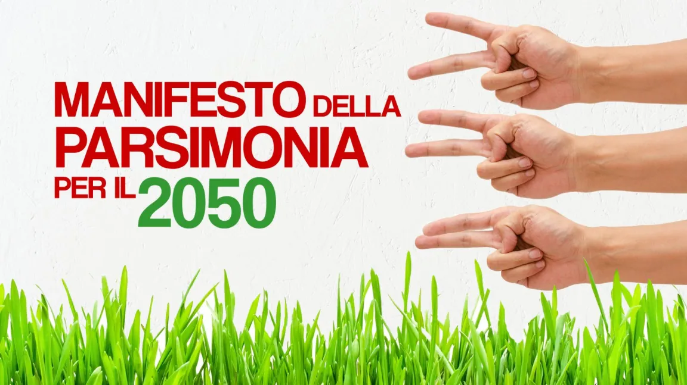

# Manifesto della parsimonia per il 2050
_Raddoppiare il benessere dimezzando energia, materiali e lavoro_

di [Beppe Grillo, pubblicato il 2 novembre 2022](https://beppegrillo.it/manifesto-della-parsimonia-per-il-2050/)

Il segreto per arrivare felici al 2050 senza stravolgere il benessere e il pianeta è la virtù della [parsimonia](https://www.treccani.it/vocabolario/parsimonia/). A Genova la pratichiamo da secoli. La parsimonia è “l’arte della giusta misura nell’uso dei beni”. Platone e Sant’Agostino la chiamano [temperanza](https://www.treccani.it/vocabolario/temperanza/), la prima virtù cardinale. La parsimonia, invece, è un peccato mortale nella società usa-e-getta. Per capire questo ribaltamento di valori avvenuto un secolo fa dobbiamo guardare lontano nel tempo.

E’ ora che la politica pensi in mezzi secoli! Non in mezze legislature. Per questo propongo che l’anno 2050 diventi il riferimento per ogni politica di ogni partito. Per fermare _la [Grande Accelerazione](https://amzn.to/3DV55nC)_ del degrado del pianeta dobbiamo coltivare **una civiltà della parsimonia**, [come ho già proposto nel 2008.](https://www.internazionale.it/opinione/beppe-grillo/2008/04/11/perche-non-voto)

Con un po’ d’intelligenza tecnologica possiamo preservare sia il benessere sia il pianeta se **dimezziamo l’uso di energia, di materiali e di tempo di lavoro,** ossia l’uso dei tre principali fattori che creano il benessere, ma anche pesano sulla natura. Non dobbiamo essere così maldisposti al progresso da pensare che le moderne tecnologie e i comportamenti oculati non ci permettano di dimezzare il nostro peso sulla natura.

Duecento anni di rivoluzione industriale hanno raddoppiato nei paesi ricchi la durata e la soddisfazione della vita. Ma i nostri antenati non potevano pensare a tutto. Così ci siamo accorti che la benedetta società industriale deve essere urgentemente riformata, salvandone il buono e mitigandone il cattivo.

Siamo su una nave che fa acqua e scopriamo sempre nuove falle. Gli scienziati hanno individuato alcuni “limiti planetari” che circoscrivono uno spazio di sicurezza per l’umanità da non superare e che riguardano: clima, biodiversità, sostanze disperse nell’ambiente, cicli di azoto e fosforo, cambiamento d’uso dei territori, acque dolci, acidificazione degli oceani, aerosol atmosferici, ozono stratosferico.

La crescita dei dissesti ecologici e dei conflitti geopolitici ridurrà gradualmente la disponibilità di energia commerciale e di materiali. Questa riduzione avverrà comunque, che ci piaccia o no. Spetta a noi scegliere una riduzione programmata dei nostri enormi sprechi, oppure subire una riduzione brutale e caotica. Forse la crisi russo-ucraina è solo un’avvisaglia.

## Energia, materiali e lavoro. La parsimonia ecologica per il 2050

La parsimonia non si impara dalla sera alla mattina. Veniamo da due secoli di euforia economica e di intemperanza ecologica. Ci vorrà tempo per moderarci, ma abbiamo trent’anni davanti. Per fare i primi passi, però, dobbiamo dare un nome alla meta lontana: il 2050.

## Metà energia entro il 2050

Il governo realizzi un piano trentennale per [dimezzare l’uso di energia primaria da una potenza di 4000 a una di 2000 watt](https://beppegrillo.it/la-rivoluzione-del-meno/) in media per abitante. Il benessere che abbiamo raggiunto può essere mantenuto o aumentato anche con la potenza media di soli 2000 watt per abitante, se adottiamo tecnologie più efficienti e comportamenti più oculati. Con “2000 watt” intendo qui non solo l’elettricità ma la potenze dell’insieme di tutte le energie (carbone, petrolio, gas, idroelettrico, etc.) impiegate per i nostri bisogni (riscaldamento, trasporti, alimenti, infrastrutture, beni di consumo e tutto il resto).

Immaginate che per soddisfare i nostri bisogni materiali tutte le nostre fonti di energia generino [un unico flusso continuo, che possiamo esprimere in watt (un’unità di potenza).](https://www.slideshare.net/morosini1952/finale-2017-romasufficienzamorosini17010047h00/1) In Italia il flusso medio per coprire tutti i bisogni della popolazione è di circa 4000 watt pro capite (non di sola elettricità, che copre solo un quinto dei nostri consumi energetici). Per darvi un’idea: 4000 watt è la potenza per fare funzionare quattro aspirapolvere da 1000 watt. Se li lasciassimo sempre accesi, in un anno consumerebbero l’equivalente di circa tre tonnellate di petrolio. E’ questo il nostro consumo medio per abitante. Ed è troppo alto.

## Perché 2000 watt? 

Il più lungo confine dell’Italia è con la Svizzera, a 50 chilometri da Milano. Inoltre, la Svizzera è l’unico altro grande paese in cui l’Italiano è lingua dello Stato e di una intera regione, il Canton Ticino. Vale la pena di dare un’occhiata. La _[società a 2000 watt](https://beppegrillo.it/la-rivoluzione-del-meno/)_ è da vent’anni l’idea-guida per lo sviluppo sostenibile della Confederazione. [L’idea fu concepita](https://it.wikipedia.org/wiki/Societ%C3%A0_a_2000_Watt) nel 1998 dal Politecnico di Zurigo ETH su commissione del governo, adottata dall’esecutivo nel 2002, approvata in referendum popolari e implementata da ordini professionali, cantoni, comuni e aziende. L’esperienza elvetica dimostra che l’obiettivo tecnologico di ottenere più benessere con meno energia è plausibile e ha portato a una riduzione significativa dei consumi energetici. Ma perché 2000 watt? Secondo gli studi dei politecnici svizzeri, 2000 watt pro capite (da tutte le energie non solo dalla elettricità) potrebbero garantire **l’attuale livello di benessere** se ovunque fossero già installate le tecnologie più efficienti e se ci comportassimo con parsimonia.

Inoltre **2000 watt era vent’anni fa la media mondiale della potenza pro capite** usata dall’umanità, ossia la media tra i 20mila watt dei più ricchi e i 500 watt dei più poveri. Una tale disuguaglianza è fonte di tensione sociale e conflitti nelle nazioni e tra le nazioni, come vediamo in questi mesi. Nelle società con la minore disuguaglianza tutto è migliore: coesione sociale, soddisfazione dei cittadini, benessere, salute, longevità, cultura, protezione dell’ambiente.

Siccome gli attuali consumi energetici già dissestano il pianeta, occorre almeno dimezzare l’uso di energia nei paesi ricchi, anche per permettere ai paesi poveri di usare più energia, come raccomanda Papa Francesco nella sua enciclica “ecologica” [Laudato sì](https://www.vatican.va/content/francesco/it/encyclicals/documents/papa-francesco_20150524_enciclica-laudato-si.html) (LS, 135). Inoltre, ben prima del 2050 occorre passare a quasi il 100% di energie rinnovabili e sostenibili. Ma attenzione grazie a tecnologia e parsimonia nella _società a 2000 watt_ il comfort materiale non diminuisce. Diminuiscono invece gli effetti indesiderati delle tecnologie energetiche. Insomma, **la _società a 2000 watt_ mira al benessere non meno che alla equità energetica.**

## Metà materiali entro il 2050

Il governo realizzi un piano trentennale per **dimezzare gradualmente entro il 2050 l’uso di materiali dalle attuali 40 tonnellate pro capite a meno di 20.** Per i suoi effetti collaterali ecologici e sociali, il livello di prelievo di 40 tonnellate di materiali è già insostenibile se praticato da una minoranza di paesi e di persone. Sarebbe ancor meno sostenibile se praticato dall’intera umanità.

La strategia per dimezzare l’uso di materiali è l’economia circolare, erroneamente confusa con il riciclo dei rifiuti. **Ciò che deve circolare più a lungo sono i manufatti, non i rifiuti!** Secondo gli scienziati dell’economia circolare l’ordine di priorità è:

1. evitare di produrre ciò che è possibile evitare
2. progettare per una più lunga durata e per un facile smontaggio e riuso delle parti
3. usare più a lungo i manufatti grazie a manutenzioni e riparazioni
4. smontare i manufatti e riusarne le parti ancora sane
5. raccogliere separatamente i rifiuti e trattarli per scopi materiali ed energetici meno pregiati: down-cycling (il riciclo completo non esiste)

## Un tram di cento anni

Un ottimo esempio di economia circolare è il [tram “ATM 1928”](https://it.wikipedia.org/wiki/Tram_ATM_serie_1500) che circola ormai da un secolo. Una flotta di queste vetture in perfetto stato di manutenzione è in servizio a Milano dal 1928. Il costo ecologico ed economico di ogni chilogrammo dei suoi materiali diviso per il numero di passeggeri trasportati in un secolo è quasi irrisorio. I soldi spesi per cento anni di trasporto sono andati quasi tutti alla manodopera locale e solo in piccolissima parte in acquisto di materiali e di energia importati. Le porte in legno e le abatjour belle-époque creano un’accogliente atmosfera retro. Le panche in legno laccato lungo le pareti permettono di guardare i passeggeri di fronte, invece di guardare la nuca del passeggero davanti. Esattamente lo stesso vale per il _[Poly-Bahn di Zurigo,](https://en.wikipedia.org/wiki/Polybahn)_ il tram-cremagliera in servizio dal 1889 che [in 100 secondi](https://www.youtube.com/watch?v=IvbhVPLS2fM) sale dal centro-città al Politecnico di Zurigo. _“Dobbiamo poter conservare volentieri le cose per affezione, non solo per ecologia ed economia”_ dice il mio amico Walter Stahel, “il nonno della economia circolare”.

Walter Stahel viaggia da trent’anni sulla sua automobile Toyota Corolla, in ottime condizioni grazie alla manutenzione [(Economia circolare per tutti, 2019).](https://shop.edizioniambiente.it/catalogo/economia-circolare-per-tutti) I vantaggi ecologici, economici e sociali aumentano con l’aumentare della durata di un’automobile. Certo, le automobili attuali sono più sicure e confortevoli. Si tratta quindi di progettare automobili – e altri beni – per la durata, ossia più robuste, sicure e modulari, in modo da beneficiare man mano di una parte delle future innovazioni tecniche.

Raddoppiare la durata di un’automobile vuol dire dimezzare il numero di automobili costruite. Vuol dire spendere più soldi nella manodopera locale di manutenzione che non nei robot, nei materiali e nell’energia importati. Vuol dire rafforzare l’economia locale invece dell’economia globalizzata. I taxi di Londra, per esempio, circolano per mezzo secolo. **L’economia circolare vuol dire soprattutto fare circolare le cose, non i rifiuti.** Non per caso l’Istituto di Walter Stahel si chiama “[Istituto della vita del prodotto](http://product-life.org)”, non istituto del riciclo.

## Rivoltiamo i colletti delle camicie

Invece di buttare via le camicie quando il solo colletto è usurato, dobbiamo tornare a far rivoltare o a cambiare i colletti, come abbiamo fatto per secoli. E dobbiamo poter fare riparare molte altre cose, non solo le camicie, con vantaggio ecologico, economico e per la manodopera e la finanza locali. Nella società usa-e-getta però una _“economia della manutenzione”_ non piove dal cielo. Anzi, le attività artigiane di riparazione sono sempre più rare. Per questo occorre che lo Stato finanzi un **“piano nazionale della manutenzione”** organizzando corsi di formazione, finanziamenti d’avviamento, sgravi fiscali, incentivi, premi, concorsi, edifici in comodato e molto altro per rendere convenienti per tutto e per tutti la manutenzione e il riuso.

## Metà lavoro entro il 2050

Il governo realizzi un piano per dimezzare gradualmente e a tappe il tempo dedicato in una vita al lavoro retribuito dalle 70 000 ore attuali a 35 000 ore. Perché? Perché lavorare troppo fa male al [“pianeta esterno” e al “pianeta interno”.](https://www.albertomelucci.it/elenco-completo/) La riduzione del tempo per il lavoro retribuito si può perseguire intervenendo su tre fattori: il numero di ore di lavoro retribuito settimanale o annuale, l’età del pensionamento e la durata delle ferie.

Ispiriamoci con prudenza al grande economista J. M. Keynes, che per il 2030 riteneva plausibile la settimana di [lavoro salariato di 15 ore](https://www.redistribuireillavoro.it/assets/prospettive.pdf). Noi siamo meno ambiziosi di Keynes e per il 2050 miriamo con gradualità alla settimana di 20 ore di lavoro retribuito, a parità di salario. Non domani, ovviamente! Ma fra trent’anni, con tappe intermedie per il 2030 e il 2040. A partire da 35-32 ore entro il 2025. La settimana di 35 ore o meno è la norma da vent’anni in [Francia](https://fr.wikipedia.org/wiki/R%C3%A9forme_des_35_heures_en_France), Germania e altri paesi, [con tendenza alle 30](https://www.jobteaser.com/de/advices/492-30-stunden-woche-gehalt-vorteile-und-nachteile?reloadCookieBanner=true) o alle [28 ore di lavoro per settimana.](https://www.sueddeutsche.de/wirtschaft/arbeitszeit-mit-der-28-stunden-woche-beginnt-die-zeit-der-experimente-1.3857525) Dimezzare le ore di lavoro? Per molti è inconcepibile – fosse anche fra trent’anni. Ma questo è quello che pensavano molti nell’800 quando nelle fabbriche si lavorava il doppio delle ore di oggi.

Per esempio, la Francia è più ricca e più produttiva dell’Italia, ma in una vita i francesi l[avorano per una retribuzione solo 50 000 ore](https://www.marcomorosini.eu/basedati/archive/Liberation220701.pdf), invece di 70 000 come noi, perché in Francia la settimana lavorativa legale è di 35 ore (da noi 40), le ferie sono 5 settimane (da noi 4), l’età del pensionamento è 62 anni (da noi più di 65).

Centocinquant’anni fa nelle fabbriche [si lavorava 3000 ore all’anno, oggi 1500.](https://docs.google.com/document/d/1c4xvrAbDJOmcGqCX6tlFAuXEkrL2eZSH/edit?usp=share_link&ouid=111518139528623053487&rtpof=true&sd=true) Ora lavoriamo metà e produciamo cento volte di più. In meno di due secoli l’aumento della produttività ci ha permesso di dimezzare il tempo di lavoro e di moltiplicare le merci prodotte. Da mezzo secolo però i politici al potere hanno voluto fermare il progresso: tutti i guadagni di produttività sono stati investiti nell’aumento della produzione e niente più nella riduzione del tempo di lavoro. Anzi, molti politici vorrebbero ancora più ore di lavoro e più produzione, aumentando così il logorio delle persone e del pianeta.

## Più vita per tutti!

Occorre invece riprendere la strada del progresso, ossia la graduale diminuzione del tempo di lavoro retribuito. Ma attenzione! Ridurre il tempo di lavoro retribuito non vuol dire ridurre il tempo di tutto il lavoro (come è definito dalla [Organizzazione Internazionale del Lavoro ILO](https://ilostat.ilo.org/resources/concepts-and-definitions/forms-of-work/)). Vuol dire evolverci verso una “società del lavoro intero” che divide il tempo di lavoro in un terzo per il lavoro salariato, un terzo per il lavoro per sé e la famiglia, un terzo per il lavoro civile volontario: politica, sindacalismo, associazioni, chiese, insegnamento e coaching gratuiti, lavori utili, servizio civile, cura, assistenza.

La riduzione del tempo di lavoro (RTL) a parità di salario porta un beneficio ecologico perché in molte attività lavorare meno vuol dire produrre meno, vendere meno, buttare meno, inquinare meno, e porta un beneficio esistenziale perché meno ore di lavoro salariato vogliono dire più ore per il per il resto della vita. **[“Più vita per tutti!”](https://www.marcomorosini.eu/basedati/archive/oltre-il-lavoro-la-rivoluzione-del-tempo-di-vita.pdf)** deve essere il nostro motto. Perché [il tempo di vita è l’unica vera risorsa non rinnovabile.](https://www.marcomorosini.eu/basedati/archive/oltre-il-lavoro-la-rivoluzione-del-tempo-di-vita.pdf)

## Riassunto delle tre idee per il 2050

**Primo:** facciamo politica per mezzi secoli, non per mezze legislature

**Secondo:** coltiviamo la parsimonia ecologica come principale virtù civica

**Terzo:** realizziamo un piano trentennale per dimezzare gradualmente e a tappe entro il 2050 l’impiego dell’energia, dei materiali e del tempo di vita dedicato al lavoro retribuito.